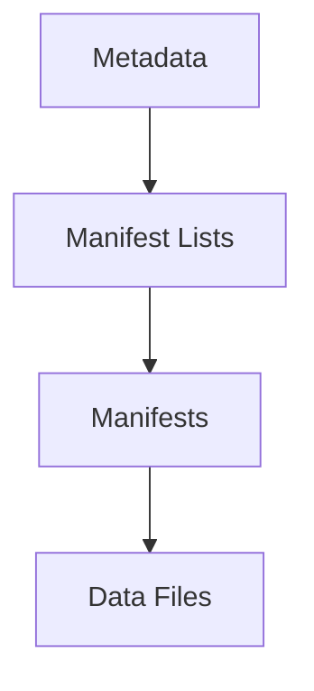

# Apache Iceberg (Deep Dive)

📄 File: `book/05_data_storage_lakehouse/apache_iceberg.md`

This chapter covers **Apache Iceberg** — table format for huge tables. Schema evolution, partition evolution, hidden partitioning.

---

## Study Plan (1 week)

* Day 1–2: Iceberg basics, metadata
* Day 3–4: Partitioning, evolution
* Day 5–6: Spark, Trino integration
* Day 7: Exercises

---

## 1 — What is Iceberg?

Iceberg = **table format** (like Delta). Tracks files, schema, partitions. Used by Spark, Trino, Flink.



---

## 2 — Metadata Layers

* **Metadata file**: Points to manifest lists
* **Manifest list**: Points to manifests
* **Manifest**: Lists data files with stats
* **Data files**: Parquet/ORC

---

## 3 — Hidden Partitioning

* Partition **not** in data path (unlike Hive)
* Partition derived from column (e.g., `days(date)`)
* **Partition evolution**: Change partition spec without rewrite

```python
# Create table with partition transform
spark.sql("""
CREATE TABLE events (
    id BIGINT,
    date DATE,
    user_id BIGINT
) USING iceberg
PARTITIONED BY (days(date))
""")
```

---

## 4 — Schema Evolution

```sql
-- Add column (no rewrite)
ALTER TABLE events ADD COLUMN region STRING;

-- Rename column
ALTER TABLE events RENAME COLUMN old_name TO new_name;
```

---

## 5 — Iceberg vs Delta

| Iceberg | Delta |
| ------- | ----- |
| Vendor-neutral | Databricks |
| Hidden partitioning | Partition in path |
| Multi-engine | Spark-first |

---

## 6 — Why Iceberg for AI?

* **Huge tables**: Billions of rows
* **Partition evolution**: Change partition without migration
* **Multi-engine**: Spark, Trino, Flink

---

## Interview Questions

1. Iceberg vs Delta?
2. Hidden partitioning — benefits?
3. Schema evolution in Iceberg?

---

## Key Takeaways

* Iceberg = table format, metadata layers
* Hidden partitioning, partition evolution
* Multi-engine support

---

## Next Chapter

Proceed to: **apache_hudi.md**
