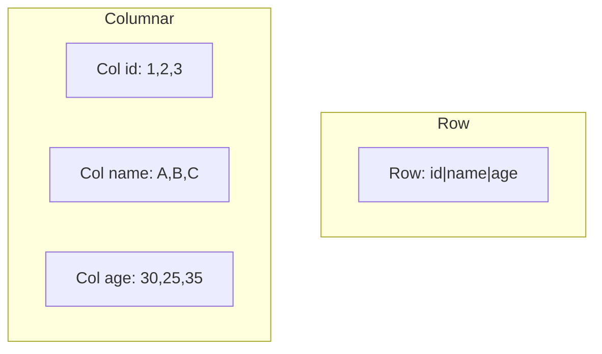
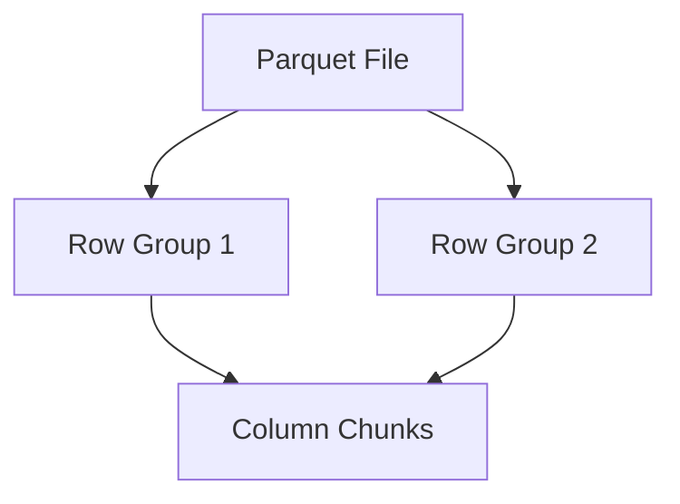
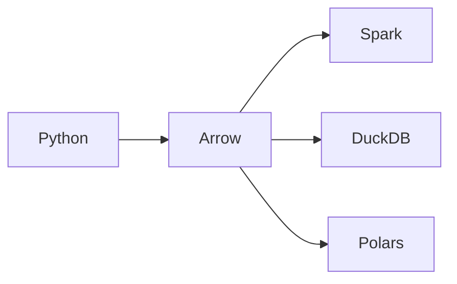

# Data Formats: Parquet and Arrow (Deep Dive)

📄 File: `book/05_data_storage_lakehouse/data_formats_parquet_arrow.md`

This chapter covers **Parquet** and **Arrow** — the standard formats for columnar data. Foundation for data lakes and AI pipelines.

---

## Study Plan (1 week)

* Day 1–2: Parquet structure, reading/writing
* Day 3–4: Arrow in-memory format
* Day 5: Interop, compression
* Day 6–7: Exercises

---

## 1 — Why Columnar?

* **Selective reads**: Read only needed columns
* **Compression**: Same type → better compression
* **Vectorization**: Process columns in batches



---

## 2 — Parquet Structure

* **File** → **Row groups** → **Column chunks** → **Pages**
* Each column chunk stored separately
* Metadata at footer (schema, row group stats)



---

## 3 — Reading Parquet (Python)

```python
import pyarrow.parquet as pq

# Read entire file; returns Arrow Table
# pq.read_table loads metadata first, then column chunks
table = pq.read_table("data.parquet")

# Read specific columns only (predicate pushdown)
# Only these columns are read from disk
table = pq.read_table("data.parquet", columns=["user_id", "amount"])

# Read with filter (row group pruning)
# Skips row groups that don't match
table = pq.read_table("data.parquet", filters=[("date", "=", "2025-01-01")])

# Convert to pandas
df = table.to_pandas()
```

---

## 4 — Writing Parquet

```python
import pyarrow as pa
import pyarrow.parquet as pq

# Create Arrow table from dict
# pa.table creates columnar representation
table = pa.table({
    "user_id": [1, 2, 3],
    "amount": [10.5, 20.0, 15.0],
})

# Write with Snappy compression (default)
# row_group_size controls row group size
pq.write_table(table, "output.parquet", compression="snappy")
```

---

## 5 — Apache Arrow (In-Memory)

* **Cross-language** columnar format
* Zero-copy between Python, Spark, DuckDB
* Used by Pandas 2.0, Polars, DuckDB



---

## 6 — Arrow Table

```python
import pyarrow as pa

# Create table; each column is a chunked array
arr = pa.array([1, 2, 3, 4, 5])
table = pa.table({"col": arr})

# Zero-copy slice
# slice creates view, no copy
sliced = table.slice(1, 3)
```

---

## 7 — Why Parquet/Arrow for AI?

* **Training data**: Efficient storage, fast reads
* **Feature store**: Columnar = fast feature lookup
* **Embeddings**: Store vectors in Parquet

---

## Interview Questions

1. Row vs columnar — when to use which?
2. What is row group pruning?
3. Arrow vs Parquet — difference?

---

## Key Takeaways

* Parquet = on-disk columnar
* Arrow = in-memory columnar
* Zero-copy interop

---

## Next Chapter

Proceed to: **object_storage.md**
