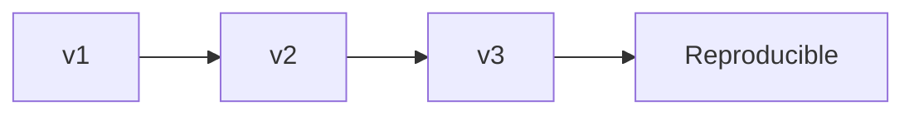

# Dataset Versioning (Deep Dive)

📄 File: `book/05_data_storage_lakehouse/dataset_versioning.md`

This chapter covers **dataset versioning** — tracking data for reproducibility. Critical for ML training and compliance.

---

## Study Plan (2 days)

* Day 1: Why version, strategies
* Day 2: DVC, Delta time travel, LakeFS

---

## 1 — Why Version Data?

* **Reproducibility**: Same data → same model
* **Audit**: What data trained this model?
* **Rollback**: Revert to previous version



---

## 2 — Strategies

| Strategy | How | Use Case |
| -------- | --- | -------- |
| **Partition by date** | `date=2025-01-01` | Daily snapshots |
| **Delta/Iceberg time travel** | `versionAsOf` | Table versions |
| **LakeFS** | Branch, commit | Git-like |
| **DVC** | Pointer files in Git | Small/medium datasets |

---

## 3 — DVC (Data Version Control)

```bash
# Initialize DVC
dvc init

# Add data (creates .dvc pointer file)
dvc add data/train.parquet

# Commit pointer to Git
git add data/train.parquet.dvc
git commit -m "Add train data v1"

# Push to remote storage
dvc push
```

---

## 4 — Delta Time Travel

```python
# Read specific version
df = spark.read.format("delta").option("versionAsOf", 5).load(path)

# Read as of timestamp
df = spark.read.format("delta").option("timestampAsOf", "2025-01-01").load(path)
```

---

## 5 — Why Dataset Versioning for AI?

* **Training**: Reproduce exact data used
* **A/B tests**: Compare models on same data
* **Compliance**: Audit trail

---

## Interview Questions

1. How do you version training data?
2. DVC vs Delta time travel?
3. When to use each strategy?

---

## Key Takeaways

* Version data for reproducibility
* Partition, Delta, LakeFS, DVC
* Match strategy to scale and workflow

---

## Next Chapter

You've completed **Data Storage & Lakehouse**. Proceed to: **06_distributed_systems**
