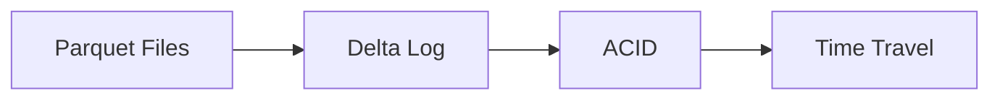

# Delta Lake (Deep Dive)

📄 File: `book/05_data_storage_lakehouse/delta_lake.md`

This chapter covers **Delta Lake** — ACID tables on object storage. Enables upserts, time travel, and schema evolution.

---

## Study Plan (1 week)

* Day 1–2: Delta basics, read/write
* Day 3–4: ACID, time travel
* Day 5–6: Optimize, Z-ordering
* Day 7: Exercises

---

## 1 — What is Delta Lake?

Delta = **Parquet + transaction log**. ACID transactions on object storage (S3, etc.).



---

## 2 — Delta Log

* **JSON** files in `_delta_log/`
* Each transaction = new log file
* **Checkpoint** (Parquet) for fast recovery

---

## 3 — Read/Write (PySpark)

```python
# Write as Delta
# mode overwrite replaces table; append adds
df.write.format("delta").mode("overwrite").save("s3://bucket/events/")

# Read
# Spark reads log, gets file list
df = spark.read.format("delta").load("s3://bucket/events/")

# Time travel: read as of timestamp
# versionAsOf or timestampAsOf
df_old = spark.read.format("delta").option("versionAsOf", 5).load("s3://bucket/events/")
```

---

## 4 — Upsert (Merge)

```python
from delta.tables import DeltaTable

# Load as DeltaTable for merge
delta = DeltaTable.forPath(spark, "s3://bucket/events/")

# Merge: update if match, insert if not
# whenMatchedUpdate: update existing rows
# whenNotMatchedInsert: insert new rows
delta.alias("target").merge(
    updates.alias("source"),
    "target.id = source.id"
).whenMatchedUpdateAll().whenNotMatchedInsertAll().execute()
```

---

## 5 — Optimize and Z-Order

```python
# Compact small files
# OPTIMIZE rewrites data into larger files
from delta.tables import DeltaTable
delta = DeltaTable.forPath(spark, "s3://bucket/events/")
delta.optimize().executeCompaction()

# Z-order: cluster by column for faster filters
delta.optimize().executeZOrderBy("date", "user_id")
```

---

## 6 — Why Delta for AI?

* **Training data**: Append new data, no overwrite
* **Reproducibility**: Time travel to exact version
* **Schema evolution**: Add columns safely

---

## Interview Questions

1. How does Delta achieve ACID?
2. Time travel — how does it work?
3. Optimize vs Z-order?

---

## Key Takeaways

* Delta = Parquet + transaction log
* ACID, time travel, upsert
* Optimize for compaction, Z-order for read performance

---

## Next Chapter

Proceed to: **apache_iceberg.md**
