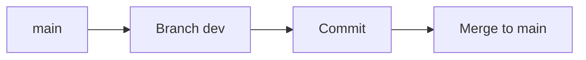

# LakeFS (Deep Dive)

📄 File: `book/05_data_storage_lakehouse/lakefs.md`

This chapter covers **LakeFS** — Git-like versioning for data lakes. Branches, commits, merge for data.

---

## Study Plan (2 days)

* Day 1: Branches, commits
* Day 2: Merge, CI/CD integration

---

## 1 — What is LakeFS?

LakeFS adds **Git-like** semantics to object storage. Branch, commit, merge data.



---

## 2 — Core Concepts

| Concept | Description |
| ------- | ----------- |
| **Repository** | Top-level container |
| **Branch** | Isolated copy of data |
| **Commit** | Snapshot of branch |
| **Merge** | Combine branches |

---

## 3 — Basic Workflow

```bash
# Create repository
lakectl repo create lakefs://my-repo s3://my-bucket/

# Create branch
lakectl branch create lakefs://my-repo@dev --source main

# Commit (after writing data to branch)
lakectl commit lakefs://my-repo@dev -m "Add new data"

# Merge to main
lakectl merge lakefs://my-repo@dev lakefs://my-repo@main
```

---

## 4 — Why LakeFS for AI?

* **Experimentation**: Branch for new features, merge when validated
* **Reproducibility**: Commit = exact data version for training
* **CI/CD**: Test on branch before merge

---

## Interview Questions

1. LakeFS vs Delta time travel?
2. When to use branches?

---

## Key Takeaways

* LakeFS = Git for data lake
* Branch, commit, merge
* Reproducibility, experimentation

---

## Next Chapter

Proceed to: **dataset_versioning.md**
