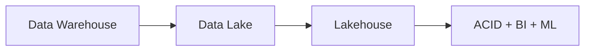
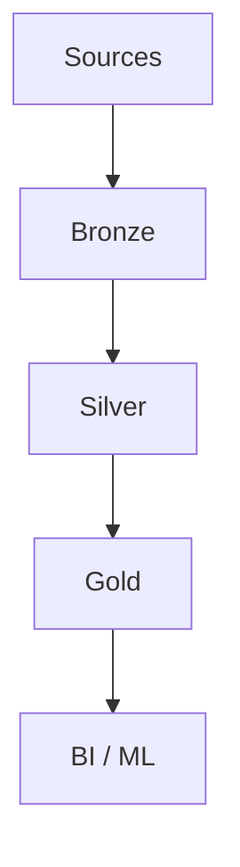

# Lakehouse Architecture (Deep Dive)

📄 File: `book/05_data_storage_lakehouse/lakehouse_architecture.md`

This chapter covers **lakehouse** — data lake + warehouse capabilities. ACID, BI, ML on one platform.

---

## Study Plan (2–3 days)

* Day 1: Data lake vs warehouse vs lakehouse
* Day 2: Medallion architecture
* Day 3: Best practices

---

## 1 — Evolution

---

## 2 — Data Lake vs Warehouse vs Lakehouse

| | Data Lake | Warehouse | Lakehouse |
|---|-----------|-----------|-----------|
| **Format** | Raw (Parquet) | Proprietary | Parquet/Delta/Iceberg |
| **ACID** | No | Yes | Yes |
| **BI** | Limited | Yes | Yes |
| **ML** | Yes | Limited | Yes |

---

## 3 — Medallion Architecture

* **Bronze**: Raw data, immutable
* **Silver**: Cleaned, conformed
* **Gold**: Aggregated, business-level

---

## 4 — Bronze Layer

* Ingest as-is (append)
* Schema on read
* Partition by ingestion time

---

## 5 — Silver Layer

* Deduplicate, clean, conform
* Schema enforced
* Join, enrich

---

## 6 — Gold Layer

* Aggregations, metrics
* Star/snowflake for BI
* Feature tables for ML

---

## 7 — Why Lakehouse for AI?

* **Single copy**: No lake → warehouse ETL
* **ACID**: Reproducible training
* **Unified**: BI + ML on same data

---

## Interview Questions

1. Lake vs lakehouse?
2. Medallion layers — purpose of each?
3. When to use Delta vs Iceberg?

---

## Key Takeaways

* Lakehouse = lake + warehouse features
* Medallion: bronze → silver → gold
* ACID, BI, ML unified

---

## Next Chapter

Proceed to: **lakefs.md**
