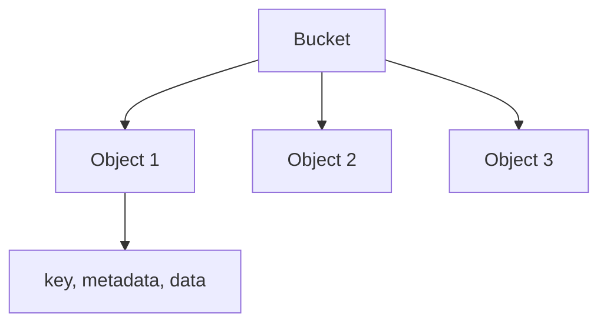

# Object Storage (Deep Dive)

📄 File: `book/05_data_storage_lakehouse/object_storage.md`

This chapter covers **object storage** — S3, GCS, Azure Blob. Foundation for data lakes and AI training data.

---

## Study Plan (2 days)

* Day 1: Concepts, S3 API
* Day 2: Lifecycle, versioning, exercises

---

## 1 — What is Object Storage?

* **Flat** namespace (no hierarchy like file system)
* **Key** = path-like identifier (e.g., `bucket/path/to/file.parquet`)
* **Immutable** objects (overwrite = new version)
* **Cheap**, durable, scalable



---

## 2 — S3 Basics (Python)

```python
import boto3

# Create client; region for endpoint
s3 = boto3.client("s3", region_name="us-east-1")

# Upload file
# Bucket: container; Key: object path; Body: bytes or file
s3.put_object(Bucket="my-bucket", Key="data/events.parquet", Body=open("events.parquet", "rb").read())

# Download
# get_object returns stream; read() gets bytes
obj = s3.get_object(Bucket="my-bucket", Key="data/events.parquet")
data = obj["Body"].read()

# List objects with prefix
# Prefix = filter by path
resp = s3.list_objects_v2(Bucket="my-bucket", Prefix="data/")
for item in resp.get("Contents", []):
    print(item["Key"])
```

---

## 3 — Partitioning in Object Storage

```
s3://bucket/events/
  date=2025-01-01/
    part-00000.parquet
    part-00001.parquet
  date=2025-01-02/
    part-00000.parquet
```

* Query engines (Spark, DuckDB) **prune** by partition
* Read only `date=2025-01-01` → skip other dates

---

## 4 — Lifecycle Policies

* **Transition**: Move to Glacier after 30 days
* **Expiration**: Delete after 90 days
* Reduces cost for cold data

---

## 5 — Why Object Storage for AI?

* **Training data**: Petabyte-scale, cheap
* **Checkpoints**: Model weights, intermediate state
* **Data lake**: Raw + processed layers

---

## Interview Questions

1. Object storage vs block storage?
2. How does partition pruning work?
3. S3 consistency model?

---

## Key Takeaways

* Object storage = flat, immutable, cheap
* Partition by date/key for pruning
* Lifecycle for cost optimization

---

## Next Chapter

Proceed to: **delta_lake.md**
