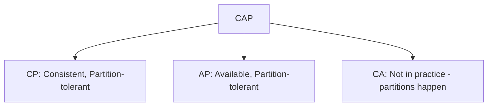

# CAP Theorem

📄 File: `book/06_distributed_systems/cap_theorem.md`

This chapter covers the **CAP theorem** — Consistency, Availability, Partition tolerance. Foundation for distributed system design.

---

## Study Plan (1–2 days)

* Day 1: CAP explained
* Day 2: PACELC, real systems

---

## 1 — The Theorem

In a distributed system, you can have at most **2 of 3**:

* **C**onsistency: Every read gets the latest write
* **A**vailability: Every request gets a response
* **P**artition tolerance: System works despite network partitions

---

## 2 — In Practice

* **Partitions happen** → P is non-negotiable
* Choice: **CP** (e.g., ZooKeeper, etcd) vs **AP** (e.g., Cassandra, DynamoDB)

---

## 3 — PACELC Extension

When **no partition**: trade-off between **L**atency and **C**onsistency.

---

## 4 — AI Data Engineering

* **Training**: Often CP (consistency for checkpointing)
* **Serving**: Often AP (availability over strict consistency)
* **Feature stores**: Depends on use case

---

## Key Takeaways

* CAP: pick 2 of 3; P is usually required
* CP: strong consistency, may sacrifice availability
* AP: always respond, may return stale data

---

## Next Chapter

Proceed to: **replication.md**
