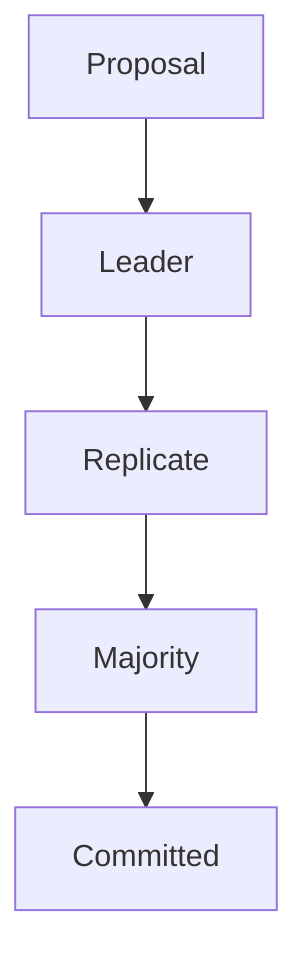

# Consensus: Raft (Deep Dive)

📄 File: `book/06_distributed_systems/consensus_raft.md`

This chapter covers **Raft** — consensus algorithm for replicated logs. Used by etcd, Consul, TiKV.

---

## Study Plan (2–3 days)

* Day 1: Consensus problem
* Day 2: Raft roles, leader election
* Day 3: Log replication

---

## 1 — Consensus Problem

* Multiple nodes must **agree** on a value
* Despite failures, network partitions
* **Paxos** (complex), **Raft** (understandable)

---

## 2 — Raft Roles

| Role | Responsibility |
| ---- | -------------- |
| **Leader** | Handle client requests, replicate log |
| **Follower** | Replicate from leader, vote in elections |
| **Candidate** | Seek votes to become leader |

---

## 3 — Leader Election

* **Heartbeat**: Leader sends heartbeats
* **Timeout**: Follower doesn't receive → become candidate
* **Vote**: Majority votes → become leader

---

## 4 — Log Replication

* Leader appends entry to log
* Replicates to followers
* **Committed** when majority have it

---

## 5 — Why Raft for AI?

* **Distributed training**: Coordinator consensus
* **Feature store**: Metadata consistency
* **Model registry**: Version agreement

---

## Interview Questions

1. Raft vs Paxos?
2. What happens when leader fails?
3. Log compaction?

---

## Key Takeaways

* Raft = leader election + log replication
* Majority for commitment
* Used by etcd, Consul

---

## Next Chapter

Proceed to: **distributed_logs.md**
