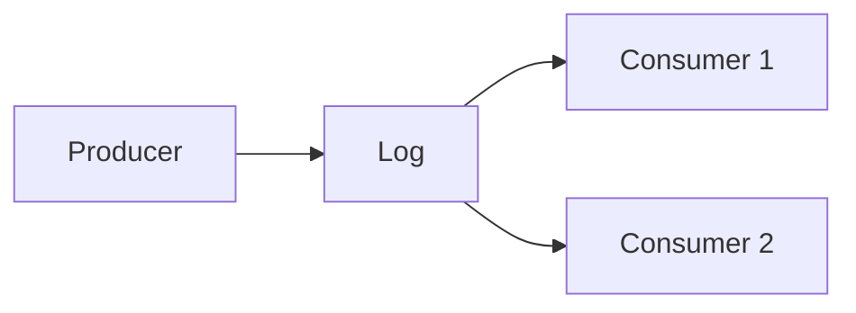

# Distributed Logs (Deep Dive)

📄 File: `book/06_distributed_systems/distributed_logs.md`

This chapter covers **distributed logs** — append-only, ordered, replicated. Kafka, Kinesis, Pulsar.

---

## Study Plan (2 days)

* Day 1: Log structure, Kafka
* Day 2: Ordering, retention

---

## 1 — What is a Distributed Log?

* **Append-only** sequence of records
* **Ordered** within partition
* **Replicated** for durability
* **Consumers** read at their own pace

---

## 2 — Partition = Ordering Guarantee

* Order **within** partition only
* Same key → same partition (Kafka)
* Parallelism = number of partitions

---

## 3 — Retention

* **Time-based**: Delete after 7 days
* **Size-based**: Delete oldest when limit reached
* **Compaction**: Keep latest per key (Kafka)

---

## 4 — Why Distributed Logs for AI?

* **Event sourcing**: Replay for training
* **CDC**: Sync DB to lake
* **Stream processing**: Source for Flink, Spark

---

## Interview Questions

1. Log vs queue?
2. How does partitioning affect ordering?
3. Compaction — when to use?

---

## Key Takeaways

* Log = append-only, ordered
* Partition = parallelism + ordering scope
* Retention, compaction for storage

---

## Next Chapter

Proceed to: **scaling_patterns.md**
