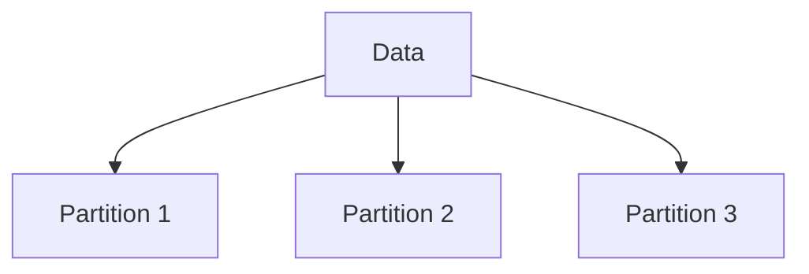

# Partitioning (Deep Dive)

📄 File: `book/06_distributed_systems/partitioning.md`

This chapter covers **partitioning** — splitting data across nodes. Enables horizontal scaling.

---

## Study Plan (2 days)

* Day 1: Partition strategies
* Day 2: Rebalancing, hotspots

---

## 1 — Why Partition?

* **Scale**: Data larger than one node
* **Parallelism**: Process partitions in parallel
* **Isolation**: Failure in one partition



---

## 2 — Partition Strategies

| Strategy | How | Example |
| -------- | --- | ------- |
| **Range** | By key range | A-M, N-Z |
| **Hash** | hash(key) % N | user_id % 10 |
| **Consistent hash** | Ring, minimal movement | Kafka, DynamoDB |

---

## 3 — Hash Partitioning

```python
# Partition key: user_id
# N = number of partitions
partition = hash(user_id) % N
```

* **Pros**: Even distribution
* **Cons**: Range queries need all partitions

---

## 4 — Hotspots

* **Skewed keys**: One partition gets most traffic
* **Solution**: Add salt to key, or use composite key

```mermaid
flowchart LR
    A[Key "celebrity"] --> B[Hot Partition]
    C[Other keys] --> D[Cold Partitions]
```

---

## 5 — Rebalancing

* Add/remove nodes → redistribute partitions
* **Consistent hashing**: Minimal data movement
* **Fixed partitioning**: Full rebalance

---

## 6 — Why Partitioning for AI?

* **Training**: Shard data across workers
* **Inference**: Partition model replicas
* **Vector DB**: Partition by embedding space

---

## Interview Questions

1. Hash vs range partitioning?
2. How to avoid hotspots?
3. Consistent hashing — how does it work?

---

## Key Takeaways

* Partition = split data across nodes
* Hash for even distribution
* Hotspots = skew; salt or composite key

---

## Next Chapter

Proceed to: **consensus_raft.md**
