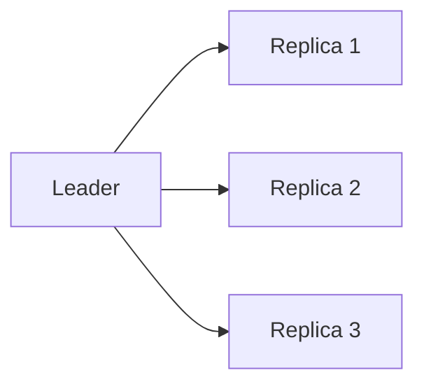
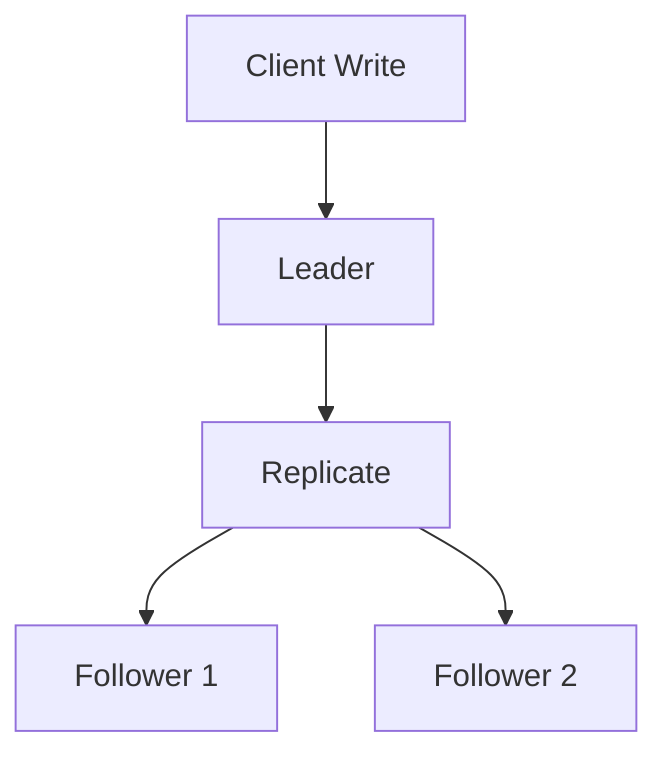

# Replication (Deep Dive)

📄 File: `book/06_distributed_systems/replication.md`

This chapter covers **replication** — copying data across nodes for availability and durability. Foundation for distributed systems.

---

## Study Plan (2 days)

* Day 1: Sync vs async, consistency
* Day 2: Leader-based, multi-leader

---

## 1 — Why Replicate?

* **Availability**: Survive node failure
* **Durability**: Multiple copies
* **Latency**: Read from nearby replica

---

## 2 — Synchronous vs Asynchronous

| Sync | Async |
| ---- | ----- |
| Wait for all replicas | Return after leader |
| Strong consistency | Eventually consistent |
| Higher latency | Lower latency |

---

## 3 — Leader-Based Replication

* **Leader**: Handles writes
* **Followers**: Replicate from leader
* **Read replica**: Scale reads

---

## 4 — Replication Lag

* Async replication → followers **behind** leader
* **Read your writes**: Read from leader after write
* **Monotonic reads**: Same replica for session

---

## 5 — Why Replication for AI?

* **Training**: Replicate checkpoints across nodes
* **Serving**: Read replicas for inference
* **Feature store**: Replicate for low latency

---

## Interview Questions

1. Sync vs async replication?
2. How to handle replication lag?
3. Multi-leader — when to use?

---

## Key Takeaways

* Replication = copies for availability
* Leader-based = single write path
* Lag → consistency trade-offs

---

## Next Chapter

Proceed to: **partitioning.md**
