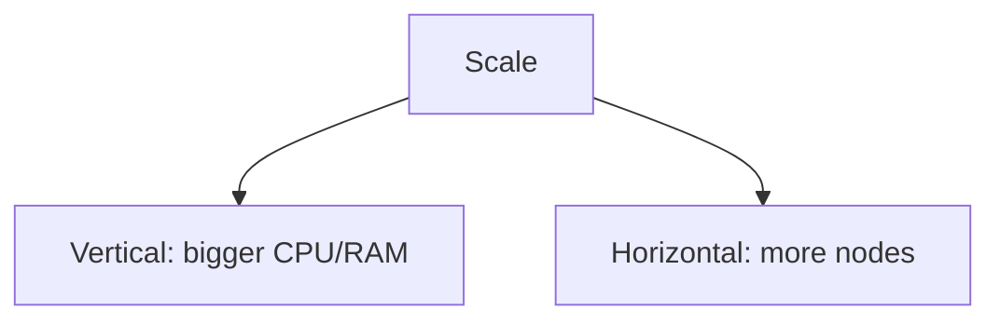

# Scaling Patterns (Deep Dive)

📄 File: `book/06_distributed_systems/scaling_patterns.md`

This chapter covers **scaling patterns** — vertical, horizontal, sharding. Essential for designing scalable AI systems.

---

## Study Plan (2 days)

* Day 1: Vertical vs horizontal
* Day 2: Caching, async, queues

---

## 1 — Vertical vs Horizontal

| Vertical | Horizontal |
| -------- | ---------- |
| Bigger machine | More machines |
| Limited by hardware | Scale out |
| Simpler | More complex |

---

## 2 — Stateless Services

* No local state → any node can handle request
* State in DB, cache, or external store
* Enables horizontal scaling

---

## 3 — Caching

* **Read-through**: Cache on read
* **Write-through**: Update cache on write
* **Cache-aside**: App manages cache
* Reduces load on DB

---

## 4 — Async Processing

* **Queue**: Decouple producer/consumer
* **Event-driven**: React to events
* Smooth spikes, scale consumers independently

---

## 5 — Database Sharding

* Partition data across DB instances
* **Shard key**: Determines partition
* **Cross-shard queries**: Expensive

---

## 6 — Why Scaling for AI?

* **Training**: Scale workers (data parallel)
* **Inference**: Scale replicas
* **Embedding**: Batch + scale workers

---

## Interview Questions

1. Vertical vs horizontal — when?
2. How to scale a read-heavy service?
3. Sharding strategies?

---

## Key Takeaways

* Horizontal = more machines
* Stateless, cache, async
* Sharding for DB scale

---

## Next Chapter

You've completed **Distributed Systems**. Proceed to: **07_machine_learning_foundations**
