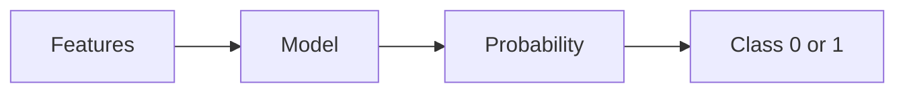
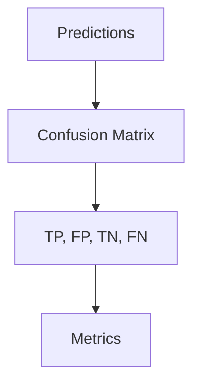

# Classification (Deep Dive)

📄 File: `book/07_machine_learning_foundations/classification.md`

This chapter covers **classification** — predicting discrete labels. Logistic regression, decision trees, metrics.

---

## Study Plan (1 week)

* Day 1–2: Logistic regression
* Day 3–4: Decision trees, metrics
* Day 5–6: Imbalanced data
* Day 7: Exercises

---

## 1 — What is Classification?

Predict **category** (e.g., spam/not spam, 0/1). Output is probability or class.



---

## 2 — Logistic Regression

```python
import numpy as np

def sigmoid(z):
    # Squash to (0, 1); 1 / (1 + e^(-z))
    return 1 / (1 + np.exp(-z))

def predict_proba(X, w, b):
    # Linear combination
    z = np.dot(X, w) + b
    # Probability of class 1
    return sigmoid(z)

def predict(X, w, b, threshold=0.5):
    # Class 1 if prob > 0.5, else 0
    proba = predict_proba(X, w, b)
    return (proba >= threshold).astype(int)
```

---

## 3 — Cross-Entropy Loss

```python
def cross_entropy(y_true, y_pred):
    # -sum(y*log(p) + (1-y)*log(1-p))
    # Clip to avoid log(0)
    y_pred = np.clip(y_pred, 1e-7, 1 - 1e-7)
    return -np.mean(y_true * np.log(y_pred) + (1 - y_true) * np.log(1 - y_pred))
```

---

## 4 — Metrics

| Metric | Formula | Use |
| ------ | ------- | --- |
| **Accuracy** | (TP+TN)/total | Balanced data |
| **Precision** | TP/(TP+FP) | Minimize false positives |
| **Recall** | TP/(TP+FN) | Minimize false negatives |
| **F1** | 2*P*R/(P+R) | Balance P and R |



---

## 5 — Why Classification for AI Data Engineering?

* **Data labeling**: Quality classification
* **Anomaly detection**: Binary (normal/anomaly)
* **Routing**: Classify request type

---

## Interview Questions

1. Precision vs recall — when to optimize which?
2. ROC-AUC — what does it measure?
3. How to handle imbalanced classes?

---

## Key Takeaways

* Classification = discrete output
* Logistic regression = sigmoid + cross-entropy
* Choose metric by business goal

---

## Next Chapter

Proceed to: **clustering.md**
