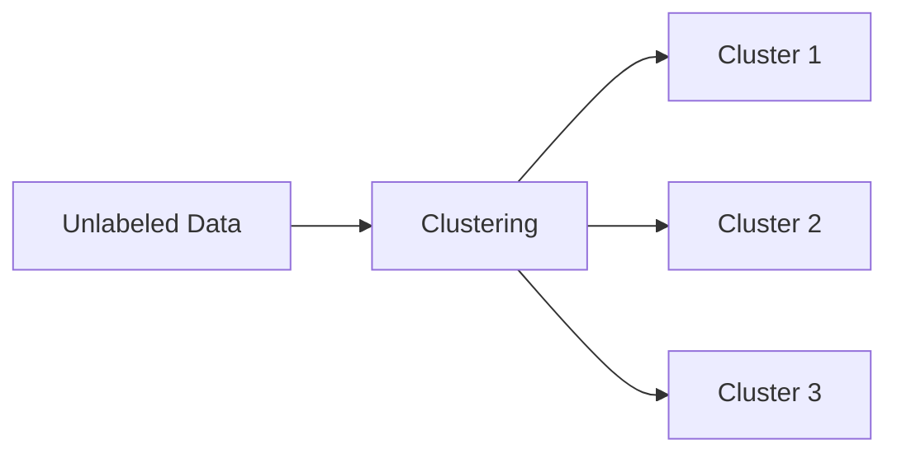
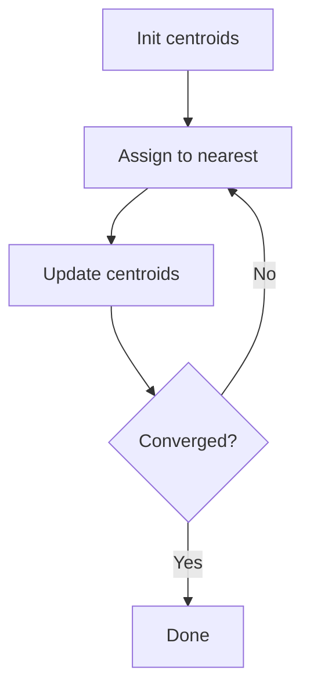

# Clustering (Deep Dive)

📄 File: `book/07_machine_learning_foundations/clustering.md`

This chapter covers **clustering** — unsupervised grouping. K-means, hierarchical, use cases.

---

## Study Plan (3–4 days)

* Day 1–2: K-means
* Day 3: Hierarchical, DBSCAN
* Day 4: Exercises

---

## 1 — What is Clustering?

Group **unlabeled** data by similarity. No target variable.



---

## 2 — K-Means

```python
import numpy as np

def kmeans(X, k, max_iters=100):
    # Initialize centroids randomly from data points
    centroids = X[np.random.choice(len(X), k, replace=False)]
    for _ in range(max_iters):
        # Assign each point to nearest centroid
        # distances: (n, k) - distance from each point to each centroid
        distances = np.linalg.norm(X[:, np.newaxis] - centroids, axis=2)
        labels = np.argmin(distances, axis=1)
        # Update centroids: mean of points in each cluster
        new_centroids = np.array([X[labels == i].mean(axis=0) for i in range(k)])
        if np.allclose(centroids, new_centroids):
            break
        centroids = new_centroids
    return labels, centroids
```

---

## Diagram — K-Means Iteration



---

## 3 — Choosing K

* **Elbow method**: Plot inertia vs K; look for elbow
* **Silhouette score**: Measure cohesion vs separation
* **Domain knowledge**: Known number of segments

---

## 4 — Why Clustering for AI Data Engineering?

* **Customer segmentation**: Group users
* **Anomaly detection**: Outliers = small clusters
* **Data exploration**: Understand structure

---

## Interview Questions

1. K-means assumptions?
2. How to choose K?
3. K-means vs hierarchical?

---

## Key Takeaways

* Clustering = unsupervised grouping
* K-means = iterative centroid update
* Choose K by elbow or silhouette

---

## Next Chapter

Proceed to: **model_evaluation.md**
