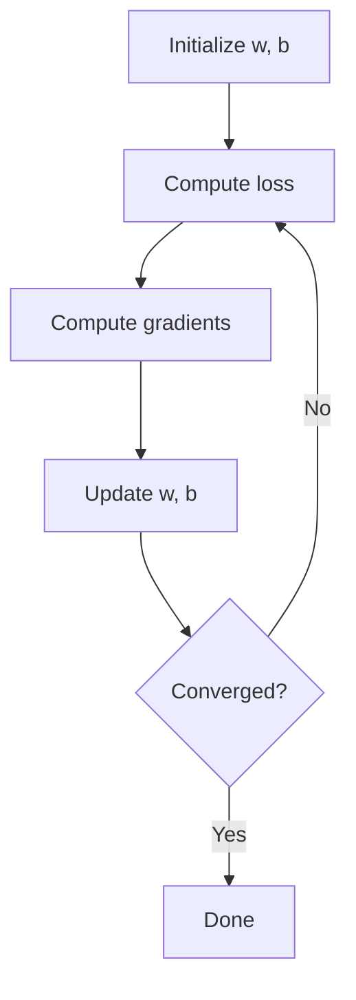

# Linear Regression (Deep Dive)

📄 File: `book/07_machine_learning_foundations/linear_regression.md`

This chapter covers **linear regression** — the foundation of supervised learning. Essential for understanding gradients and loss.

---

## Study Plan (3–4 days)

* Day 1: Simple linear regression
* Day 2: Multiple regression, gradient descent
* Day 3: Normal equation, regularization
* Day 4: Exercises

---

## 1 — What is Linear Regression?

Predict **continuous** output from input features. Model: \( y = w_1 x_1 + w_2 x_2 + ... + b \)


---

## 2 — Simple Linear Regression (1 feature)

```python
# y = w*x + b
# w = weight (slope), b = bias (intercept)

def predict(x, w, b):
    # Each x multiplied by w, add b
    return w * x + b

# Example: w=2, b=1
# predict(3, 2, 1) = 2*3 + 1 = 7
```

---

## 3 — Loss (MSE)

```python
def mse(y_true, y_pred):
    # Mean Squared Error: average of (actual - predicted)^2
    return ((y_true - y_pred) ** 2).mean()

# Example
y_true = [1, 2, 3]
y_pred = [1.1, 2.2, 2.8]
loss = mse(np.array(y_true), np.array(y_pred))
```

---

## 4 — Gradient Descent

```python
def gradient_descent(X, y, lr=0.01, epochs=100):
    n = len(X)
    w, b = 0.0, 0.0
    for _ in range(epochs):
        y_pred = w * X + b
        # Gradient of MSE w.r.t. w: -2/n * sum((y - y_pred) * x)
        dw = -2/n * np.sum((y - y_pred) * X)
        # Gradient w.r.t. b: -2/n * sum(y - y_pred)
        db = -2/n * np.sum(y - y_pred)
        w -= lr * dw  # Update w
        b -= lr * db  # Update b
    return w, b
```

---

## Diagram — Gradient Descent



---

## 5 — Why Linear Regression for AI Data Engineering?

* **Baseline**: Simple model for feature importance
* **Understanding**: Foundation for neural nets
* **Monitoring**: Drift in coefficients

---

## Interview Questions

1. MSE vs MAE?
2. What is gradient descent?
3. Normal equation vs gradient descent?

---

## Key Takeaways

* Linear regression = linear combination of features
* MSE = common loss
* Gradient descent = iterative optimization

---

## Next Chapter

Proceed to: **classification.md**
