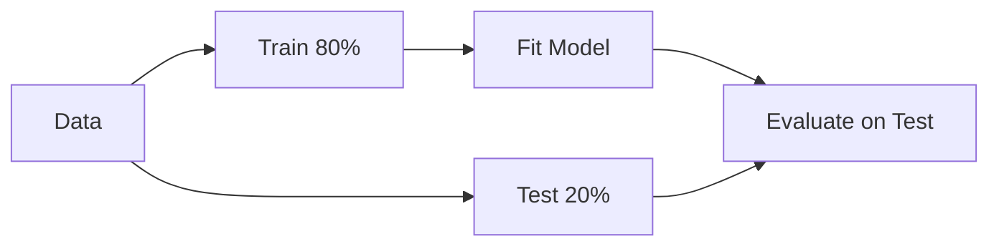

# Model Evaluation (Deep Dive)

📄 File: `book/07_machine_learning_foundations/model_evaluation.md`

This chapter covers **model evaluation** — train/test split, cross-validation, metrics. Critical for reliable ML.

---

## Study Plan (2–3 days)

* Day 1: Train/test, overfitting
* Day 2: Cross-validation
* Day 3: Metrics, baselines

---

## 1 — Train/Test Split

```python
from sklearn.model_selection import train_test_split

# Split: 80% train, 20% test
# random_state for reproducibility
X_train, X_test, y_train, y_test = train_test_split(
    X, y, test_size=0.2, random_state=42
)

# Fit on train only
model.fit(X_train, y_train)

# Evaluate on test (unseen data)
score = model.score(X_test, y_test)
```

---

## Diagram — Train/Test Flow



---

## 2 — Overfitting vs Underfitting

| Overfitting | Underfitting |
| ----------- | ------------ |
| Train high, test low | Train low, test low |
| Too complex | Too simple |
| Regularize, more data | More features, complex model |

---

## 3 — Cross-Validation

```python
from sklearn.model_selection import cross_val_score

# 5-fold: split into 5, train on 4, test on 1, rotate
scores = cross_val_score(model, X, y, cv=5)

# Mean and std of scores
print(scores.mean(), scores.std())
```

---

## 4 — Stratified Split

* For classification: preserve class distribution in train/test
* `stratify=y` in train_test_split

---

## 5 — Why Evaluation for AI Data Engineering?

* **Pipeline validation**: Ensure model works before deploy
* **A/B tests**: Compare models
* **Monitoring**: Track metrics over time

---

## Interview Questions

1. Why not train and test on same data?
2. K-fold vs holdout?
3. How to detect overfitting?

---

## Key Takeaways

* Always hold out test set
* Cross-validation for robust estimate
* Stratify for classification

---

## Next Chapter

Proceed to: **pca_dimensionality_reduction.md**
