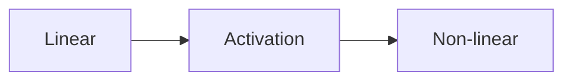
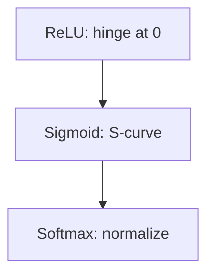

# Activation Functions (Deep Dive)

📄 File: `book/08_deep_learning/activation_functions.md`

This chapter covers **activation functions** — non-linearity in neural networks. ReLU, Sigmoid, Softmax, and when to use each.

---

## Study Plan (2 days)

* Day 1: ReLU, Sigmoid, Tanh
* Day 2: Softmax, GELU, choices

---

## 1 — Why Activation Functions?

Without activation, stacked linear layers = single linear layer. **Non-linearity** enables learning complex patterns.



---

## 2 — ReLU (Rectified Linear Unit)

\[ f(x) = \max(0, x) \]

* **Gradient**: 1 if x>0, 0 if x<0
* **Dead ReLU**: Neurons stuck at 0 (learning rate too high)
* **Default** for hidden layers

```python
def relu(x):
    # Max of 0 and x; negative → 0
    return np.maximum(0, x)

def relu_derivative(x):
    # 1 where x>0, 0 elsewhere
    return (x > 0).astype(float)
```

---

## 3 — Sigmoid

\[ f(x) = \frac{1}{1 + e^{-x}} \]

* Output in (0, 1) — probability
* **Vanishing gradient** for |x| large
* Use for **binary classification** output

```python
def sigmoid(x):
    # 1 / (1 + exp(-x))
    return 1 / (1 + np.exp(-np.clip(x, -500, 500)))
```

---

## 4 — Softmax (Multi-class Output)

\[ \text{softmax}(x_i) = \frac{e^{x_i}}{\sum_j e^{x_j}} \]

* Outputs sum to 1 — probability distribution
* Use for **multi-class** output

```python
def softmax(x):
    # Subtract max for numerical stability
    exp_x = np.exp(x - np.max(x))
    return exp_x / exp_x.sum()
```

---

## 5 — Comparison

| Function | Range | Use |
| -------- | ----- | --- |
| ReLU | [0, ∞) | Hidden layers |
| Sigmoid | (0, 1) | Binary output |
| Tanh | (-1, 1) | Hidden (less common now) |
| Softmax | (0, 1), sum=1 | Multi-class output |

---

## Diagram — Activation Shapes



---

## Interview Questions

1. Why ReLU over Sigmoid for hidden?
2. Vanishing gradient in Sigmoid?
3. Softmax for multi-class?

---

## Key Takeaways

* Activation = non-linearity
* ReLU = default hidden
* Sigmoid/Softmax = output layer

---

## Next Chapter

Proceed to: **normalization.md**
