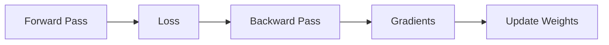
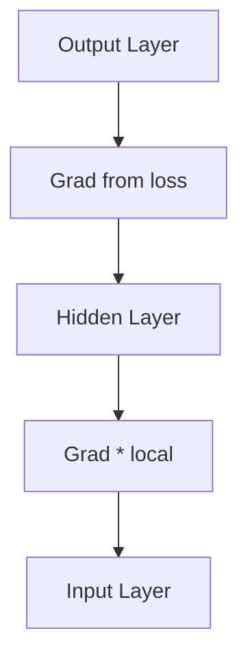

# Backpropagation (Deep Dive)

📄 File: `book/08_deep_learning/backpropagation.md`

This chapter covers **backpropagation** — how neural networks learn. The algorithm that enables gradient flow through layers.

---

## Study Plan (3–4 days)

* Day 1: Chain rule, gradients
* Day 2: Backward pass through layers
* Day 3: PyTorch autograd
* Day 4: Exercises

---

## 1 — What is Backpropagation?

**Backprop** = compute gradients of loss w.r.t. all parameters using the **chain rule**. Enables gradient descent.



---

## 2 — Chain Rule

If \( L = f(g(x)) \), then:
\[ \frac{dL}{dx} = \frac{dL}{df} \cdot \frac{df}{dg} \cdot \frac{dg}{dx} \]

* Each layer multiplies gradient from above by its local gradient
* Gradients flow **backward** from output to input

---

## 3 — Simple Example (Single Neuron)

```python
import numpy as np

# Forward: y = w*x + b, loss = (y - target)^2
def forward(x, w, b, target):
    z = w * x + b       # Linear
    loss = (z - target) ** 2  # MSE
    return z, loss

# Backward: dL/dw, dL/db
# dL/dz = 2*(z - target)
# dz/dw = x, dz/db = 1
# dL/dw = dL/dz * dz/dw = 2*(z-target)*x
# dL/db = dL/dz * dz/db = 2*(z-target)
def backward(x, z, target):
    dL_dz = 2 * (z - target)
    dL_dw = dL_dz * x
    dL_db = dL_dz * 1
    return dL_dw, dL_db
```

---

## 4 — Backward Through Layers



* Each layer receives **upstream gradient** (from layer above)
* Multiplies by **local gradient** (derivative of its operation)
* Passes **downstream** to layer below

---

## 5 — PyTorch Autograd

```python
import torch

# Requires grad: track operations for backprop
x = torch.tensor([1.0, 2.0, 3.0], requires_grad=True)
w = torch.tensor([0.5, 0.5, 0.5], requires_grad=True)

# Forward
y = (x * w).sum()

# Backward: compute all gradients
y.backward()

# Gradients stored in .grad
print(w.grad)  # d(y)/dw
```

---

## 6 — Why Backprop for AI Data Engineering?

* **Understanding**: How models learn
* **Debugging**: Gradient flow, vanishing gradients
* **Custom layers**: Implement backward

---

## Interview Questions

1. What is the chain rule?
2. Vanishing gradient — cause and fix?
3. How does PyTorch autograd work?

---

## Key Takeaways

* Backprop = chain rule through computation graph
* Gradients flow backward
* Autograd automates this

---

## Next Chapter

Proceed to: **activation_functions.md**
