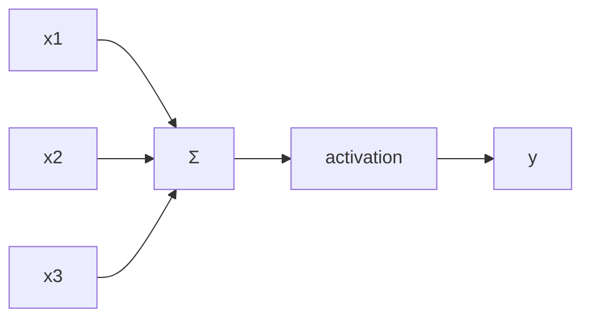
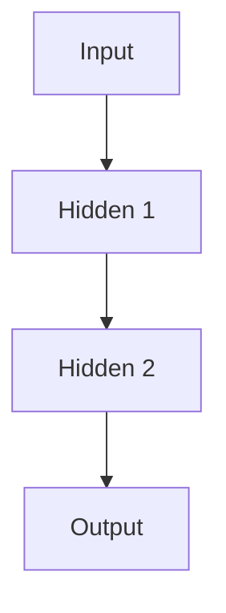

# Neural Networks (Deep Dive)

📄 File: `book/08_deep_learning/neural_networks.md`

This chapter covers **neural networks** — layers, forward pass, loss. Foundation for all deep learning and LLM understanding.

---

## Study Plan (1 week)

* Day 1–2: Perceptron, MLP
* Day 3–4: Forward pass, activation functions
* Day 5–6: Loss, backprop (next chapter)
* Day 7: PyTorch implementation

---

## 1 — Perceptron (Single Neuron)

A neuron: **weighted sum + activation**

```python
# y = activation(w1*x1 + w2*x2 + b)
def perceptron(x, w, b):
    z = sum(xi * wi for xi, wi in zip(x, w)) + b
    return 1 if z > 0 else 0  # step activation
```

---

## Diagram — Single Neuron



---

## 2 — Multi-Layer Perceptron (MLP)

* **Input layer**: raw features
* **Hidden layers**: learned representations
* **Output layer**: predictions



---

## 3 — Forward Pass

```python
def forward(x, weights, biases):
    for w, b in zip(weights, biases):
        x = np.dot(x, w) + b
        x = relu(x)  # activation
    return x
```

---

## 4 — Activation Functions

* **ReLU**: max(0, x) — most common
* **Sigmoid**: 1/(1+e^-x) — for probability
* **Softmax**: for multi-class output

---

## 5 — Loss Functions

* **MSE**: regression
* **Cross-entropy**: classification

---

## Key Takeaways

* Neuron = weighted sum + activation
* MLP = stacked layers
* Forward pass: input → hidden → output

---

## Next Chapter

Proceed to: **backpropagation.md**
