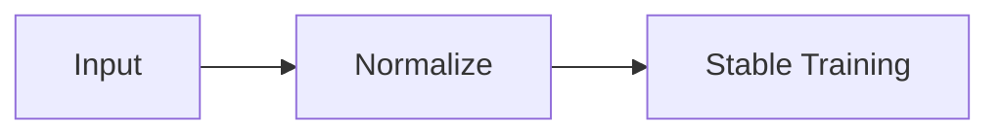

# Normalization (Deep Dive)

📄 File: `book/08_deep_learning/normalization.md`

This chapter covers **normalization** — BatchNorm, LayerNorm. Stabilizes training and enables deeper networks.

---

## Study Plan (2–3 days)

* Day 1: Why normalize, BatchNorm
* Day 2: LayerNorm, RMSNorm
* Day 3: Use in Transformers

---

## 1 — Why Normalize?

* **Internal covariate shift**: Distribution changes across layers
* **Stable gradients**: Normalized inputs → better gradient flow
* **Faster convergence**: Allows higher learning rate



---

## 2 — Batch Normalization (BatchNorm)

* Normalize **across batch** for each channel
* Learn scale (γ) and shift (β)

```python
def batch_norm(x, gamma, beta, eps=1e-5):
    # x: (batch, channels, ...)
    # Mean and var over batch (and spatial dims)
    mean = x.mean(axis=(0, 2, 3), keepdims=True)
    var = x.var(axis=(0, 2, 3), keepdims=True) + eps
    # Normalize
    x_norm = (x - mean) / np.sqrt(var)
    # Scale and shift (learnable)
    return gamma * x_norm + beta
```

---

## 3 — Layer Normalization (LayerNorm)

* Normalize **across features** for each sample
* Used in **Transformers** (sequence length varies)

```python
def layer_norm(x, gamma, beta, eps=1e-5):
    # x: (batch, seq, hidden)
    # Mean and var over last dim (features)
    mean = x.mean(axis=-1, keepdims=True)
    var = x.var(axis=-1, keepdims=True) + eps
    x_norm = (x - mean) / np.sqrt(var)
    return gamma * x_norm + beta
```

---

## 4 — BatchNorm vs LayerNorm

| | BatchNorm | LayerNorm |
|---|-----------|-----------|
| **Normalize over** | Batch | Features |
| **Sensitive to** | Batch size | Sequence length |
| **Use in** | CNNs | Transformers |

---

## 5 — RMSNorm (Simpler)

* No mean subtraction, only scale by RMS
* Used in LLaMA, simpler than LayerNorm

---

## Interview Questions

1. BatchNorm vs LayerNorm?
2. Why LayerNorm in Transformers?
3. What is internal covariate shift?

---

## Key Takeaways

* Normalization stabilizes training
* BatchNorm = over batch; LayerNorm = over features
* Transformers use LayerNorm

---

## Next Chapter

Proceed to: **training_loops.md**
