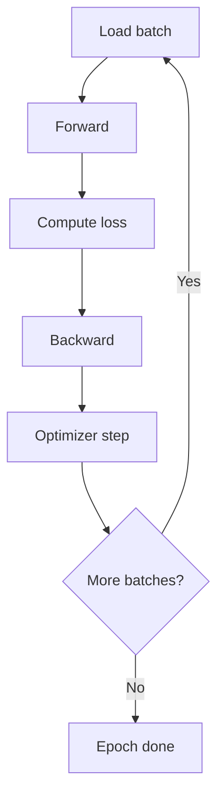

# Training Loops (Deep Dive)

📄 File: `book/08_deep_learning/training_loops.md`

This chapter covers **training loops** — the core of model training. Forward, loss, backward, optimizer step.

---

## Study Plan (2–3 days)

* Day 1: Basic loop structure
* Day 2: Optimizers, learning rate
* Day 3: Batching, validation

---

## 1 — Training Loop Structure



---

## 2 — PyTorch Training Loop

```python
import torch
import torch.nn as nn

model = nn.Linear(10, 1)
optimizer = torch.optim.Adam(model.parameters(), lr=1e-3)
criterion = nn.MSELoss()

for epoch in range(100):
    model.train()  # Set to training mode (e.g., BatchNorm)
    for x_batch, y_batch in dataloader:
        optimizer.zero_grad()   # Clear previous gradients
        y_pred = model(x_batch) # Forward pass
        loss = criterion(y_pred, y_batch)  # Compute loss
        loss.backward()        # Backprop
        optimizer.step()       # Update weights
```

---

## 3 — Key Steps (Line-by-Line)

```python
# zero_grad: gradients accumulate by default; must clear
optimizer.zero_grad()

# forward: compute predictions
y_pred = model(x)

# loss: scalar value for backprop
loss = criterion(y_pred, y)

# backward: compute gradients for all parameters
loss.backward()

# step: apply gradients to update weights
optimizer.step()
```

---

## 4 — Validation Loop

```python
model.eval()  # Eval mode (e.g., BatchNorm uses running stats)
with torch.no_grad():  # No gradient computation
    for x, y in val_loader:
        y_pred = model(x)
        val_loss = criterion(y_pred, y)
```

---

## 5 — Optimizers

| Optimizer | Notes |
| --------- | ----- |
| **SGD** | Simple, momentum helps |
| **Adam** | Adaptive lr, default choice |
| **AdamW** | Weight decay fix |

---

## 6 — Learning Rate Schedule

```python
scheduler = torch.optim.lr_scheduler.CosineAnnealingLR(optimizer, T_max=100)
# After each epoch
scheduler.step()
```

---

## Interview Questions

1. Why zero_grad before backward?
2. train() vs eval()?
3. Adam vs SGD?

---

## Key Takeaways

* Loop: forward → loss → backward → step
* zero_grad each iteration
* eval() and no_grad for validation

---

## Next Chapter

Proceed to: **pytorch_basics.md**
