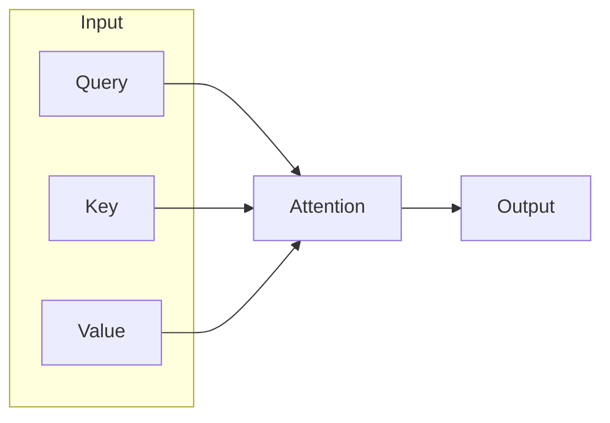
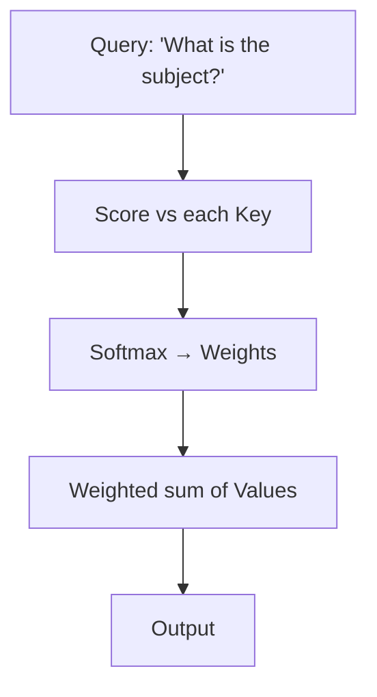
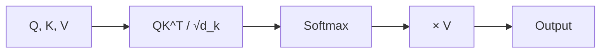
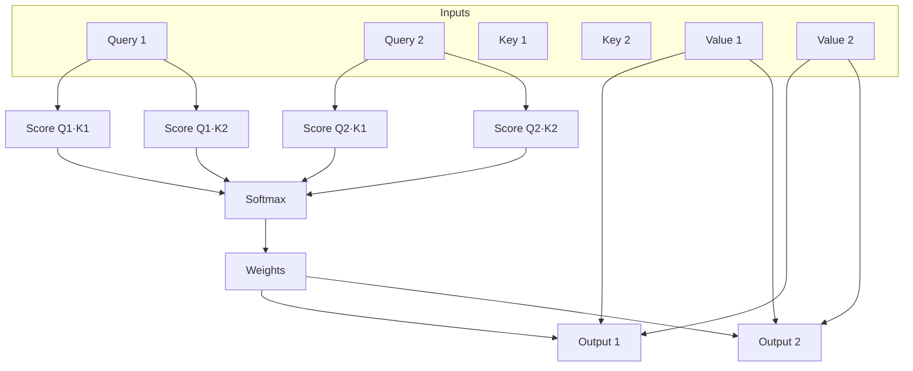

# Attention Mechanism

📄 File: `book/09_transformers_llm_core/attention_mechanism.md`

This chapter covers the **attention mechanism** — the core innovation that enables transformers to model long-range dependencies. Foundation for understanding LLMs.

---

## Study Plan (2–3 days)

* Day 1: Intuition + query-key-value
* Day 2: Scaled dot-product attention math
* Day 3: Code implementation + exercises

---

## 1 — What is Attention?

Attention lets a model **focus on relevant parts of the input** when producing each output token.

* **Query (Q)**: "What am I looking for?"
* **Key (K)**: "What do I contain?"
* **Value (V)**: "What do I output?"



---

## 2 — Intuition: Information Retrieval

Think of attention as a **soft lookup** in a dictionary:

* Query = the search term
* Keys = dictionary entries
* Values = the content to retrieve
* Attention weights = how much each entry matches the query



---

## 3 — Scaled Dot-Product Attention (Math)

$$\text{Attention}(Q, K, V) = \text{softmax}\left(\frac{QK^T}{\sqrt{d_k}}\right) V$$

* **QK^T**: similarity between query and each key
* **√d_k**: scaling factor (prevents softmax saturation)
* **Softmax**: converts scores to probabilities
* **× V**: weighted combination of values



---

## 4 — Why Scale by √d_k?

When `d_k` is large, dot products can be large → softmax gradients vanish.

```python
import numpy as np

def scaled_dot_product_attention(Q, K, V, d_k):
    """
    Q: (seq_len, d_k) - query matrix
    K: (seq_len, d_k) - key matrix
    V: (seq_len, d_v) - value matrix
    d_k: dimension of key (for scaling)
    """
    # Step 1: Compute raw attention scores (Q @ K^T)
    # Each row of Q dotted with each row of K → (seq_len, seq_len)
    scores = np.dot(Q, K.T)

    # Step 2: Scale by sqrt(d_k) to prevent large values
    # Large d_k → larger dot products → softmax saturates
    scores = scores / np.sqrt(d_k)

    # Step 3: Softmax over last dim (each query's distribution over keys)
    # exp(scores) / sum(exp(scores)) per row
    exp_scores = np.exp(scores - np.max(scores, axis=-1, keepdims=True))
    attention_weights = exp_scores / np.sum(exp_scores, axis=-1, keepdims=True)

    # Step 4: Weighted sum of values
    # (seq_len, seq_len) @ (seq_len, d_v) → (seq_len, d_v)
    output = np.dot(attention_weights, V)

    return output, attention_weights
```

---

## 5 — Diagram: Attention Flow



---

## 6 — PyTorch Implementation

```python
import torch
import torch.nn.functional as F

def attention_forward(Q, K, V, mask=None):
    """
    Q, K, V: (batch, seq_len, d_model)
    mask: optional (batch, 1, seq_len) to mask padding
    """
    # Get dimension for scaling
    d_k = Q.size(-1)

    # Compute attention scores: (batch, seq_len, seq_len)
    # Each query attends to all keys
    scores = torch.matmul(Q, K.transpose(-2, -1)) / (d_k ** 0.5)

    # Apply mask (set masked positions to -inf before softmax)
    if mask is not None:
        scores = scores.masked_fill(mask == 0, float('-inf'))

    # Softmax: probabilities over keys for each query
    attn_weights = F.softmax(scores, dim=-1)

    # Weighted sum of values: (batch, seq_len, d_model)
    output = torch.matmul(attn_weights, V)

    return output, attn_weights
```

---

## 7 — Complexity

| Operation | Complexity |
| --------- | ---------- |
| QK^T      | O(n² · d)  |
| Softmax   | O(n²)      |
| × V       | O(n² · d)  |
| **Total** | **O(n² · d)** |

Where n = sequence length, d = dimension. Quadratic in sequence length.

---

## Exercises

### 1. Manual Attention Weights

Given Q = [1, 0], K = [[1, 0], [0, 1]], compute attention weights for Q against both keys (before softmax). Assume d_k = 2.

<details>
<summary>Solution</summary>

```python
Q = np.array([1, 0])
K = np.array([[1, 0], [0, 1]])
scores = Q @ K.T  # [1, 0] — Q matches K[0] strongly
weights = np.exp(scores) / np.sum(np.exp(scores))
# ≈ [0.73, 0.27]
```
</details>

---

### 2. Causal Mask

Why do autoregressive models use a causal mask? Implement a causal mask for seq_len=4.

<details>
<summary>Solution</summary>

Causal mask prevents attending to future tokens. Position i can only attend to positions 0..i.

```python
seq_len = 4
causal_mask = np.triu(np.ones((seq_len, seq_len)), k=1)
# Upper triangle = 1 (masked). Lower triangle + diagonal = 0 (attended)
```
</details>

---

## Interview Questions (with answers)

1. **What is the purpose of scaling by √d_k?**
   Answer: Prevents dot products from growing large when d_k is large, which would cause softmax to saturate and gradients to vanish.

2. **Why is attention O(n²) in sequence length?**
   Answer: Each of n queries must compute similarity with each of n keys → n×n = n².

3. **What is the difference between self-attention and cross-attention?**
   Answer: Self-attention: Q, K, V from same source. Cross-attention: Q from one source, K/V from another (e.g., decoder attending to encoder).

---

## Key Takeaways

* Attention = soft retrieval: Query finds relevant Keys, retrieves Values
* Scaled dot-product: QK^T / √d_k → softmax → × V
* Scaling prevents softmax saturation
* Complexity: O(n² · d) — quadratic in sequence length

---

## Next Chapter

Proceed to: **tokenization.md**
