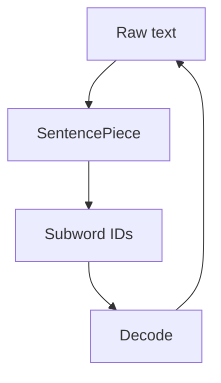
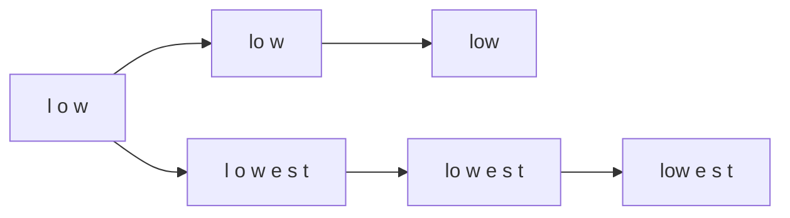

# BPE and SentencePiece

📄 File: `book/09_transformers_llm_core/bpe_sentencepiece.md`

This chapter covers **Byte Pair Encoding (BPE)** and **SentencePiece** — the dominant subword tokenization algorithms used in GPT, BERT, and most LLMs.

---

## Study Plan (2–3 days)

* Day 1: BPE algorithm
* Day 2: SentencePiece + unicode handling
* Day 3: Implementation + exercises

---

## 1 — What is BPE?

BPE iteratively **merges** the most frequent pair of adjacent tokens into a new token. Starts from characters (or bytes).


---

## 2 — BPE Algorithm Steps

1. **Initialize**: Vocabulary = characters (or bytes)
2. **Count**: Count all adjacent pairs in corpus
3. **Merge**: Merge most frequent pair; add to vocab
4. **Repeat**: Until target vocab size

```mermaid
flowchart TD
    S[Start: "low" "lowest" "newer"] --> C[Count: lo=2, ow=2, ...]
    C --> M[Merge "lo" → "lo"]
    M --> R[Repeat]
    R --> C
```

---

## 3 — BPE Example

```python
from collections import Counter, defaultdict

def get_pairs(word):
    """Get adjacent character pairs in a word."""
    pairs = set()
    for i in range(len(word) - 1):
        pairs.add((word[i], word[i + 1]))
    return pairs

def bpe_learn(corpus, num_merges=50):
    """
    Learn BPE merges from corpus.
    corpus: list of words (or pre-tokenized subwords)
    Returns: list of (pair) merges to apply in order
    """
    # Word frequencies (count duplicates)
    word_freq = Counter(corpus)
    # Start: each word as list of chars + end marker
    splits = {word: list(word) + ["</w>"] for word in word_freq}

    merges = []
    for _ in range(num_merges):
        # Count all adjacent pairs in corpus
        pair_count = Counter()
        for word, freq in word_freq.items():
            parts = splits[word]
            for i in range(len(parts) - 1):
                pair = (parts[i], parts[i + 1])
                pair_count[pair] += freq

        if not pair_count:
            break
        # Merge most frequent pair
        best_pair = pair_count.most_common(1)[0][0]
        merges.append(best_pair)
        new_token = "".join(best_pair)

        # Update splits: replace pair with new token in all words
        for word in list(splits.keys()):
            parts = splits[word]
            i = 0
            new_parts = []
            while i < len(parts):
                if i < len(parts) - 1 and (parts[i], parts[i + 1]) == best_pair:
                    new_parts.append(new_token)
                    i += 2
                else:
                    new_parts.append(parts[i])
                    i += 1
            splits[word] = new_parts

    return merges
```

---

## 4 — BPE Encoding (Apply Merges)

```python
def bpe_encode(word, merges):
    """
    Encode word using learned merges.
    Apply merges in order; each merge combines two adjacent tokens.
    """
    if not word:
        return []
    tokens = list(word) + ["</w>"]
    for merge in merges:
        i = 0
        new_tokens = []
        while i < len(tokens):
            if i < len(tokens) - 1 and (tokens[i], tokens[i + 1]) == merge:
                new_tokens.append("".join(merge))
                i += 2
            else:
                new_tokens.append(tokens[i])
                i += 1
        tokens = new_tokens
    return tokens
```

---

## 5 — SentencePiece

SentencePiece treats input as **raw Unicode** and uses a unified algorithm (BPE or unigram) with:

* **No pre-tokenization** (no space splitting)
* **Byte fallback** for unknown characters
* **Reversible** (decode recovers original)



---

## 6 — SentencePiece vs BPE

| Feature      | BPE        | SentencePiece   |
| ------------ | ---------- | --------------- |
| Input        | Pre-tokenized | Raw text      |
| Space        | Often separate token | Can be part of token |
| Unicode      | Depends on preprocess | Native handling |
| Algorithm    | Greedy merge | BPE or Unigram LM |

---

## 7 — Using SentencePiece (Python)

```python
import sentencepiece as spm

# Train a model (typically done offline)
# spm.SentencePieceTrainer.train(
#     input="corpus.txt",
#     model_prefix="m",
#     vocab_size=32000,
#     model_type="bpe"
# )

# Load and use
sp = spm.SentencePieceProcessor()
sp.load("m.model")

# Encode: text → IDs
ids = sp.encode("Hello world", out_type=int)

# Decode: IDs → text
text = sp.decode(ids)

# Get pieces (subword strings)
pieces = sp.encode("Hello world", out_type=str)
```

---

## 8 — Diagram: BPE Merge Order



---

## Exercises

### 1. Manual BPE

Given corpus ["aa", "aa", "ab"], what is the first merge? What is the second?

<details>
<summary>Solution</summary>

First: (a,a) → "aa" (count 2). Second: (a,b) → "ab" (count 1) or (aa,?) — depends on representation after first merge.
</details>

---

### 2. Vocabulary Size

Why do GPT-2 and LLaMA use ~50k vocab? What are trade-offs?

<details>
<summary>Solution</summary>

Balance: too small → long sequences; too large → rare tokens, memory. ~50k is empirical sweet spot for English-heavy text.
</details>

---

## Interview Questions (with answers)

1. **How does BPE differ from word-level tokenization?**
   Answer: BPE starts from characters, merges frequent pairs; handles OOV by subword composition.

2. **What is SentencePiece's advantage over standard BPE?**
   Answer: Works on raw text, no pre-tokenization; language-agnostic; reversible; byte fallback for any Unicode.

3. **Why use byte-level BPE (e.g., GPT-2)?**
   Answer: Handles any Unicode; no UNK token; smaller base vocab (256 bytes).

---

## Key Takeaways

* BPE: iterative merge of most frequent pairs
* SentencePiece: BPE/unigram on raw text, language-agnostic
* Byte-level BPE: 256 byte base, no UNK
* Vocab size ~32k–50k typical for LLMs

---

## Next Chapter

Proceed to: **book/10_embeddings_vector_databases/embeddings.md**
