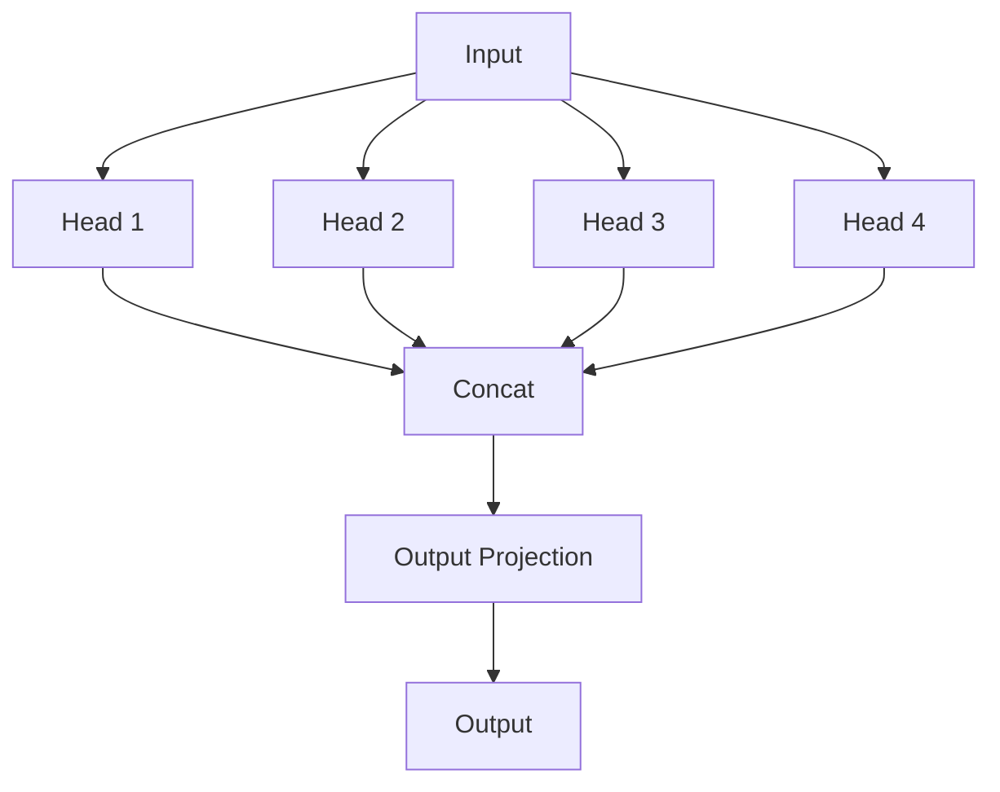
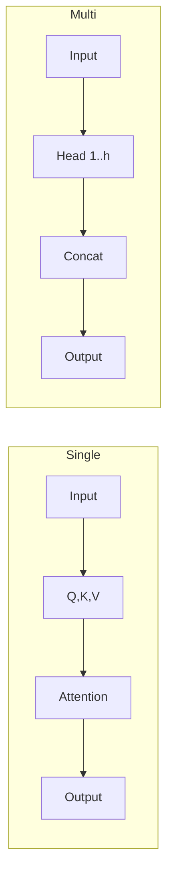
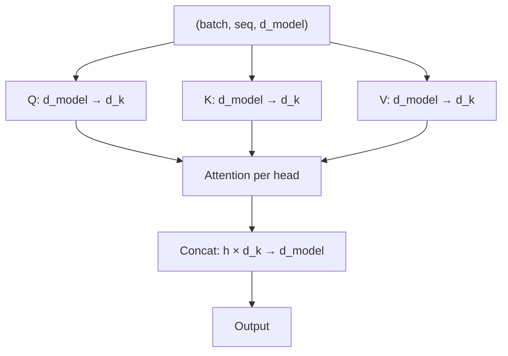
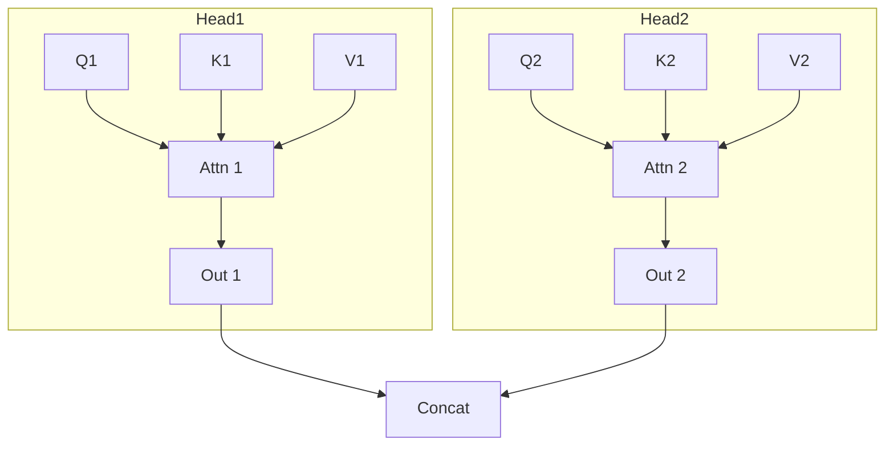

# Multi-Head Attention

📄 File: `book/09_transformers_llm_core/multi_head_attention.md`

This chapter covers **multi-head attention** — running multiple attention "heads" in parallel to capture different types of relationships. Core component of the transformer.

---

## Study Plan (2–3 days)

* Day 1: Intuition + single vs multi-head
* Day 2: Implementation with PyTorch
* Day 3: Exercises + interview prep

---

## 1 — What is Multi-Head Attention?

Instead of one attention mechanism, use **h heads** that attend in parallel. Each head can focus on different patterns (syntax, coreference, etc.).



---

## 2 — Single Head vs Multi-Head

| Single Head | Multi-Head |
| ----------- | ---------- |
| One set of Q,K,V projections | h sets, each with d_k dimensions |
| One attention pattern | h different patterns |
| d_model → d_model | d_model → h × d_k → d_model |



---

## 3 — Dimension Split

For h heads with d_model dimensions:
* Each head: d_k = d_model / h
* Q, K, V each projected to (batch, seq_len, d_k) per head
* Total params: 4 × d_model × d_model (Q, K, V, O projections)



---

## 4 — PyTorch Implementation

```python
import torch
import torch.nn as nn
import math

class MultiHeadAttention(nn.Module):
    def __init__(self, d_model, num_heads, dropout=0.1):
        super().__init__()
        assert d_model % num_heads == 0, "d_model must be divisible by num_heads"
        self.d_model = d_model
        self.num_heads = num_heads
        self.d_k = d_model // num_heads

        # Single linear layers; we split into heads in forward
        self.W_q = nn.Linear(d_model, d_model)
        self.W_k = nn.Linear(d_model, d_model)
        self.W_v = nn.Linear(d_model, d_model)
        self.W_o = nn.Linear(d_model, d_model)
        self.dropout = nn.Dropout(dropout)

    def forward(self, Q, K, V, mask=None):
        batch_size = Q.size(0)

        # Linear projections: (batch, seq, d_model)
        Q = self.W_q(Q)
        K = self.W_k(K)
        V = self.W_v(V)

        # Reshape to (batch, num_heads, seq, d_k)
        Q = Q.view(batch_size, -1, self.num_heads, self.d_k).transpose(1, 2)
        K = K.view(batch_size, -1, self.num_heads, self.d_k).transpose(1, 2)
        V = V.view(batch_size, -1, self.num_heads, self.d_k).transpose(1, 2)

        # Scaled dot-product attention per head
        scores = torch.matmul(Q, K.transpose(-2, -1)) / math.sqrt(self.d_k)
        if mask is not None:
            scores = scores.masked_fill(mask == 0, float('-inf'))
        attn = torch.softmax(scores, dim=-1)
        attn = self.dropout(attn)

        # (batch, num_heads, seq, d_k) @ V
        context = torch.matmul(attn, V)

        # Concat heads: (batch, seq, d_model)
        context = context.transpose(1, 2).contiguous().view(batch_size, -1, self.d_model)

        return self.W_o(context)
```

---

## 5 — Diagram: Head Independence



---

## 6 — Why Multiple Heads Help

* **Diversity**: Different heads can specialize (e.g., local vs long-range)
* **Capacity**: More parameters without increasing sequence-length complexity
* **Robustness**: Ensemble-like effect across heads

---

## 7 — Typical Configurations

| Model   | d_model | num_heads | d_k  |
| ------- | ------- | --------- | ---- |
| GPT-2   | 768     | 12        | 64   |
| BERT-base | 768   | 12        | 64   |
| LLaMA-7B | 4096  | 32        | 128  |

---

## Exercises

### 1. Head Output Size

For d_model=256, num_heads=8, seq_len=10, what is the shape after concat?

<details>
<summary>Solution</summary>

Each head: (batch, seq_len, d_k) with d_k=32. Concat: (batch, seq_len, 8×32) = (batch, seq_len, 256).
</details>

---

### 2. Parameter Count

For d_model=768, num_heads=12, count parameters in Q, K, V, O projections.

<details>
<summary>Solution</summary>

Each: 768×768 = 589,824. Total: 4 × 589,824 = 2,359,296.
</details>

---

## Interview Questions (with answers)

1. **Why use multiple heads instead of one large head?**
   Answer: Allows different heads to learn different attention patterns; similar to ensemble; d_k stays smaller per head.

2. **What is d_k in multi-head attention?**
   Answer: d_k = d_model / num_heads; dimension per head for Q, K, V.

3. **Is multi-head attention more expensive than single-head?**
   Answer: Similar compute (same total dimensions); slightly more params due to output projection.

---

## Key Takeaways

* Multi-head = h parallel attention operations
* d_k = d_model / h per head
* Concat heads → output projection
* Different heads can capture different relationships

---

## Next Chapter

Proceed to: **transformer_architecture.md**
