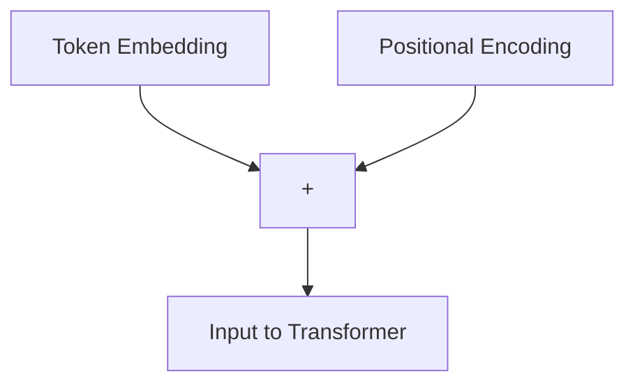
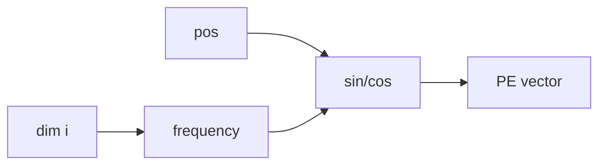
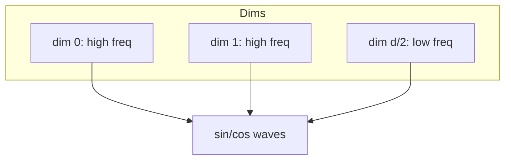
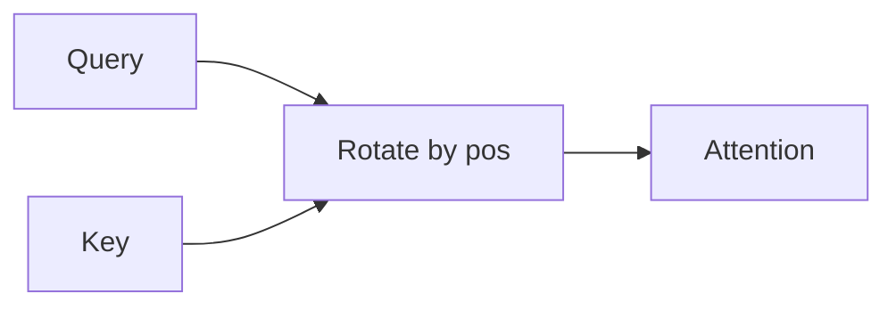

# Positional Encoding

📄 File: `book/09_transformers_llm_core/positional_encoding.md`

This chapter covers **positional encoding** — how transformers inject position information into sequences. Attention is permutation-invariant without it.

---

## Study Plan (2 days)

* Day 1: Why position matters + sinusoidal encoding
* Day 2: Learned embeddings + RoPE + code

---

## 1 — Why Position Matters

Attention treats all tokens equally; it has **no notion of order**. "Dog bites man" vs "Man bites dog" would be identical without position.


---

## 2 — Adding Position to Embeddings

$$\text{Input} = \text{Token Embedding} + \text{Positional Encoding}$$



---

## 3 — Sinusoidal Encoding (Original Transformer)

$$PE_{(pos, 2i)} = \sin(pos / 10000^{2i/d})$$
$$PE_{(pos, 2i+1)} = \cos(pos / 10000^{2i/d})$$

* **pos**: position index (0, 1, 2, ...)
* **i**: dimension index (0 to d/2-1)
* **d**: embedding dimension
* Different frequencies for each dimension



---

## 4 — Sinusoidal Implementation

```python
import numpy as np

def sinusoidal_positional_encoding(seq_len, d_model):
    """
    seq_len: sequence length
    d_model: embedding dimension
    Returns: (seq_len, d_model)
    """
    # Create position indices (0 to seq_len-1)
    position = np.arange(seq_len)[:, np.newaxis]

    # Dimension indices for even/odd formula
    # div_term = 10000^(2i/d) for i in 0..d/2-1
    div_term = np.exp(np.arange(0, d_model, 2) * -(np.log(10000.0) / d_model))

    # Initialize PE matrix
    pe = np.zeros((seq_len, d_model))

    # Even dimensions: sin
    pe[:, 0::2] = np.sin(position * div_term)

    # Odd dimensions: cos
    pe[:, 1::2] = np.cos(position * div_term)

    return pe
```

---

## 5 — Diagram: Sinusoidal Frequencies



---

## 6 — Learned Positional Embeddings

Instead of fixed sin/cos, **learn** position embeddings (like BERT, GPT-2):

```python
import torch
import torch.nn as nn

class LearnedPositionalEmbedding(nn.Module):
    def __init__(self, max_len, d_model):
        super().__init__()
        # One embedding vector per position
        self.pe = nn.Embedding(max_len, d_model)

    def forward(self, x):
        # x: (batch, seq_len, d_model)
        batch_size, seq_len, _ = x.shape
        # Create position indices [0, 1, ..., seq_len-1]
        positions = torch.arange(seq_len, device=x.device).unsqueeze(0)
        positions = positions.expand(batch_size, -1)
        return x + self.pe(positions)
```

---

## 7 — Rotary Position Embedding (RoPE)

RoPE encodes position via **rotation** in query/key space. Used in LLaMA, GPT-NeoX.

* Relative position encoded in attention scores
* Extrapolates to longer sequences better than learned



---

## 8 — Comparison

| Type       | Pros                    | Cons                    |
| ---------- | ----------------------- | ----------------------- |
| Sinusoidal | No extra params, extrapolates | Fixed, may not fit data |
| Learned    | Flexible, data-driven   | Fixed max length        |
| RoPE       | Relative, extrapolates  | More complex            |

---

## Exercises

### 1. Visualize PE

Plot the first 4 dimensions of sinusoidal PE for seq_len=100, d_model=64.

<details>
<summary>Solution</summary>

```python
import matplotlib.pyplot as plt
pe = sinusoidal_positional_encoding(100, 64)
for i in range(4):
    plt.plot(pe[:, i], label=f'dim {i}')
plt.legend()
plt.show()
```
</details>

---

### 2. Max Length

Why does learned PE have a max length? How do models handle longer sequences?

<details>
<summary>Solution</summary>

Learned PE has a fixed embedding table (max_len × d). For longer sequences: truncate, interpolate, or use RoPE/ALiBi which extrapolate.
</details>

---

## Interview Questions (with answers)

1. **Why do we need positional encoding?**
   Answer: Attention is permutation-invariant; position encoding injects order information.

2. **What is the advantage of sinusoidal over learned?**
   Answer: No extra parameters; can extrapolate to longer sequences than seen in training.

3. **What is RoPE?**
   Answer: Rotary Position Embedding — encodes position via rotation in Q/K space; used in LLaMA for better length extrapolation.

---

## Key Takeaways

* Position encoding = Token embedding + Position embedding
* Sinusoidal: fixed, no params, extrapolates
* Learned: flexible, fixed max length
* RoPE: relative, good extrapolation

---

## Next Chapter

Proceed to: **multi_head_attention.md**
