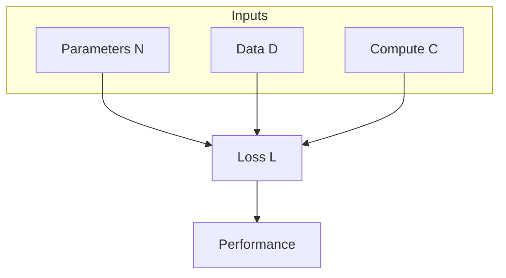
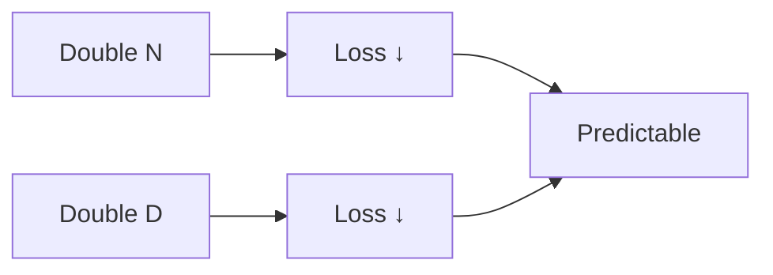
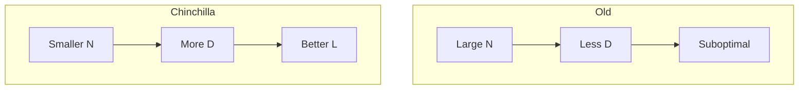
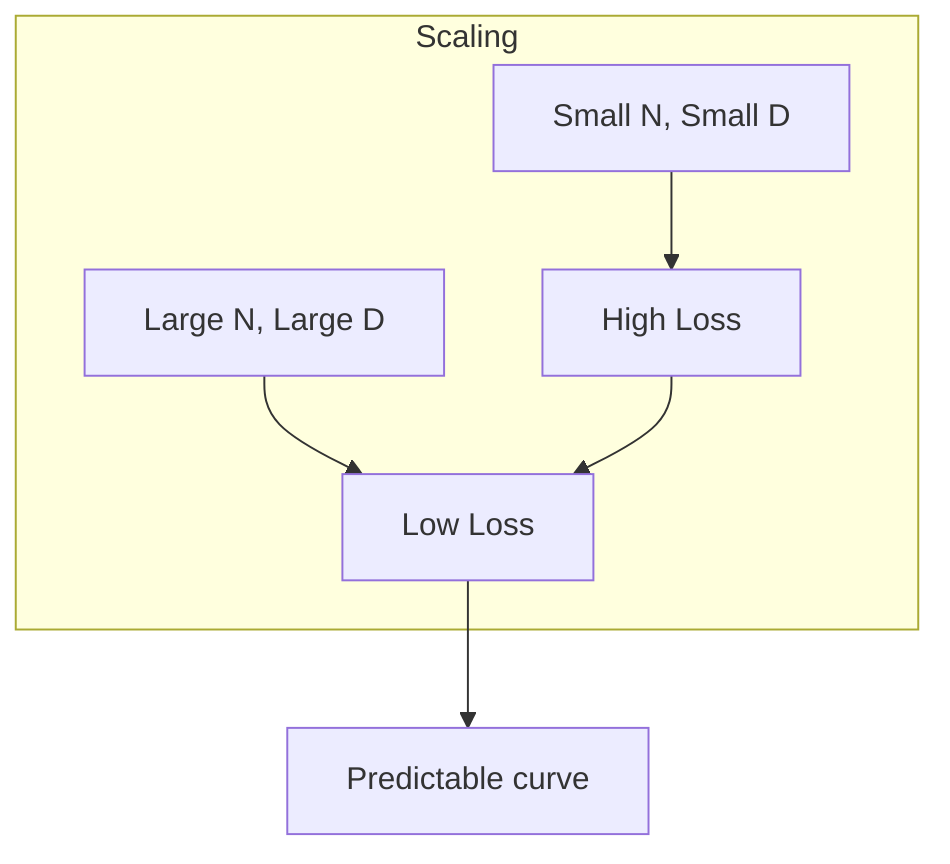
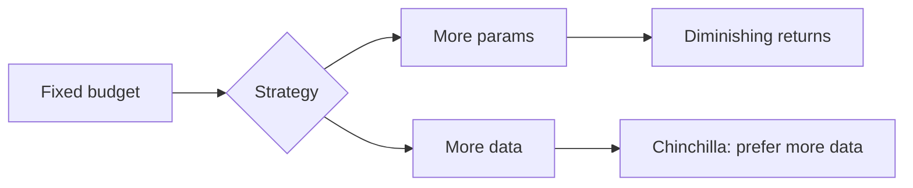
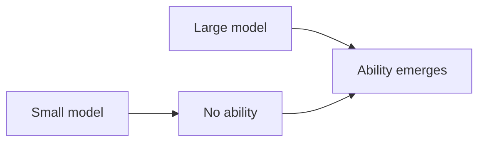

# Scaling Laws

📄 File: `book/09_transformers_llm_core/scaling_laws.md`

This chapter covers **scaling laws** — empirical relationships between model size, data, compute, and performance. Essential for LLM training and resource planning.

---

## Study Plan (2 days)

* Day 1: Chinchilla, Kaplan et al.
* Day 2: Implications + code experiments

---

## 1 — What are Scaling Laws?

Scaling laws describe how **model performance** changes with:

* **N**: number of parameters
* **D**: dataset size (tokens)
* **C**: compute (FLOPs)



---

## 2 — Kaplan et al. (2020) — Power Laws

Loss decreases as a **power law** in N, D, and compute:

$$L(N, D) \approx \left(\frac{N_c}{N}\right)^{\alpha_N} + \left(\frac{D_c}{D}\right)^{\alpha_D}$$

* **N_c, D_c**: critical values (irreducible loss)
* **α_N, α_D**: scaling exponents (~0.076, ~0.095)



---

## 3 — Chinchilla (2022) — Optimal Compute Allocation

For a given compute budget C, **Chinchilla** showed:

* Train **more parameters** with **less data per parameter**
* Optimal: ~20 tokens per parameter (not 1:1)
* Same compute → 4× more data, 4× smaller model can match larger model



---

## 4 — Compute-Optimal Frontier

```python
def chinchilla_optimal_tokens(parameters_billion):
    """
    Chinchilla: optimal tokens ≈ 20 × parameters (in same units).
    Parameters in billions, return tokens in billions.
    """
    return 20 * parameters_billion

def estimate_training_flops(parameters, tokens):
    """
    Rough FLOPs for training: ~6 * params * tokens (forward + backward).
    """
    return 6 * parameters * tokens

# Example: 7B model
params_b = 7
opt_tokens_b = chinchilla_optimal_tokens(params_b)
print(f"7B model: ~{opt_tokens_b}B tokens optimal")
# 7B model: ~140B tokens optimal
```

---

## 5 — Diagram: Loss vs Scale



---

## 6 — Key Exponents (Approximate)

| Factor   | Exponent | Effect                    |
| -------- | -------- | ------------------------- |
| N (params)| ~0.076  | Double N → ~5% loss drop  |
| D (data) | ~0.095  | Double D → ~6% loss drop  |
| C (compute) | ~0.05 | Double C → ~3% loss drop  |

```python
def loss_reduction_from_doubling(alpha=0.076):
    """
    If L ∝ N^{-alpha}, doubling N multiplies L by 2^{-alpha}.
    """
    return 2 ** (-alpha)

# Doubling parameters: loss × 0.95 (5% reduction)
print(f"Loss multiplier when doubling N: {loss_reduction_from_doubling():.3f}")
```

---

## 7 — Implications for Training



* **Data is underutilized** in many large models
* **Smaller models + more data** often beat larger models + less data
* **Compute** is the main bottleneck; allocate to data and params wisely

---

## 8 — Emergent Abilities

Some capabilities **emerge** only at scale (e.g., few-shot, reasoning):



---

## Exercises

### 1. Compute Budget

Given 1e24 FLOPs, estimate optimal (N, D) using Chinchilla. Assume C ≈ 6ND.

<details>
<summary>Solution</summary>

C = 6ND, D = 20N → C = 120N² → N = sqrt(C/120). For C=1e24, N ≈ 9e10 params, D ≈ 1.8e12 tokens.
</details>

---

### 2. Loss Prediction

If a 1B model has loss 2.5 at 10B tokens, estimate loss at 40B tokens (same model). Use α_D ≈ 0.095.

<details>
<summary>Solution</summary>

L ∝ D^{-0.095}. 4× more data → L × 4^{-0.095} ≈ 0.92. New L ≈ 2.5 × 0.92 ≈ 2.3.
</details>

---

## Interview Questions (with answers)

1. **What did Chinchilla change about scaling?**
   Answer: Showed that for fixed compute, training with more data and fewer parameters often outperforms fewer data and more parameters.

2. **What is the approximate optimal token-to-parameter ratio?**
   Answer: ~20 tokens per parameter (Chinchilla).

3. **Why do we scale by power laws?**
   Answer: Empirical observation; loss decreases predictably with N, D, C.

---

## Key Takeaways

* Loss ∝ N^{-α}, D^{-α}, C^{-α}
* Chinchilla: prefer more data over more parameters at fixed compute
* ~20 tokens per parameter is a rough optimum
* Emergent abilities appear at scale

---

## Next Chapter

Proceed to: **positional_encoding.md**
