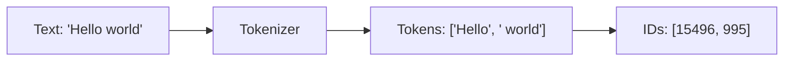
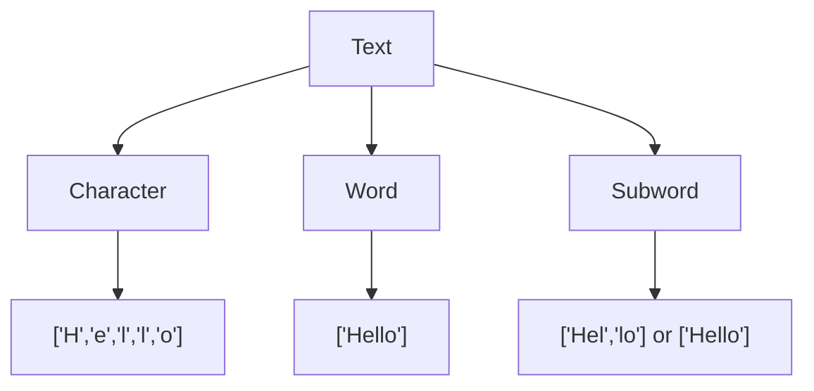
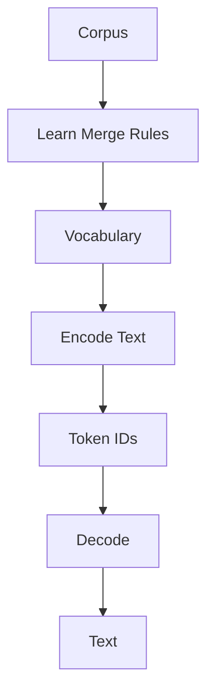
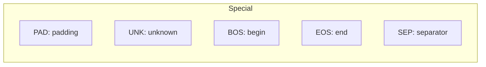
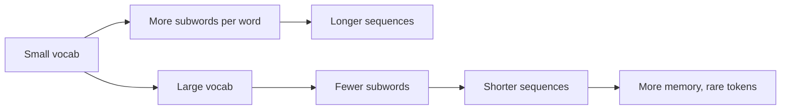

# Tokenization

📄 File: `book/09_transformers_llm_core/tokenization.md`

This chapter covers **tokenization** — converting text into subword units that LLMs process. Critical for understanding model inputs and vocabulary design.

---

## Study Plan (2–3 days)

* Day 1: Character vs word vs subword
* Day 2: BPE algorithm basics
* Day 3: Hugging Face tokenizers + exercises

---

## 1 — What is Tokenization?

Tokenization splits text into **tokens** (subword units) that map to vocabulary IDs.



---

## 2 — Tokenization Strategies

| Strategy   | Unit    | Pros                    | Cons                    |
| ---------- | ------- | ----------------------- | ----------------------- |
| Character  | chars   | Small vocab, no OOV      | Long sequences          |
| Word       | words   | Intuitive               | Large vocab, OOV        |
| Subword    | subwords| Balance vocab/sequence   | Merge rules to learn    |



---

## 3 — Out-of-Vocabulary (OOV) Problem

Word-level tokenization fails on unseen words:

```python
# Word-level: "unhappiness" not in vocab → OOV token (information lost)
vocab = {"happy": 1, "un": 2, "ness": 3}
word = "unhappiness"  # Not in vocab → [UNK]

# Subword: "un" + "happiness" or "un" + "happy" + "ness"
# Reconstructs meaning from known subwords
```

---

## 4 — Subword Tokenization Flow



---

## 5 — Basic Tokenizer Implementation

```python
from collections import Counter

def simple_word_tokenize(text):
    """
    Split text into words (whitespace). Lowercase for consistency.
    """
    # Lowercase to reduce vocab size (optional)
    text_lower = text.lower()
    # Split on whitespace
    tokens = text_lower.split()
    return tokens

def build_vocab(tokens, min_freq=1):
    """
    Build vocabulary from token list. Assign IDs by frequency.
    """
    # Count token frequencies
    counter = Counter(tokens)
    # Filter by min frequency
    filtered = {t: c for t, c in counter.items() if c >= min_freq}
    # Assign IDs: 0 = PAD, 1 = UNK, then by frequency
    vocab = {"<PAD>": 0, "<UNK>": 1}
    for i, (t, _) in enumerate(sorted(filtered.items(), key=lambda x: -x[1])):
        vocab[t] = i + 2
    return vocab

def encode(tokens, vocab):
    """
    Convert tokens to IDs. Use UNK for unknown tokens.
    """
    return [vocab.get(t, vocab["<UNK>"]) for t in tokens]

def decode(ids, vocab):
    """
    Convert IDs back to tokens. Reverse lookup.
    """
    id_to_token = {v: k for k, v in vocab.items()}
    return [id_to_token.get(i, "<UNK>") for i in ids]
```

---

## 6 — Hugging Face Tokenizers

```python
from transformers import AutoTokenizer

# Load pretrained tokenizer (e.g., GPT-2 style BPE)
tokenizer = AutoTokenizer.from_pretrained("gpt2")

# Encode: text → token IDs
text = "Hello, how are you?"
# encode returns list of IDs; add_special_tokens adds BOS/EOS
ids = tokenizer.encode(text, add_special_tokens=True)

# Decode: IDs → text
decoded = tokenizer.decode(ids)

# Get token strings (for inspection)
tokens = tokenizer.tokenize(text)
```

---

## 7 — Special Tokens



| Token | Purpose                          |
| ----- | -------------------------------- |
| PAD   | Pad sequences to same length     |
| UNK   | Unknown / OOV token              |
| BOS   | Beginning of sequence            |
| EOS   | End of sequence                  |
| SEP   | Separate segments (e.g., QA)     |

---

## 8 — Vocabulary Size Trade-off



---

## Exercises

### 1. Build a Simple Vocab

Given corpus `["hello world", "world of data"]`, build vocab and encode "hello data".

<details>
<summary>Solution</summary>

```python
corpus = ["hello world", "world of data"]
tokens = []
for s in corpus:
    tokens.extend(s.split())
vocab = build_vocab(tokens)
# Encode "hello data": hello in vocab, "data" in vocab
ids = encode("hello data".split(), vocab)
```
</details>

---

### 2. Padding and Truncation

Why do we pad sequences? What happens if we truncate from the left vs right?

<details>
<summary>Solution</summary>

Pad: Batches need same-length sequences for matrix ops. Truncate left: lose context at start. Truncate right: lose context at end. For QA, often keep end (answer).
</details>

---

## Interview Questions (with answers)

1. **Why subword over word tokenization?**
   Answer: Handles OOV via subword composition; balances vocab size and sequence length.

2. **What is the vocabulary size of GPT-2?**
   Answer: 50,257 (BPE with byte-level fallback).

3. **Why do we need a PAD token?**
   Answer: Batches require fixed-length sequences; PAD fills shorter sequences.

---

## Key Takeaways

* Tokenization: text → tokens → IDs
* Subword balances vocab size and sequence length
* Special tokens: PAD, UNK, BOS, EOS, SEP
* Hugging Face `AutoTokenizer` for pretrained tokenizers

---

## Next Chapter

Proceed to: **bpe_sentencepiece.md**
