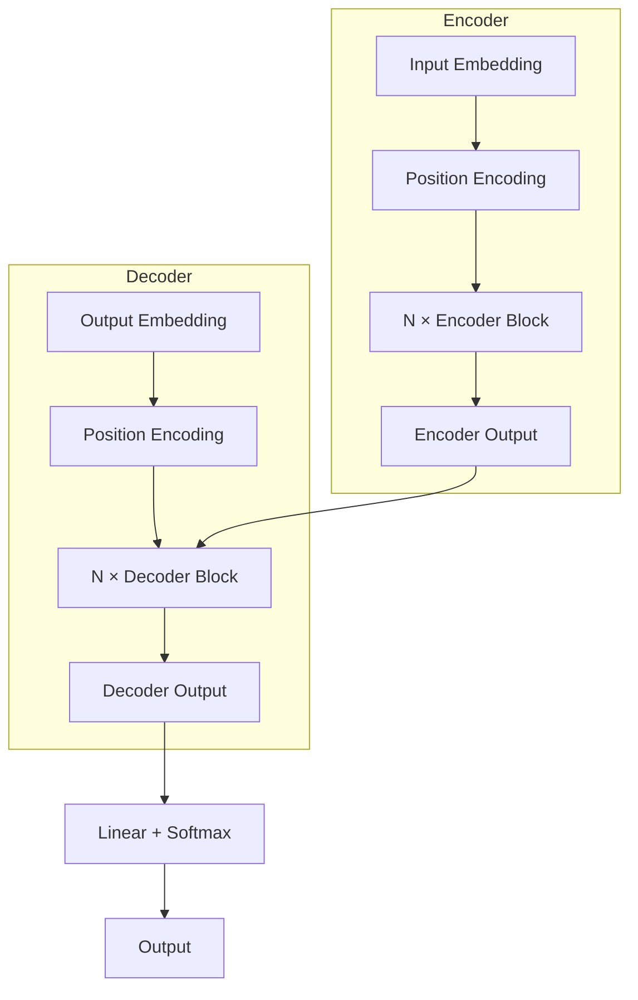
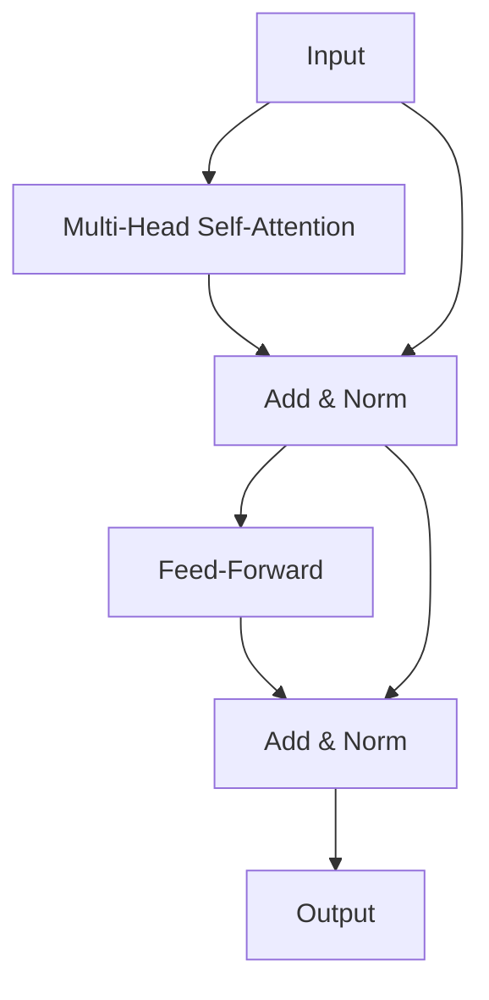
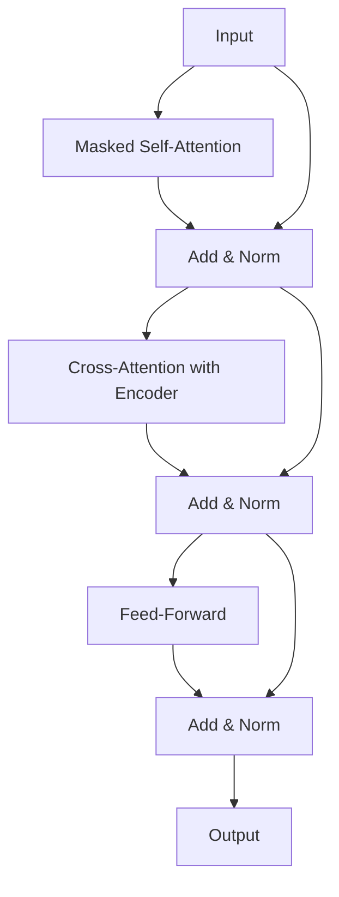
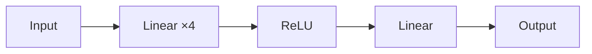
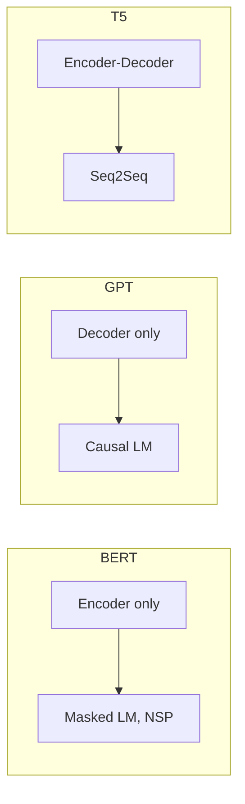

# Transformer Architecture

📄 File: `book/09_transformers_llm_core/transformer_architecture.md`

This chapter covers the full **transformer architecture** — encoder, decoder, and encoder-decoder. The foundation of modern LLMs.

---

## Study Plan (3–4 days)

* Day 1: Encoder stack
* Day 2: Decoder stack
* Day 3: Encoder-decoder (seq2seq)
* Day 4: End-to-end code + exercises

---

## 1 — High-Level Overview



---

## 2 — Encoder Block

Each encoder block: **Multi-Head Self-Attention** → **Add & Norm** → **FFN** → **Add & Norm**



---

## 3 — Decoder Block

Decoder block adds **masked self-attention** and **cross-attention**:



---

## 4 — Key Components

| Component | Encoder | Decoder |
| --------- | ------- | ------- |
| Self-Attention | Bidirectional | Causal (masked) |
| Cross-Attention | — | Yes (encoder output) |
| FFN | Yes | Yes |
| Layers | Typically 6–12 | Typically 6–12 |

---

## 5 — Feed-Forward Network (FFN)

$$\text{FFN}(x) = \text{ReLU}(x W_1 + b_1) W_2 + b_2$$

* Usually d_model → 4×d_model → d_model
* Applied per position independently



---

## 6 — Layer Normalization

Normalize across the feature dimension (d_model):

```python
import torch
import torch.nn as nn

class TransformerEncoderBlock(nn.Module):
    def __init__(self, d_model, num_heads, d_ff, dropout=0.1):
        super().__init__()
        self.self_attn = nn.MultiheadAttention(d_model, num_heads, dropout=dropout, batch_first=True)
        self.ffn = nn.Sequential(
            nn.Linear(d_model, d_ff),
            nn.ReLU(),
            nn.Dropout(dropout),
            nn.Linear(d_ff, d_model),
        )
        self.norm1 = nn.LayerNorm(d_model)
        self.norm2 = nn.LayerNorm(d_model)
        self.dropout = nn.Dropout(dropout)

    def forward(self, x, mask=None):
        # Self-attention with residual
        attn_out, _ = self.self_attn(x, x, x, attn_mask=mask)
        x = self.norm1(x + self.dropout(attn_out))

        # FFN with residual
        ffn_out = self.ffn(x)
        x = self.norm2(x + self.dropout(ffn_out))
        return x
```

---

## 7 — Encoder-Only vs Decoder-Only



| Architecture | Example | Use Case |
| ------------ | ------- | -------- |
| Encoder-only | BERT | Classification, NER |
| Decoder-only | GPT, LLaMA | Generation |
| Encoder-decoder | T5, BART | Translation, summarization |

---

## 8 — End-to-End Forward Pass

```python
def transformer_forward(x, encoder_blocks, decoder_blocks, src_mask, tgt_mask):
    # Encoder
    enc_out = x
    for block in encoder_blocks:
        enc_out = block(enc_out, src_mask)

    # Decoder (simplified: receives enc_out for cross-attention)
    dec_out = enc_out  # In practice, decoder has its own input
    for block in decoder_blocks:
        dec_out = block(dec_out, enc_out, tgt_mask)

    return dec_out
```

---

## Exercises

### 1. Block Count

Why do transformers use multiple encoder/decoder blocks?

<details>
<summary>Solution</summary>

Each block refines representations. More blocks = deeper network = more abstract features. Typically 6–24 layers.
</details>

---

### 2. Pre-LN vs Post-LN

What is the difference? (Pre-LN: norm before sublayer; Post-LN: norm after)

<details>
<summary>Solution</summary>

Pre-LN (used in LLaMA): more stable training, norm before attention/FFN. Post-LN (original): norm after residual; can be harder to train deep models.
</details>

---

## Interview Questions (with answers)

1. **What is the difference between encoder and decoder?**
   Answer: Encoder uses bidirectional attention; decoder uses causal (masked) self-attention + cross-attention to encoder.

2. **Why residual connections?**
   Answer: Enable training of deep networks; gradients flow through shortcuts.

3. **What does the FFN do?**
   Answer: Two-layer MLP per position; adds non-linearity and capacity; often 4× expansion in hidden dim.

---

## Key Takeaways

* Encoder: self-attention + FFN, bidirectional
* Decoder: masked self-attention + cross-attention + FFN
* Residual + LayerNorm after each sublayer
* Encoder-only (BERT), decoder-only (GPT), encoder-decoder (T5)

---

## Next Chapter

Proceed to: **bpe_sentencepiece.md**
