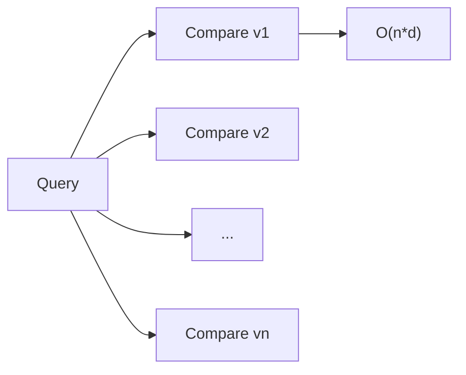
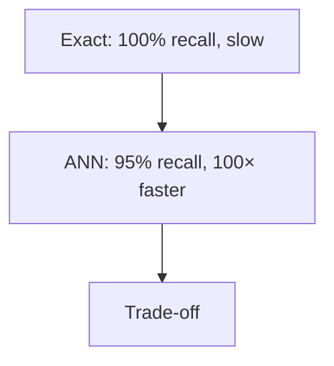
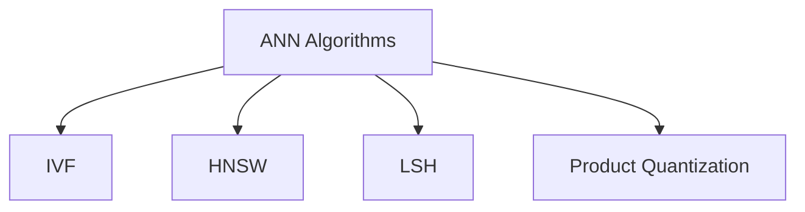
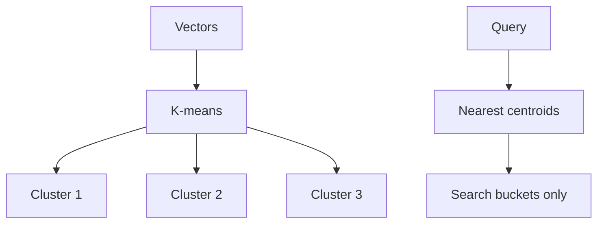
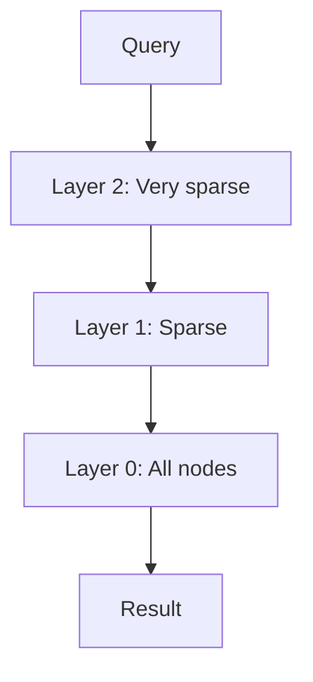
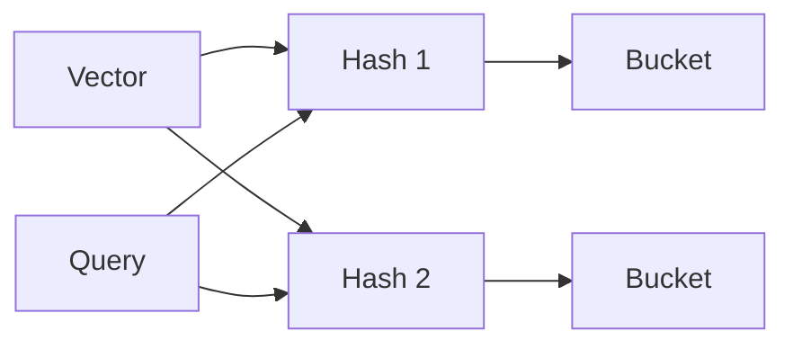
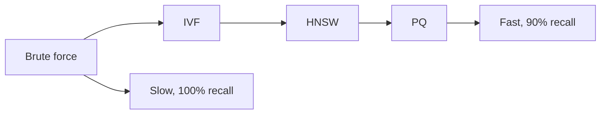

# ANN Algorithms

📄 File: `book/10_embeddings_vector_databases/ann_algorithms.md`

This chapter covers **Approximate Nearest Neighbor (ANN)** algorithms — efficient search in high-dimensional vector spaces. Essential for scaling retrieval to millions of vectors.

---

## Study Plan (2–3 days)

* Day 1: Exact vs approximate + trade-offs
* Day 2: IVF, HNSW, LSH
* Day 3: Algorithm selection + exercises

---

## 1 — The Problem: Exact Search is Slow

Brute-force k-NN: compare query to **every** vector. O(n·d) per query.

* n = 1M vectors, d = 384 → 384M ops per query
* Infeasible at scale



---

## 2 — ANN: Approximate for Speed

ANN trades **accuracy** for **speed**. Returns "good enough" neighbors in sublinear time.

$$\text{Recall} = \frac{|\text{ANN results} \cap \text{Exact k-NN}|}{k}$$



---

## 3 — Main ANN Families

| Algorithm | Idea | Pros | Cons |
| --------- | ---- | ---- | ---- |
| IVF | Partition space, search few clusters | Fast, simple | Needs training |
| HNSW | Graph with hierarchical layers | High recall, fast | Memory |
| LSH | Hash similar vectors to same bucket | Simple, parallel | Tuning |
| PQ | Compress vectors, approximate distance | Low memory | Lower recall |



---

## 4 — Inverted File (IVF)

1. **Cluster** vectors (e.g., k-means)
2. **Index**: Each vector → nearest cluster centroid
3. **Search**: Find query's nearest centroids, search only those buckets



---

## 5 — HNSW (Hierarchical Navigable Small World)

* **Graph** of vectors as nodes
* **Layers**: Bottom = all nodes; top = few "hub" nodes
* **Search**: Start at top, greedily descend to nearest neighbor, repeat



---

## 6 — LSH (Locality-Sensitive Hashing)

* **Hash** similar vectors to same bucket (with high probability)
* **Search**: Hash query, search only that bucket (and nearby)
* **Multiple** hash tables increase recall



---

## 7 — Algorithm Selection

```python
# Pseudocode: When to use what
def choose_ann(n_vectors, dim, recall_required, memory_budget):
    if n_vectors < 10_000:
        return "brute_force"  # Exact is fine
    elif memory_budget == "low":
        return "IVF_PQ"  # Compressed
    elif recall_required > 0.99:
        return "HNSW"  # Best recall
    else:
        return "IVF_flat"  # Balanced
```

---

## 8 — Diagram: Recall vs Speed



---

## Exercises

### 1. IVF Parameters

For 1M vectors, 1000 clusters, how many vectors searched per query (approx)?

<details>
<summary>Solution</summary>

~1000 vectors per cluster on average. If we search 10 clusters → ~10k vectors. 100× speedup vs brute force.
</details>

---

### 2. HNSW Layers

Why does HNSW use multiple layers? What does the top layer do?

<details>
<summary>Solution</summary>

Top layer has few nodes → fast coarse navigation. Lower layers refine. Like skip lists for graphs.
</details>

---

## Interview Questions (with answers)

1. **What is ANN and why use it?**
   Answer: Approximate Nearest Neighbor; trades exactness for speed; enables sublinear search in high dimensions.

2. **IVF vs HNSW?**
   Answer: IVF partitions space (clusters); HNSW uses graph with layers. HNSW typically higher recall; IVF simpler, less memory.

3. **What is recall in ANN?**
   Answer: Fraction of true k-NN found by ANN. 95% recall = 95 of 100 true neighbors in result set.

---

## Key Takeaways

* ANN = approximate for speed
* IVF: cluster + search few buckets
* HNSW: graph + hierarchical search
* Trade recall vs speed vs memory

---

## Next Chapter

Proceed to: **faiss.md**
