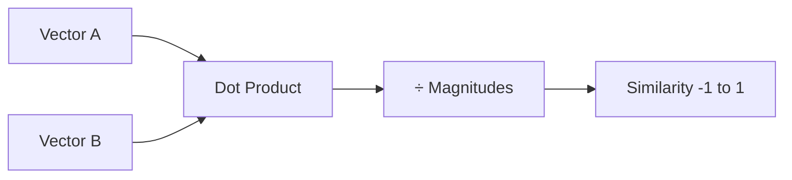
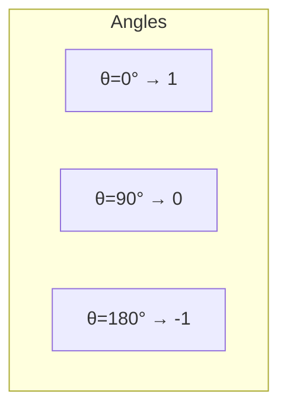
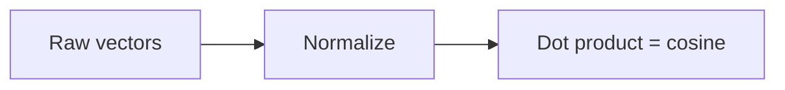
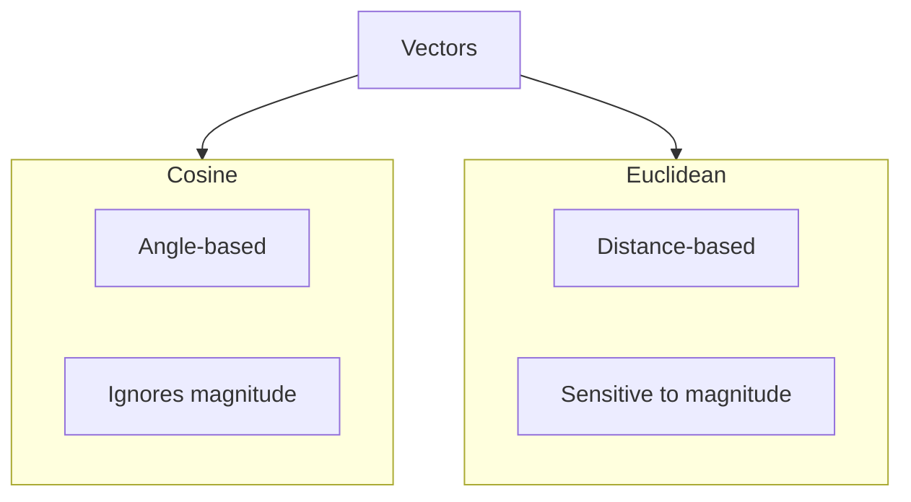
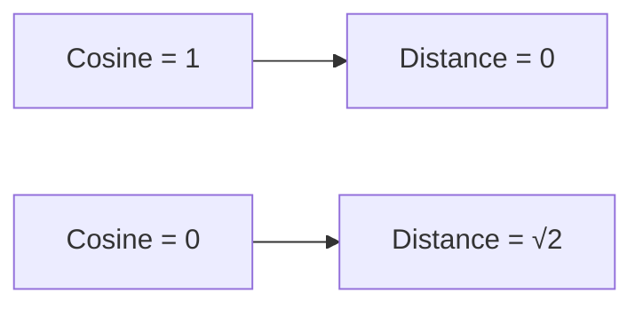

# Cosine Similarity

📄 File: `book/10_embeddings_vector_databases/cosine_similarity.md`

This chapter covers **cosine similarity** — the primary metric for comparing embedding vectors in retrieval and semantic search.

---

## Study Plan (1–2 days)

* Day 1: Definition + math + code
* Day 2: When to use vs other metrics

---

## 1 — What is Cosine Similarity?

Cosine similarity measures the **angle** between two vectors, not their magnitude. Range: [-1, 1].

$$\text{cosine}(A, B) = \frac{A \cdot B}{\|A\| \|B\|} = \frac{\sum_i A_i B_i}{\sqrt{\sum A_i^2} \sqrt{\sum B_i^2}}$$



---

## 2 — Geometric Intuition

* **1**: Same direction (identical)
* **0**: Orthogonal (unrelated)
* **-1**: Opposite direction (antonyms in some embeddings)



---

## 3 — Why Cosine for Embeddings?

* **Magnitude-invariant**: Long vs short documents compared fairly
* **Normalized**: Bounded [-1, 1], interpretable
* **Efficient**: When vectors are pre-normalized, cosine = dot product



---

## 4 — NumPy Implementation

```python
import numpy as np

def cosine_similarity(a, b):
    """
    Compute cosine similarity between two vectors.
    a, b: 1D arrays of same length
    Returns: float in [-1, 1]
    """
    # Dot product of a and b
    dot_product = np.dot(a, b)
    # Magnitude (L2 norm) of each vector
    norm_a = np.linalg.norm(a)
    norm_b = np.linalg.norm(b)
    # Avoid division by zero
    if norm_a == 0 or norm_b == 0:
        return 0.0
    return dot_product / (norm_a * norm_b)

def cosine_similarity_batch(query, vectors):
    """
    query: (d,) - single vector
    vectors: (n, d) - matrix of n vectors
    Returns: (n,) - similarity for each vector
    """
    # Normalize query and vectors
    query_norm = query / np.linalg.norm(query)
    vectors_norm = vectors / np.linalg.norm(vectors, axis=1, keepdims=True)
    # Dot product = cosine when normalized
    return np.dot(vectors_norm, query_norm)
```

---

## 5 — Diagram: Cosine vs Euclidean



---

## 6 — Pre-normalized Vectors

When embeddings are **L2-normalized**, cosine = dot product (O(d) per pair):

```python
def cosine_normalized(query, vectors):
    """
    query: (d,) normalized
    vectors: (n, d) normalized
    """
    return np.dot(vectors, query)  # Already cosine!
```

---

## 7 — Similarity vs Distance

* **Similarity**: Higher = more similar (cosine, dot product)
* **Distance**: Lower = more similar (Euclidean, L2)

For normalized vectors: $\text{distance}^2 = 2(1 - \text{cosine})$



---

## 8 — When to Use What

| Metric | Use When |
| ------ | -------- |
| Cosine | Embeddings (default) |
| Dot product | Normalized embeddings, faster |
| Euclidean | Need actual distance, magnitude matters |

---

## Exercises

### 1. Manual Cosine

Given A = [1, 0], B = [1, 1], compute cosine(A, B).

<details>
<summary>Solution</summary>

A·B = 1, |A|=1, |B|=√2. Cosine = 1/√2 ≈ 0.707.
</details>

---

### 2. Top-K Similarity

Given query embedding and 1000 document embeddings, find top-5 most similar. Use batch cosine.

<details>
<summary>Solution</summary>

```python
scores = cosine_similarity_batch(query, vectors)
top5_idx = np.argsort(scores)[-5:][::-1]
```
</details>

---

## Interview Questions (with answers)

1. **Why cosine over Euclidean for embeddings?**
   Answer: Embeddings often vary in magnitude (e.g., document length); cosine focuses on direction (semantic content).

2. **What is the range of cosine similarity?**
   Answer: [-1, 1]. 1 = identical direction, 0 = orthogonal, -1 = opposite.

3. **How to convert cosine to distance?**
   Answer: For normalized vectors, L2 distance² = 2(1 - cosine). So distance = sqrt(2(1-cosine)).

---

## Key Takeaways

* Cosine = dot product / (|A||B|)
* Range [-1, 1]; invariant to magnitude
* Pre-normalize → dot product = cosine
* Default choice for embedding similarity

---

## Next Chapter

Proceed to: **ann_algorithms.md**
