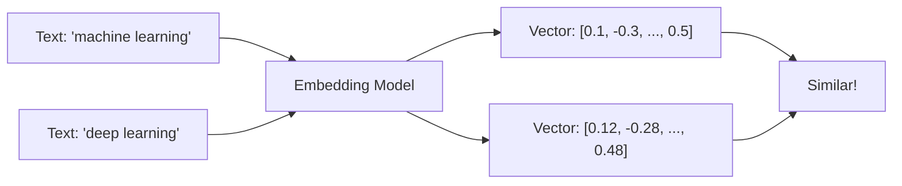
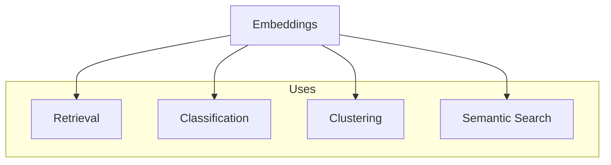
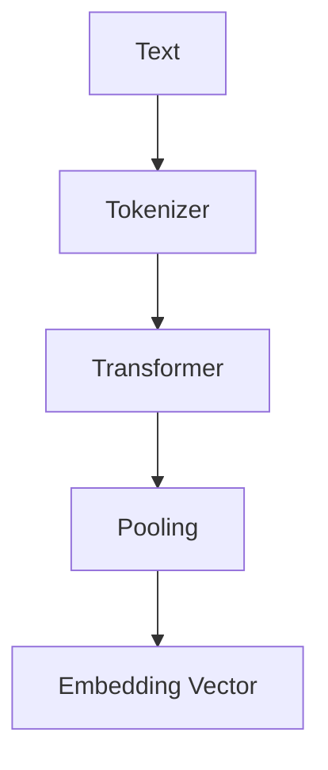
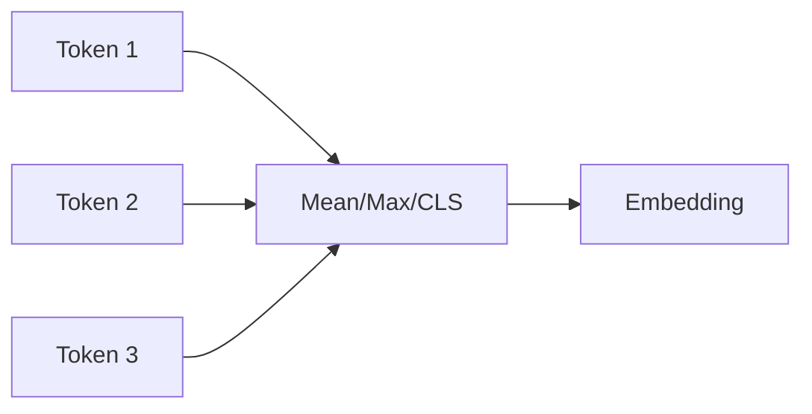
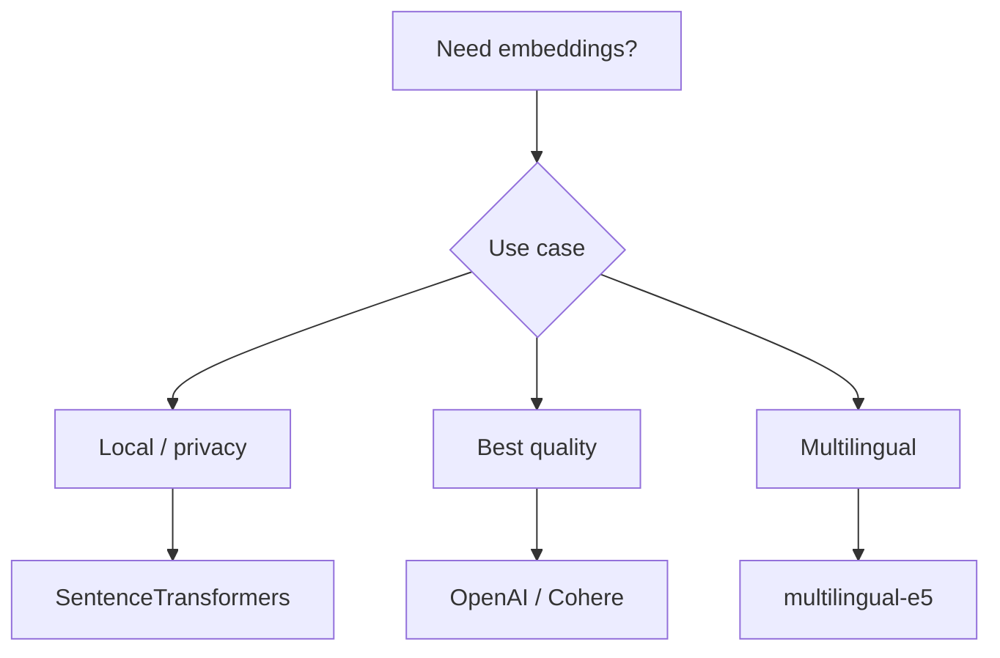

# Embeddings

📄 File: `book/10_embeddings_vector_databases/embeddings.md`

This chapter covers **embeddings** — dense vector representations of text, images, or entities. Foundation for semantic search, RAG, and retrieval systems.

---

## Study Plan (2–3 days)

* Day 1: What are embeddings + intuition
* Day 2: Sentence transformers + OpenAI API
* Day 3: Batch encoding + exercises

---

## 1 — What are Embeddings?

An embedding maps discrete tokens (words, sentences, documents) to **continuous vectors** in ℝ^d. Similar meaning → similar vectors.



---

## 2 — Why Embeddings?

* **Semantic similarity**: "dog" and "puppy" close in space
* **Arithmetic**: king - man + woman ≈ queen
* **Retrieval**: Find similar documents by vector distance



---

## 3 — Embedding Dimensions

| Model | Dimensions | Use Case |
| ----- | ---------- | -------- |
| Word2Vec | 100–300 | Word-level |
| sentence-transformers | 384–1024 | Sentence-level |
| OpenAI ada-002 | 1536 | General purpose |
| Cohere | 1024 | Multilingual |

---

## 4 — Sentence Transformers (Local)

```python
from sentence_transformers import SentenceTransformer

# Load model (downloads on first run)
# "all-MiniLM-L6-v2" is fast, 384 dims
model = SentenceTransformer("all-MiniLM-L6-v2")

# Encode single sentence
text = "Machine learning is a subset of AI"
# encode returns numpy array of shape (384,)
embedding = model.encode(text)

# Encode multiple sentences (batched, more efficient)
texts = ["First sentence", "Second sentence", "Third sentence"]
# Returns (3, 384) array
embeddings = model.encode(texts)

# With normalization (for cosine similarity)
embeddings_norm = model.encode(texts, normalize_embeddings=True)
```

---

## 5 — Diagram: Embedding Pipeline



---

## 6 — OpenAI Embeddings API

```python
from openai import OpenAI

client = OpenAI()

# Single embedding
response = client.embeddings.create(
    model="text-embedding-3-small",
    input="Your text here"
)
# response.data[0].embedding is list of 1536 floats
embedding = response.data[0].embedding

# Batch (up to 2048 inputs per request)
response = client.embeddings.create(
    model="text-embedding-3-small",
    input=["Text 1", "Text 2", "Text 3"]
)
embeddings = [d.embedding for d in response.data]
```

---

## 7 — Pooling Strategies

| Strategy | Description |
| -------- | ----------- |
| CLS | Use [CLS] token output |
| Mean | Average all token outputs |
| Max | Max pool across tokens |



---

## 8 — Choosing an Embedding Model



---

## Exercises

### 1. Encode and Compare

Encode "cat" and "dog" with sentence-transformers. Compute cosine similarity. Compare with "car".

<details>
<summary>Solution</summary>

```python
from sentence_transformers import SentenceTransformer
from numpy import dot
from numpy.linalg import norm

model = SentenceTransformer("all-MiniLM-L6-v2")
e_cat = model.encode("cat", normalize_embeddings=True)
e_dog = model.encode("dog", normalize_embeddings=True)
e_car = model.encode("car", normalize_embeddings=True)
print(dot(e_cat, e_dog))  # Higher
print(dot(e_cat, e_car))  # Lower
```
</details>

---

### 2. Batch Size

Why batch encoding is faster? What batch size to use?

<details>
<summary>Solution</summary>

GPU parallelizes batch; fewer model forward passes. Typical batch 32–128; tune based on GPU memory.
</details>

---

## Interview Questions (with answers)

1. **What is an embedding?**
   Answer: Dense vector representation of text/entity; captures semantic meaning; similar items have similar vectors.

2. **Why normalize embeddings for retrieval?**
   Answer: Cosine similarity = dot product when normalized; avoids magnitude effects; faster with some indexes.

3. **Difference between word and sentence embeddings?**
   Answer: Word: single token. Sentence: whole phrase; captures context; better for semantic search.

---

## Key Takeaways

* Embeddings = dense vectors representing meaning
* Similar meaning → similar vectors
* sentence-transformers for local; OpenAI for API
* Normalize for cosine similarity

---

## Next Chapter

Proceed to: **cosine_similarity.md**
