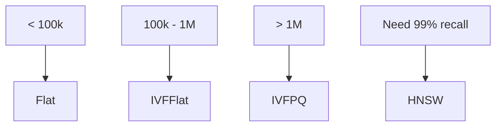
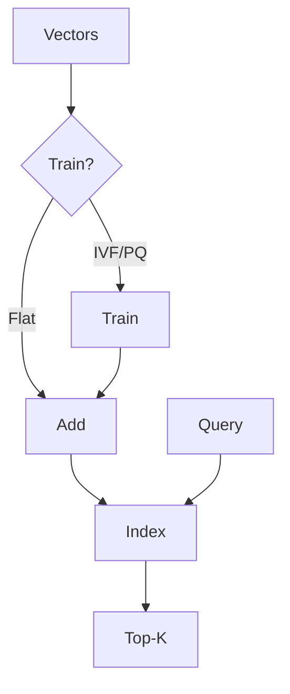

# FAISS

📄 File: `book/10_embeddings_vector_databases/faiss.md`

This chapter covers **FAISS** (Facebook AI Similarity Search) — the most widely used library for efficient similarity search. Used by Meta, and in many production RAG systems.

---

## Study Plan (2–3 days)

* Day 1: Installation + basic index
* Day 2: IVF, HNSW indexes
* Day 3: GPU + batch search

---

## 1 — What is FAISS?

FAISS is a library for **efficient similarity search** and clustering of dense vectors. Supports CPU and GPU, multiple index types.


---

## 2 — Index Types

| Index | Type | Use Case |
| ----- | ---- | -------- |
| IndexFlatL2 | Exact | Small datasets (<100k) |
| IndexFlatIP | Exact (dot product) | Normalized vectors |
| IndexIVFFlat | IVF | Medium scale |
| IndexHNSWFlat | HNSW | High recall |
| IndexIVFPQ | IVF + PQ | Large scale, low memory |



---

## 3 — Basic Usage: Exact Search

```python
import numpy as np
import faiss

# Create random vectors (in practice: your embeddings)
d = 384  # dimension
nb = 10000  # database size
xb = np.random.randn(nb, d).astype("float32")
xb = xb / np.linalg.norm(xb, axis=1, keepdims=True)  # Normalize for cosine

# Build index (IndexFlatIP = inner product = cosine for normalized)
index = faiss.IndexFlatIP(d)
index.add(xb)

# Search
nq = 5  # number of queries
xq = np.random.randn(nq, d).astype("float32")
xq = xq / np.linalg.norm(xq, axis=1, keepdims=True)
k = 4  # top-4 neighbors
D, I = index.search(xq, k)
# D: distances (actually similarities for IP)
# I: indices of neighbors
```

---

## 4 — IVF Index

```python
# IVF: train on data, then add
nlist = 100  # number of clusters
quantizer = faiss.IndexFlatIP(d)
index = faiss.IndexIVFFlat(quantizer, d, nlist, faiss.METRIC_INNER_PRODUCT)

# Train on data (required for IVF)
index.train(xb)
index.add(xb)

# Search: nprobe = how many clusters to search
index.nprobe = 10
D, I = index.search(xq, k)
```

---

## 5 — Diagram: FAISS Pipeline



---

## 6 — HNSW Index

```python
# HNSW: M = connections per node, efConstruction = build-time search
M = 16
index = faiss.IndexHNSWFlat(d, M, faiss.METRIC_INNER_PRODUCT)
index.add(xb)

# At search time: efSearch controls recall/speed
index.hnsw.efSearch = 64
D, I = index.search(xq, k)
```

---

## 7 — GPU Acceleration

```python
# Move index to GPU
res = faiss.StandardGpuResources()
index_cpu = faiss.IndexFlatIP(d)
index_cpu.add(xb)
index_gpu = faiss.index_cpu_to_gpu(res, 0, index_cpu)

# Search on GPU (faster for large batches)
D, I = index_gpu.search(xq, k)
```

---

## 8 — Saving and Loading

```python
# Save index to disk
faiss.write_index(index, "index.faiss")

# Load
index_loaded = faiss.read_index("index.faiss")
```

---

## Exercises

### 1. Build and Search

Create 1000 random 128-dim vectors. Build IndexFlatL2, search for top-5. Verify with brute force.

<details>
<summary>Solution</summary>

```python
xb = np.random.randn(1000, 128).astype("float32")
index = faiss.IndexFlatL2(128)
index.add(xb)
D, I = index.search(xq, 5)
# Brute force: np.argsort(np.linalg.norm(xb - xq, axis=1))[:5]
```
</details>

---

### 2. IVF nprobe

How does nprobe affect recall and speed? Try nprobe=1 vs nprobe=50.

<details>
<summary>Solution</summary>

Higher nprobe → more clusters searched → higher recall, slower. nprobe=1: fast, low recall. nprobe=50: slower, higher recall.
</details>

---

## Interview Questions (with answers)

1. **When to use IndexFlat vs IndexIVF?**
   Answer: Flat for <100k vectors, exact. IVF for larger, approximate, faster.

2. **What is nprobe in IVF?**
   Answer: Number of clusters to search at query time. Higher = more recall, slower.

3. **Does FAISS support cosine similarity?**
   Answer: Use IndexFlatIP or METRIC_INNER_PRODUCT with normalized vectors (cosine = dot product when normalized).

---

## Key Takeaways

* FAISS = library for vector similarity search
* Flat = exact; IVF/PQ = approximate
* Normalize vectors → use METRIC_INNER_PRODUCT for cosine
* GPU for large-scale batch search

---

## Next Chapter

Proceed to: **hnsw.md**
