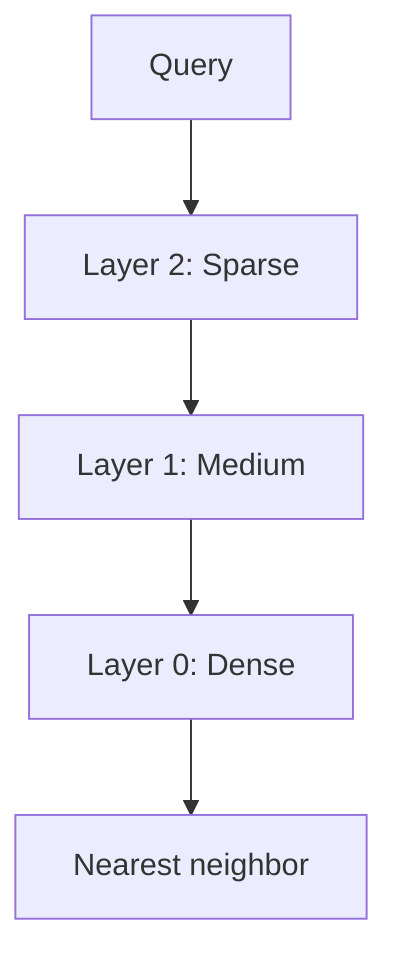
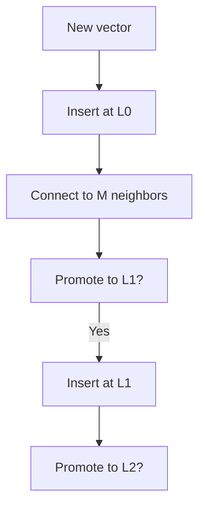
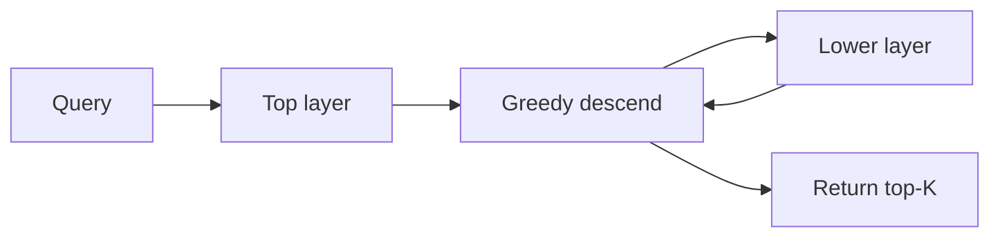
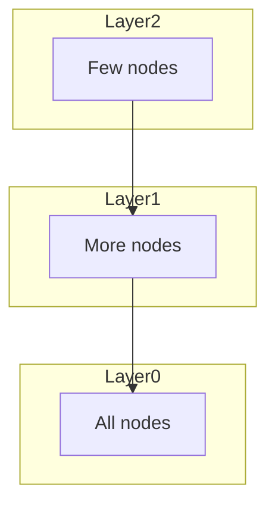

# HNSW

📄 File: `book/10_embeddings_vector_databases/hnsw.md`

This chapter covers **HNSW** (Hierarchical Navigable Small World) — a graph-based ANN algorithm known for high recall and fast search. Used in FAISS, Milvus, Qdrant, and Elasticsearch.

---

## Study Plan (2 days)

* Day 1: Graph structure + layers
* Day 2: Build + search algorithm + parameters

---

## 1 — What is HNSW?

HNSW builds a **multi-layer graph** where each node is a vector. Search starts at the top (sparse) layer and greedily descends to find nearest neighbors.



---

## 2 — Small World Property

* **Small world**: Short paths exist between any two nodes
* **Navigable**: Greedy search finds good approximate paths
* **Hierarchical**: Top layers = "highways"; bottom = "local roads"


---

## 3 — Build Algorithm (Simplified)

1. Insert vector one by one
2. Find nearest neighbors in each layer (greedy)
3. Connect new node to M nearest in each layer
4. With probability, promote node to next layer



---

## 4 — Search Algorithm

1. Start at top layer, enter at random or fixed entry point
2. Greedily move to nearest neighbor until no improvement
3. Drop to next layer, repeat
4. At layer 0, return k nearest from visited set



---

## 5 — Key Parameters

| Parameter | Effect |
| --------- | ------ |
| M | Max connections per node; higher = better recall, more memory |
| efConstruction | Build-time search width; higher = better graph, slower build |
| efSearch | Query-time search width; higher = better recall, slower |

```python
# FAISS HNSW example
import faiss
index = faiss.IndexHNSWFlat(dim=384, M=16, faiss.METRIC_INNER_PRODUCT)
index.hnsw.efConstruction = 200  # Build quality
index.add(vectors)
index.hnsw.efSearch = 64  # Query quality
D, I = index.search(queries, k=10)
```

---

## 6 — Diagram: Layer Structure



---

## 7 — HNSW vs IVF

| | HNSW | IVF |
|---|------|-----|
| Structure | Graph | Partitions |
| Build | No training | Needs k-means |
| Recall | Typically higher | Depends on nprobe |
| Memory | Higher (graph) | Lower (centroids + ids) |

---

## 8 — When to Use HNSW

* **High recall** required (e.g., 95%+)
* **Moderate scale** (up to tens of millions)
* **Memory available** for graph structure
* **Dynamic** inserts (HNSW supports incremental add)

---

## Exercises

### 1. efSearch Trade-off

For fixed index, how does efSearch=16 vs efSearch=256 affect recall and latency?

<details>
<summary>Solution</summary>

efSearch=16: faster, lower recall. efSearch=256: slower, higher recall. efSearch controls size of priority queue during search.
</details>

---

### 2. M Parameter

What happens if M is too small? Too large?

<details>
<summary>Solution</summary>

Too small: graph disconnected, poor navigation, low recall. Too large: more memory, slower build, diminishing returns.
</details>

---

## Interview Questions (with answers)

1. **How does HNSW achieve sublinear search?**
   Answer: Hierarchical layers; top layer has few nodes so we quickly get close to target; lower layers refine. Like skip list for graphs.

2. **What is efConstruction?**
   Answer: During build, how many candidates to consider when connecting new node. Higher = better graph quality, slower build.

3. **Can HNSW handle streaming inserts?**
   Answer: Yes. HNSW supports incremental add without full rebuild (unlike IVF which typically needs retrain for major changes).

---

## Key Takeaways

* HNSW = hierarchical graph, greedy search
* Layers: sparse top, dense bottom
* M, efConstruction, efSearch control quality/speed
* High recall, good for dynamic data

---

## Next Chapter

Proceed to: **ivf_pq.md**
