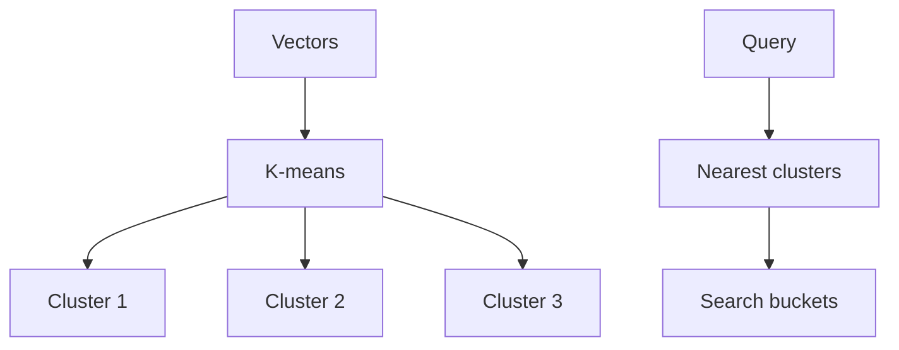
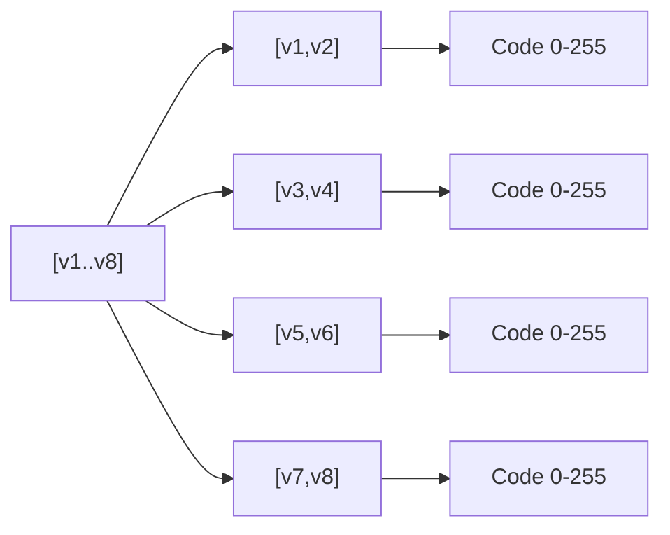
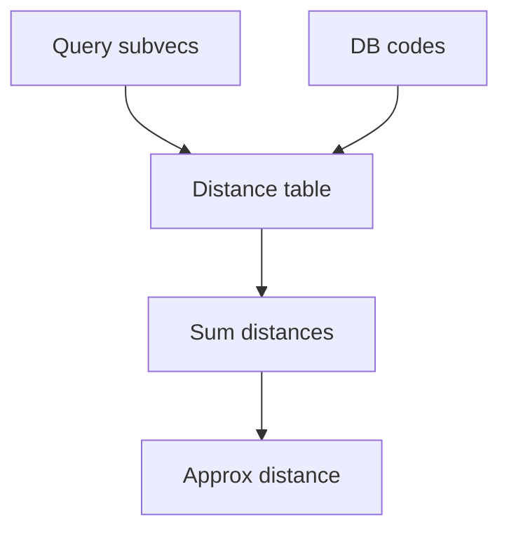
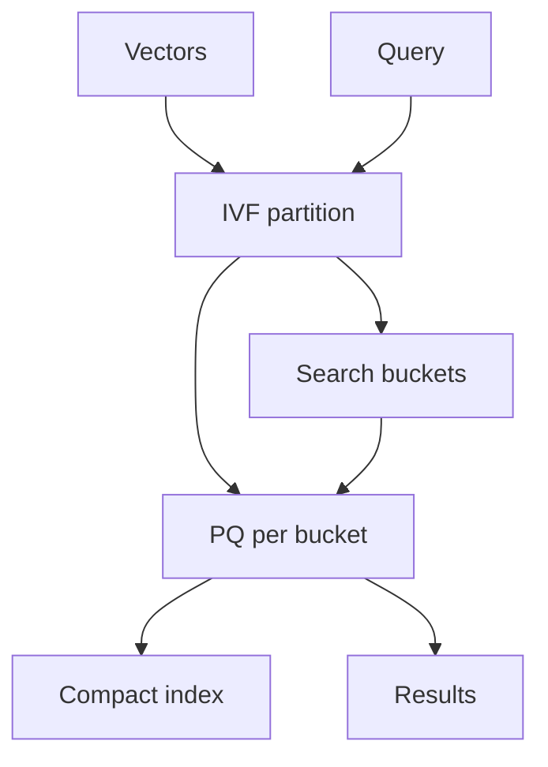
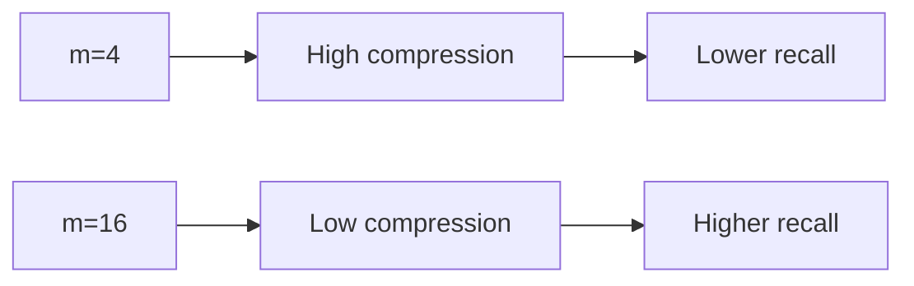

# IVF and Product Quantization (IVF-PQ)

📄 File: `book/10_embeddings_vector_databases/ivf_pq.md`

This chapter covers **IVF (Inverted File)** and **Product Quantization (PQ)** — techniques for scaling vector search to billions of vectors with limited memory.

---

## Study Plan (2–3 days)

* Day 1: IVF + PQ separately
* Day 2: IVF-PQ combined
* Day 3: FAISS implementation

---

## 1 — IVF Recap

**Inverted File**: Partition vectors into clusters; search only nearest clusters.



---

## 2 — Product Quantization (PQ)

**Idea**: Split each vector into **subvectors**; quantize each subvector to a **codebook** entry. Store only **codes** (integers), not full vectors.

* d dimensions → m subvectors of d/m dims each
* Each subvector → nearest of 256 centroids (1 byte)
* Compression: 4 bytes/float → 1 byte/code (4× for float32)



---

## 3 — PQ Distance (Approximate)

* **Asymmetric**: Query vs quantized DB. Query not quantized.
* **Symmetric**: Both quantized (lower quality)
* **Lookup table**: Precompute distances from query subvectors to each codebook; sum for approximate distance



---

## 4 — IVF + PQ Combined

1. **IVF**: Reduce search to few clusters
2. **PQ**: Compress vectors in each cluster
3. **Result**: Fast + memory-efficient



---

## 5 — FAISS IVF-PQ

```python
import numpy as np
import faiss

d = 384
nb = 100000
nlist = 1000
m = 8  # number of subquantizers (d must be divisible by m)
nprobe = 32

# Training data
xb = np.random.randn(nb, d).astype("float32")
xb = xb / np.linalg.norm(xb, axis=1, keepdims=True)

# Build IVF-PQ index
quantizer = faiss.IndexFlatIP(d)
index = faiss.IndexIVFPQ(quantizer, d, nlist, m, 8)  # 8 bits per code
index.train(xb)
index.add(xb)
index.nprobe = nprobe

# Search
xq = np.random.randn(10, d).astype("float32")
xq = xq / np.linalg.norm(xq, axis=1, keepdims=True)
D, I = index.search(xq, k=5)
```

---

## 6 — PQ Parameters

| Parameter | Effect |
| --------- | ------ |
| m | Number of subquantizers; more = less compression, better recall |
| nbits | Bits per code (8 → 256 centroids); more = better quality |



---

## 7 — Memory Comparison

For 1M vectors, d=384, float32:

* **Flat**: 1M × 384 × 4 = 1.5 GB
* **IVF-Flat**: ~1.5 GB + centroid overhead
* **IVF-PQ (m=8, 8 bits)**: ~1M × 8 bytes = 8 MB for codes + centroids

---

## 8 — When to Use IVF-PQ

* **Very large** scale (10M+ vectors)
* **Memory constrained**
* **Acceptable** to trade some recall for speed/size
* **Batch** queries (amortize lookup table build)

---

## Exercises

### 1. PQ Compression Ratio

d=384, m=8, 8 bits/code. What is compression vs raw float32?

<details>
<summary>Solution</summary>

Raw: 384 × 4 = 1536 bytes. PQ: 8 × 1 = 8 bytes. Ratio ~192×.
</details>

---

### 2. nprobe vs Recall

For IVF-PQ with nlist=1000, how does nprobe affect recall? What if nprobe=1000?

<details>
<summary>Solution</summary>

nprobe=1000 = search all clusters = higher recall but no IVF speedup. nprobe=1 = very fast, low recall. Typical: 10–50.
</details>

---

## Interview Questions (with answers)

1. **What is Product Quantization?**
   Answer: Split vector into subvectors; quantize each to codebook; store codes instead of full vectors. Enables compression and fast approximate distance via lookup tables.

2. **IVF-PQ: why combine them?**
   Answer: IVF reduces search space; PQ compresses vectors. Together: sublinear search + low memory for billions of vectors.

3. **Asymmetric vs symmetric PQ distance?**
   Answer: Asymmetric: query full precision, DB quantized; better quality. Symmetric: both quantized; faster but lower quality.

---

## Key Takeaways

* IVF = partition + search few buckets
* PQ = subvector quantization, store codes
* IVF-PQ = scalable + memory-efficient
* Trade recall for speed and memory

---

## Next Chapter

Proceed to: **milvus.md**
