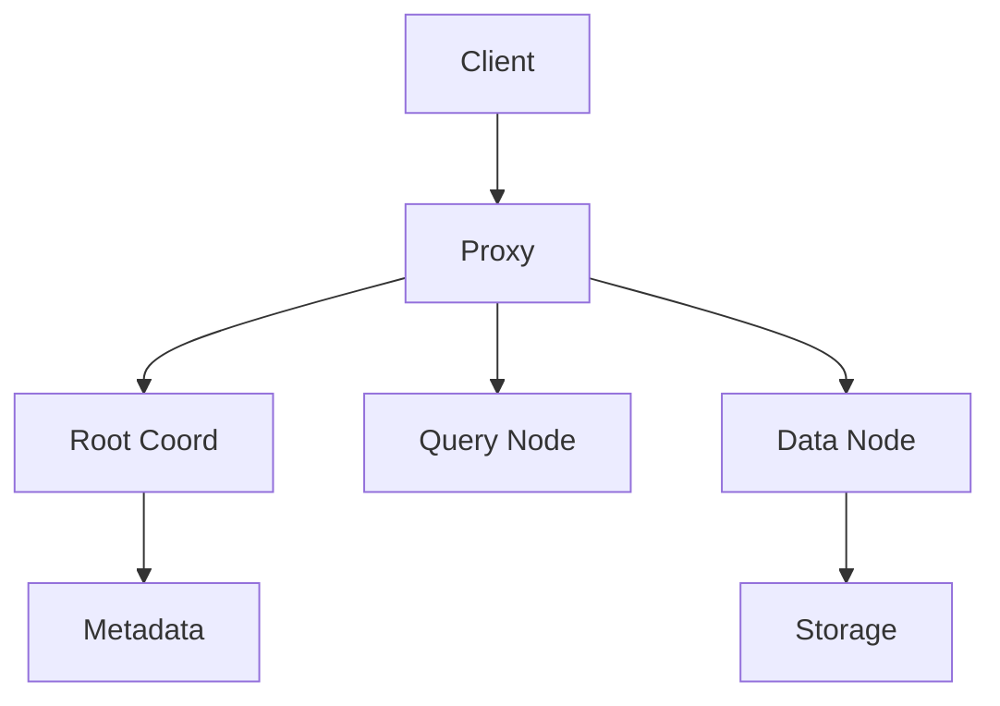
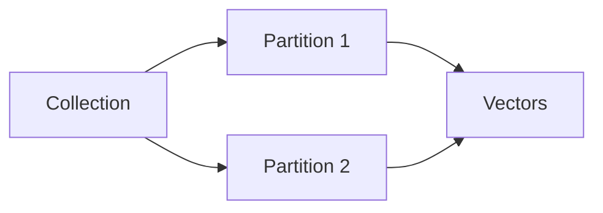
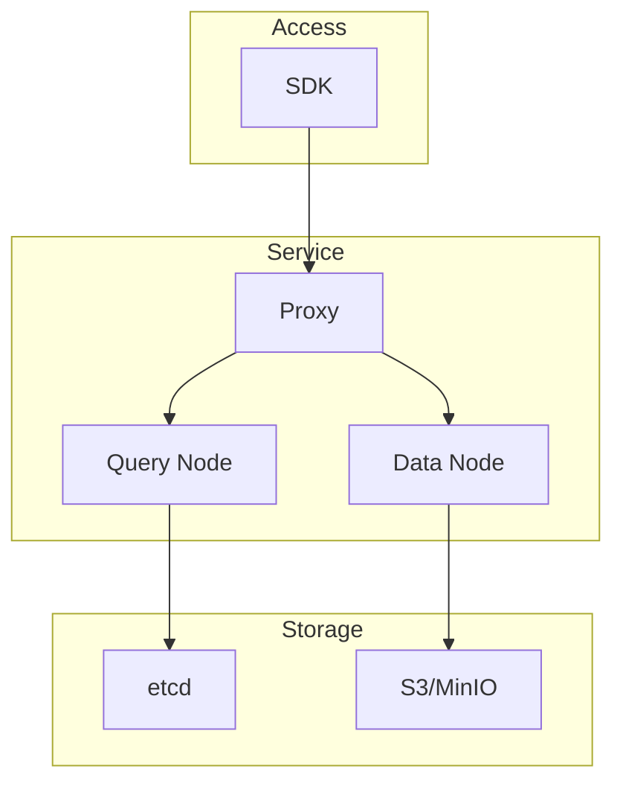

# Milvus

📄 File: `book/10_embeddings_vector_databases/milvus.md`

This chapter covers **Milvus** — an open-source vector database for AI applications. Supports billions of vectors, hybrid search, and distributed deployment.

---

## Study Plan (2–3 days)

* Day 1: Architecture + setup
* Day 2: Collections, insert, search
* Day 3: Index types + production tips

---

## 1 — What is Milvus?

Milvus is a **vector database** optimized for similarity search. Features:

* Scalable to billions of vectors
* Multiple index types (IVF, HNSW, etc.)
* Hybrid search (vector + scalar filter)
* Cloud-native, distributed



---

## 2 — Core Concepts

| Concept | Description |
| ------- | ----------- |
| Collection | Like a table; holds vectors + optional scalar fields |
| Schema | Defines fields (vector dim, type) |
| Partition | Logical grouping within collection |
| Index | ANN index on vector field |



---

## 3 — Basic Usage (pymilvus)

```python
from pymilvus import connections, Collection, FieldSchema, CollectionSchema, DataType

# Connect to Milvus server
connections.connect(alias="default", host="localhost", port="19530")

# Define schema
fields = [
    FieldSchema(name="id", dtype=DataType.INT64, is_primary=True, auto_id=True),
    FieldSchema(name="embedding", dtype=DataType.FLOAT_VECTOR, dim=384),
]
schema = CollectionSchema(fields=fields, description="Document embeddings")

# Create collection
collection = Collection(name="docs", schema=schema)

# Create index (IVF_FLAT for example)
index_params = {
    "metric_type": "IP",  # Inner product for cosine (normalized vectors)
    "index_type": "IVF_FLAT",
    "params": {"nlist": 1024}
}
collection.create_index(field_name="embedding", index_params=index_params)
```

---

## 4 — Insert and Search

```python
import numpy as np

# Insert vectors
vectors = np.random.randn(1000, 384).astype("float32")
vectors = vectors / np.linalg.norm(vectors, axis=1, keepdims=True)
entities = [vectors]
collection.insert(entities)
collection.flush()

# Load collection for search
collection.load()

# Search
search_params = {"metric_type": "IP", "params": {"nprobe": 10}}
query = np.random.randn(1, 384).astype("float32")
query = query / np.linalg.norm(query, axis=1, keepdims=True)
results = collection.search(
    data=query,
    anns_field="embedding",
    param=search_params,
    limit=5
)
```

---

## 5 — Diagram: Milvus Architecture



---

## 6 — Index Types in Milvus

| Index | Type | Use Case |
| ----- | ---- | -------- |
| FLAT | Exact | Small data |
| IVF_FLAT | IVF | Medium |
| IVF_SQ8 | IVF + scalar quantize | Memory saving |
| HNSW | HNSW | High recall |
| IVF_PQ | IVF + PQ | Large scale |

---

## 7 — Hybrid Search (Filter + Vector)

```python
# Filter by scalar field before vector search
expr = "category == 'tech'"
results = collection.search(
    data=query,
    anns_field="embedding",
    param=search_params,
    limit=5,
    expr=expr  # Scalar filter
)
```

---

## 8 — Production Considerations

* **Sharding**: Partition by tenant or time
* **Replica**: For HA
* **Resource groups**: Isolate workloads
* **Compaction**: Merge segments for efficiency

---

## Exercises

### 1. Create Collection

Create a collection with id, embedding (dim=768), and category (VARCHAR). Insert 100 vectors.

<details>
<summary>Solution</summary>

Add FieldSchema for category with dtype=DataType.VARCHAR, max_length=64. Insert with entities=[ids, embeddings, categories].
</details>

---

### 2. Index Choice

For 10M vectors, 384 dim, 95% recall required. Which index?

<details>
<summary>Solution</summary>

HNSW or IVF_FLAT with high nprobe. IVF_PQ if memory constrained.
</details>

---

## Interview Questions (with answers)

1. **Milvus vs FAISS?**
   Answer: FAISS is a library; Milvus is a database (persistence, distributed, API, filtering). Use FAISS for embedded; Milvus for service.

2. **What is a partition in Milvus?**
   Answer: Logical grouping; can filter by partition; useful for multi-tenant or time-based data.

3. **How does Milvus handle updates?**
   Answer: Delete + insert (no in-place update). Compaction merges segments.

---

## Key Takeaways

* Milvus = vector database (not just library)
* Collections, schemas, partitions
* Multiple index types (IVF, HNSW, PQ)
* Hybrid search: vector + scalar filter

---

## Next Chapter

Proceed to: **qdrant.md**
