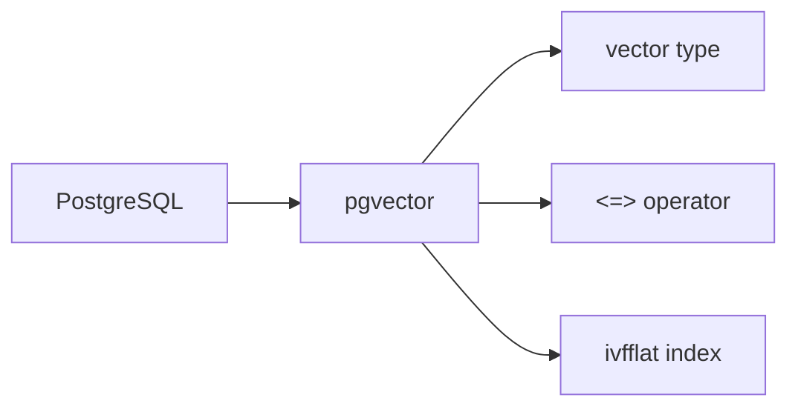
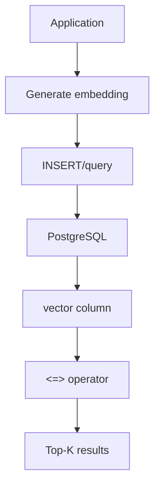

# pgvector

📄 File: `book/10_embeddings_vector_databases/pgvector.md`

This chapter covers **pgvector** — a PostgreSQL extension for vector similarity search. Ideal when you already use Postgres and need vector search alongside relational data.

---

## Study Plan (2 days)

* Day 1: Extension + vector type + operators
* Day 2: Indexes + hybrid queries + exercises

---

## 1 — What is pgvector?

pgvector adds a **vector** type and similarity operators to PostgreSQL. Run vector search in the same database as your relational data.



---

## 2 — Installation

```sql
-- Enable extension (requires superuser)
CREATE EXTENSION IF NOT EXISTS vector;

-- Verify
SELECT * FROM pg_extension WHERE extname = 'vector';
```

---

## 3 — Create Table with Vectors

```sql
-- Create table with vector column
CREATE TABLE documents (
    id SERIAL PRIMARY KEY,
    content TEXT,
    embedding vector(384),  -- 384 dimensions
    metadata JSONB
);

-- Insert (embedding from your application)
INSERT INTO documents (content, embedding, metadata)
VALUES (
    'Machine learning basics',
    '[0.1, -0.2, 0.3, ...]'::vector,
    '{"category": "tech"}'::jsonb
);
```

---

## 4 — Similarity Operators

| Operator | Description |
| -------- | ----------- |
| <-> | L2 distance (Euclidean) |
| <#> | Negative inner product |
| <=> | Cosine distance (1 - cosine) |

```sql
-- Cosine similarity: use <=> (cosine distance), order by ascending
SELECT id, content, embedding <=> '[0.1, -0.2, ...]'::vector AS distance
FROM documents
ORDER BY embedding <=> '[0.1, -0.2, ...]'::vector
LIMIT 5;
```

---

## 5 — Diagram: pgvector Flow



---

## 6 — Index: IVFFlat

```sql
-- Create IVFFlat index for faster search
-- lists = number of clusters
CREATE INDEX ON documents
USING ivfflat (embedding vector_cosine_ops)
WITH (lists = 100);

-- For L2 distance:
-- USING ivfflat (embedding vector_l2_ops)
```

---

## 7 — Hybrid Query (Vector + SQL)

```sql
-- Vector search + metadata filter
SELECT id, content, embedding <=> $1 AS distance
FROM documents
WHERE metadata->>'category' = 'tech'
ORDER BY embedding <=> $1
LIMIT 10;
```

---

## 8 — Python Example

```python
import psycopg2
from pgvector.psycopg2 import register_vector
import numpy as np

conn = psycopg2.connect("dbname=vectordb user=postgres")
register_vector(conn)

# Insert
embedding = np.random.randn(384).astype("float32")
cur = conn.cursor()
cur.execute(
    "INSERT INTO documents (content, embedding) VALUES (%s, %s)",
    ("Some text", embedding.tolist())
)
conn.commit()

# Search
cur.execute(
    "SELECT id, content FROM documents ORDER BY embedding <=> %s LIMIT 5",
    (embedding.tolist(),)
)
results = cur.fetchall()
```

---

## Exercises

### 1. Create and Query

Create table `products` with id, name, embedding vector(128). Insert 3 rows. Query top-2 by cosine similarity.

<details>
<summary>Solution</summary>

```sql
CREATE TABLE products (id SERIAL, name TEXT, embedding vector(128));
INSERT INTO products (name, embedding) VALUES ('A', '[0.1,...]'::vector), ...;
SELECT * FROM products ORDER BY embedding <=> '[0.1,...]'::vector LIMIT 2;
```
</details>

---

### 2. When to Use pgvector

When would you choose pgvector over Milvus or Qdrant?

<details>
<summary>Solution</summary>

When you already use Postgres; need ACID, joins with relational data; smaller scale (<10M vectors); want simplicity.
</details>

---

## Interview Questions (with answers)

1. **What is pgvector?**
   Answer: PostgreSQL extension adding vector type and similarity operators (L2, inner product, cosine) for vector search.

2. **What index does pgvector support?**
   Answer: IVFFlat (and HNSW in newer versions). IVFFlat: k-means clusters, search nearest clusters.

3. **Cosine in pgvector: which operator?**
   Answer: <=> gives cosine distance (1 - cosine). For similarity, use 1 - (embedding <=> query). Order by <=> ASC for nearest.

---

## Key Takeaways

* pgvector = Postgres + vectors
* vector(n) type, <=> for cosine distance
* IVFFlat index for speed
* Hybrid: vector search + SQL filters

---

## Next Chapter

Proceed to: **book/11_rag_systems/rag_architecture.md** (or next phase in your roadmap)
