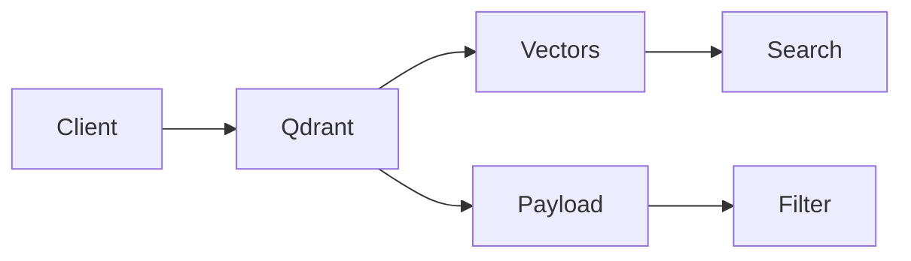
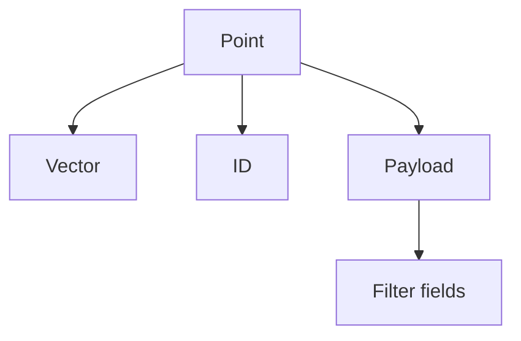
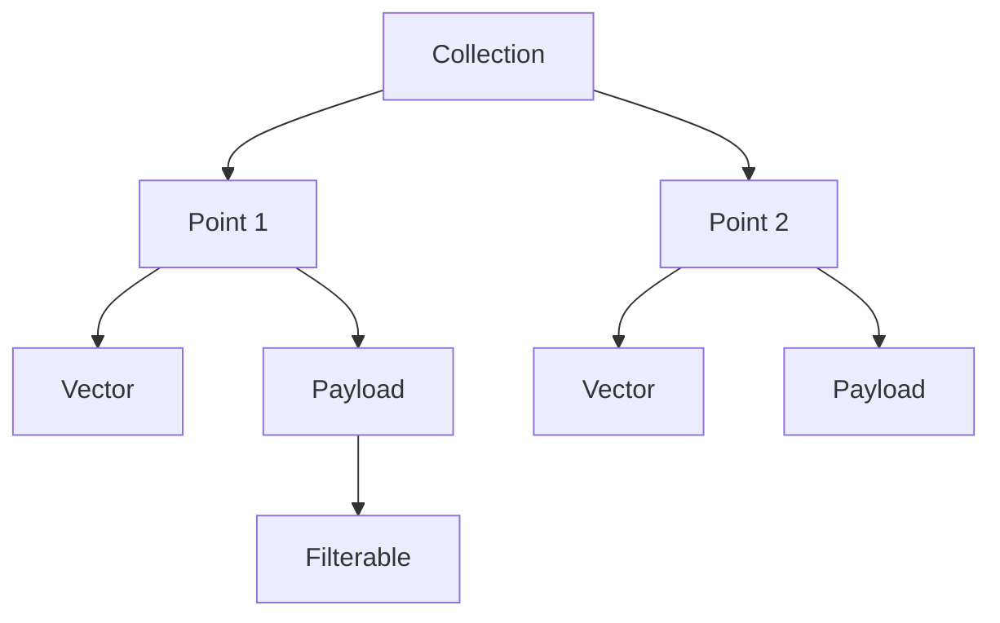

# Qdrant

📄 File: `book/10_embeddings_vector_databases/qdrant.md`

This chapter covers **Qdrant** — a vector database and similarity search engine. Popular for RAG, recommendation, and semantic search. Written in Rust for performance.

---

## Study Plan (2–3 days)

* Day 1: Setup + collections
* Day 2: Insert, search, filters
* Day 3: Payload + production

---

## 1 — What is Qdrant?

Qdrant is a **vector search engine** with:

* REST and gRPC APIs
* Filtering by payload (metadata)
* HNSW and IVF indexes
* Rust core, fast and memory-efficient



---

## 2 — Core Concepts

| Concept | Description |
| ------- | ----------- |
| Collection | Set of vectors + payloads |
| Point | Vector + id + payload |
| Payload | Metadata (JSON) for filtering |
| Vector | Embedding (dense array) |



---

## 3 — Python Client Setup

```python
from qdrant_client import QdrantClient
from qdrant_client.models import Distance, VectorParams, PointStruct

# Connect (local or remote)
client = QdrantClient(host="localhost", port=6333)

# Create collection
client.create_collection(
    collection_name="documents",
    vectors_config=VectorParams(size=384, distance=Distance.COSINE),
)
```

---

## 4 — Insert Points

```python
# Points: list of (id, vector, payload)
points = [
    PointStruct(
        id=1,
        vector=[0.1] * 384,  # Your embedding
        payload={"text": "First doc", "category": "tech"}
    ),
    PointStruct(
        id=2,
        vector=[0.2] * 384,
        payload={"text": "Second doc", "category": "news"}
    ),
]
client.upsert(collection_name="documents", points=points)
```

---

## 5 — Search with Filter

```python
# Search
results = client.search(
    collection_name="documents",
    query_vector=[0.15] * 384,
    limit=5,
)

# Search with payload filter
from qdrant_client.models import Filter, FieldCondition, MatchValue

results = client.search(
    collection_name="documents",
    query_vector=query_vector,
    query_filter=Filter(
        must=[FieldCondition(key="category", match=MatchValue(value="tech"))]
    ),
    limit=5,
)
```

---

## 6 — Diagram: Qdrant Data Model



---

## 7 — Batch Upload

```python
# Efficient batch upload
from qdrant_client.models import PointStruct

def batch_upsert(ids, vectors, payloads, batch_size=100):
    for i in range(0, len(ids), batch_size):
        batch = [
            PointStruct(id=ids[j], vector=vectors[j], payload=payloads[j])
            for j in range(i, min(i + batch_size, len(ids)))
        ]
        client.upsert(collection_name="documents", points=batch)
```

---

## 8 — Index Configuration

```python
# Update collection params (HNSW)
from qdrant_client.models import HnswConfigDiff

client.update_collection(
    collection_name="documents",
    hnsw_config=HnswConfigDiff(
        m=16,
        ef_construct=100,
    ),
)
```

---

## Exercises

### 1. Create and Search

Create collection "products", insert 3 points with id, vector (dim=4), payload (name, price). Search top-2.

<details>
<summary>Solution</summary>

```python
client.create_collection("products", vectors_config=VectorParams(size=4, distance=Distance.COSINE))
client.upsert("products", points=[PointStruct(id=i, vector=[...], payload={"name": "...", "price": 10}) for i in range(3)])
client.search("products", query_vector=[...], limit=2)
```
</details>

---

### 2. Filter Syntax

Filter points where category="tech" AND price < 100.

<details>
<summary>Solution</summary>

Filter(must=[FieldCondition(key="category", match=MatchValue(value="tech")), FieldCondition(key="price", range=Range(gte=0, lt=100))])
</details>

---

## Interview Questions (with answers)

1. **Qdrant vs Pinecone?**
   Answer: Qdrant is open-source, self-hosted. Pinecone is managed cloud. Qdrant gives more control; Pinecone simpler ops.

2. **What is payload in Qdrant?**
   Answer: Metadata attached to each point; JSON; used for filtering (e.g., category, date) without vector search.

3. **How does Qdrant handle updates?**
   Answer: Upsert by id; overwrites existing point. Delete by filter or id.

---

## Key Takeaways

* Qdrant = vector DB with payload filtering
* Points = id + vector + payload
* REST/gRPC, Python client
* HNSW default; configurable

---

## Next Chapter

Proceed to: **pgvector.md**
