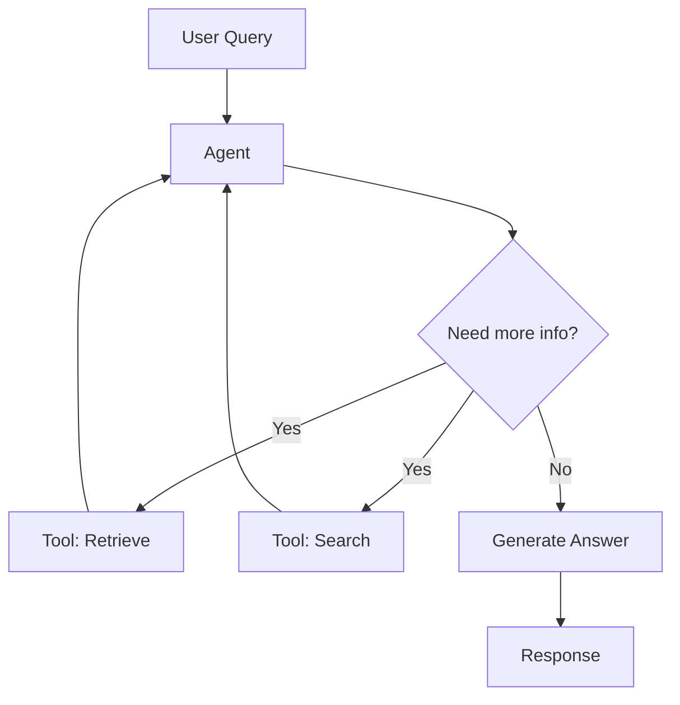
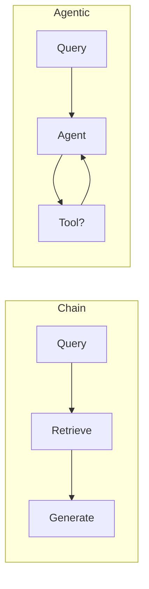
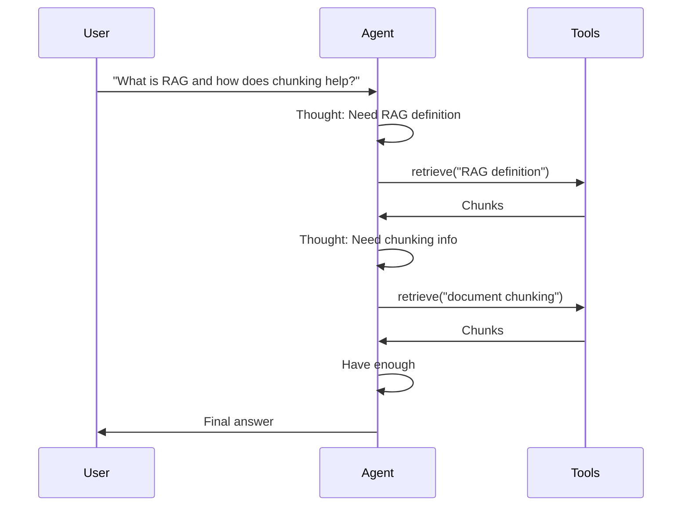
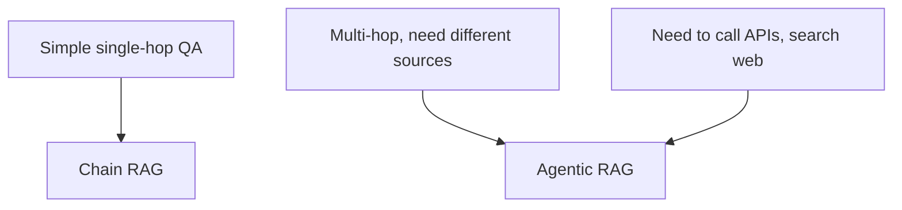

# Agentic RAG (Deep Dive)

📄 File: `book/11_rag_systems/agentic_rag.md`

This chapter covers **agentic RAG** — RAG systems where an LLM agent decides when to retrieve, which tools to use, and how to iterate. Goes beyond fixed retrieve-then-generate pipelines.

---

## Study Plan (2–3 days)

* Day 1: Agents vs chains, ReAct pattern
* Day 2: Tool use (retrieval, search, calculator)
* Day 3: Build agentic RAG with LangChain

---

## 1 — What is Agentic RAG?

In agentic RAG, an **LLM agent** orchestrates retrieval, tool calls, and generation in a loop until it has enough context to answer.



---

## 2 — Chain RAG vs Agentic RAG

| Aspect | Chain RAG | Agentic RAG |
| ------ | --------- | ----------- |
| **Flow** | Fixed: retrieve → generate | Dynamic: agent decides |
| **Retrieval** | Always, once | On demand, multiple |
| **Tools** | None | Retrieval, search, etc. |
| **Use case** | Simple QA | Complex, multi-step |



---

## 3 — ReAct Pattern

ReAct = **Reason** + **Act**. Agent outputs thought, action, observation in a loop.

```mermaid
flowchart TD
    A[Thought: What do I need?] --> B[Action: retrieve "RAG architecture"]
    B --> C[Observation: chunks returned]
    C --> D[Thought: Enough to answer?]
    D -->|No| A
    D -->|Yes| E[Final Answer]
```

---

## 4 — Agent Loop



---

## 5 — Code: Agentic RAG with LangChain

```python
from langchain_openai import ChatOpenAI
from langchain_community.vectorstores import Chroma
from langchain_openai import OpenAIEmbeddings
from langchain.agents import create_tool_calling_agent, AgentExecutor
from langchain_core.prompts import ChatPromptTemplate, MessagesPlaceholder
from langchain_core.tools import tool

# 1. Create retriever as a tool
embeddings = OpenAIEmbeddings()
vectorstore = Chroma.from_documents(docs, embeddings)
retriever = vectorstore.as_retriever(k=4)

@tool
def retrieve_docs(query: str) -> str:
    """Retrieve relevant document chunks for a query. Use when you need more context."""
    docs = retriever.invoke(query)
    return "\n\n".join(d.page_content for d in docs)

# 2. Define tools
tools = [retrieve_docs]

# 3. Prompt with tool-calling format
prompt = ChatPromptTemplate.from_messages([
    ("system", "You are a helpful assistant. Use retrieve_docs when you need more context."),
    MessagesPlaceholder(variable_name="chat_history", optional=True),
    ("human", "{input}"),
    MessagesPlaceholder(variable_name="agent_scratchpad"),
])

# 4. Create agent
llm = ChatOpenAI(model="gpt-4o", temperature=0)
agent = create_tool_calling_agent(llm, tools, prompt)
agent_executor = AgentExecutor(agent=agent, tools=tools, verbose=True)

# 5. Run
result = agent_executor.invoke({"input": "What is RAG and why is chunking important?"})
print(result["output"])
```

---

## 6 — When to Use Agentic RAG



| Use Agentic When | Use Chain When |
| ----------------- | -------------- |
| Multi-step reasoning | Single retrieval suffices |
| Dynamic tool use | Fixed pipeline |
| Web search, APIs | Document-only |

---

## Exercises

### 1. Add a search tool

Add a web search tool (e.g., Tavily) to the agent. Ask: "What is the latest RAG paper?" and observe tool use.

### 2. Limit tool calls

Set `max_iterations=3` in AgentExecutor. Compare behavior when the agent needs more than 3 steps.

### 3. Log tool usage

Instrument the agent to log which tools were called and how many times per query.

---

## Interview Questions

1. **What is the difference between chain RAG and agentic RAG?**
   * Answer: Chain has fixed flow; agentic lets the LLM decide when to retrieve and which tools to use in a loop.

2. **What is ReAct?**
   * Answer: Reason + Act — agent outputs thought, action, observation iteratively until it can answer.

3. **When would you choose agentic over chain RAG?**
   * Answer: Multi-hop questions, need for external tools (search, APIs), or when retrieval needs vary by query.

---

## Key Takeaways

* **Agentic RAG** — LLM agent orchestrates retrieval and tools dynamically
* **ReAct** — Thought → Action → Observation loop
* **Tools** — Retrieval, search, calculator, etc.
* **Use when** — Multi-hop, dynamic tool use; otherwise chain RAG is simpler

---

## Next Chapter

Proceed to: **orchestration_frameworks.md** or **rag_architecture.md**
