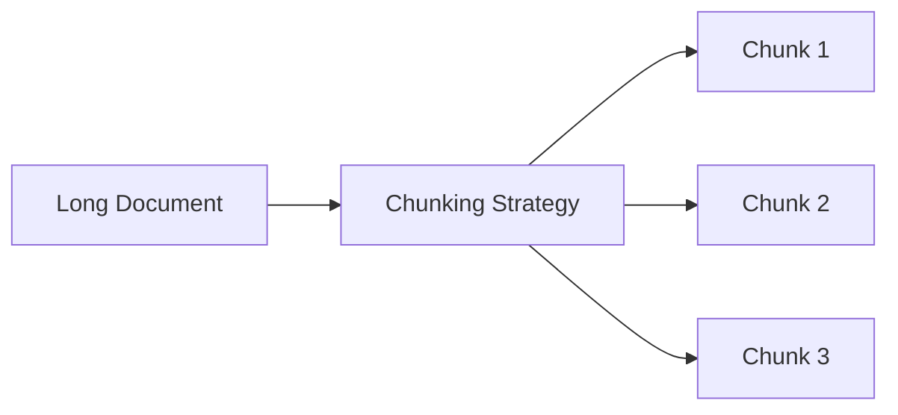
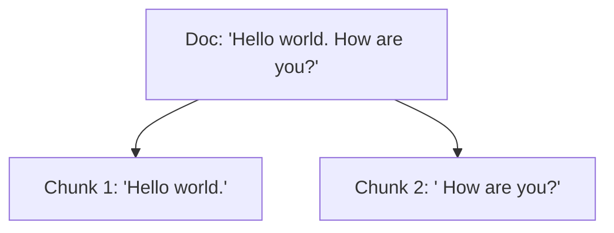
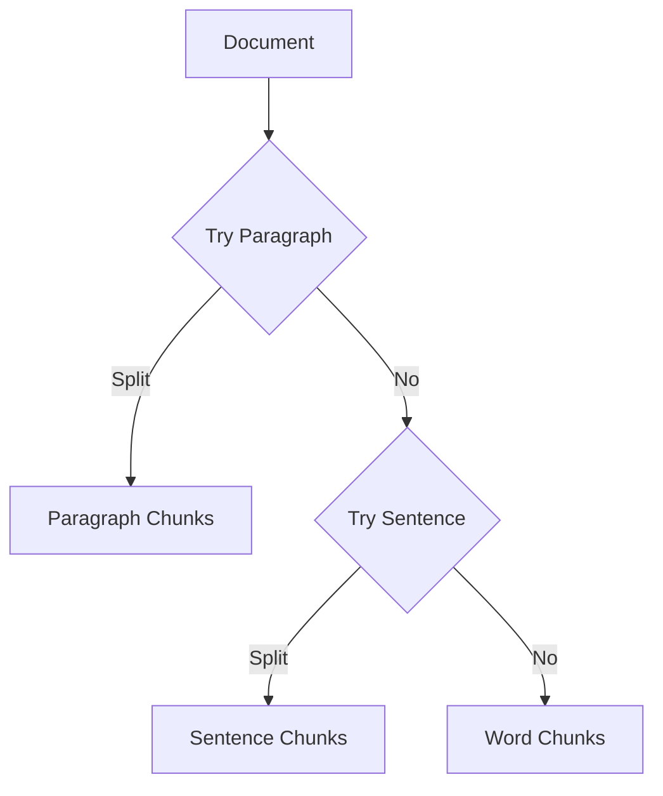
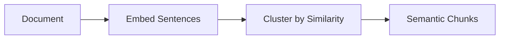
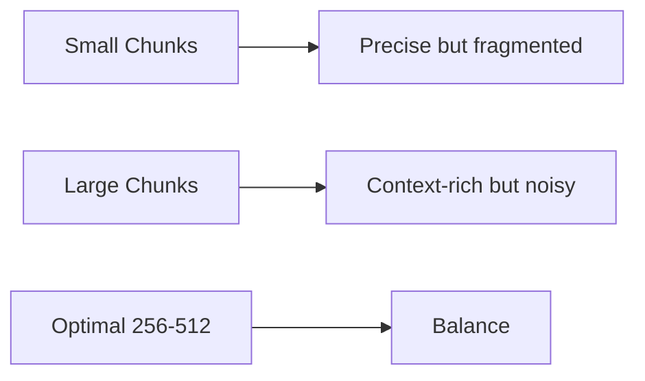
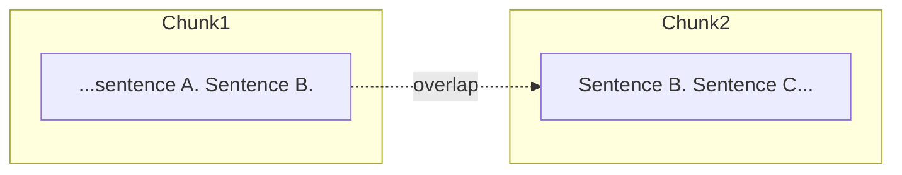

# Document Chunking (Deep Dive)

📄 File: `book/11_rag_systems/document_chunking.md`

This chapter covers **document chunking** — how to split documents into retrievable units for RAG. Chunking directly impacts retrieval quality and LLM context usage.

---

## Study Plan (2–3 days)

* Day 1: Chunking strategies (fixed, recursive, semantic)
* Day 2: Overlap, boundaries, and token limits
* Day 3: Implementation with LangChain/LlamaIndex + exercises

---

## 1 — What is Document Chunking?

Chunking splits long documents into smaller **retrievable units** that fit embedding models and LLM context windows.



---

## 2 — Why Chunking Matters

| Factor | Impact |
| ------ | ------ |
| **Chunk size** | Too small → loses context; too large → noisy retrieval |
| **Overlap** | Preserves continuity across boundaries |
| **Boundaries** | Sentence/paragraph boundaries improve coherence |

---

## 3 — Chunking Strategies

### Fixed-Size Chunking

Splits by character count. Simple but can cut mid-sentence.



### Recursive Character Splitter

Splits by hierarchy: paragraphs → sentences → words. Preserves natural boundaries.



### Semantic Chunking

Uses embeddings to group semantically similar text. More expensive but higher quality.



---

## 4 — Code: Recursive Character Splitter (LangChain)

```python
from langchain_text_splitters import RecursiveCharacterTextSplitter

# Create splitter with chunk_size and chunk_overlap
splitter = RecursiveCharacterTextSplitter(
    chunk_size=500,        # Max chars per chunk
    chunk_overlap=50,      # Overlap between chunks for context continuity
    length_function=len,   # How to measure length (len or token counter)
    separators=["\n\n", "\n", ". ", " ", ""],  # Split hierarchy
)

# Sample document
doc = """
Machine learning is a subset of AI. It enables systems to learn from data.
Deep learning uses neural networks. Transformers revolutionized NLP.
"""

# Split into chunks
chunks = splitter.split_text(doc)

# Print each chunk with index
for i, chunk in enumerate(chunks):
    print(f"Chunk {i+1}: {chunk[:80]}...")
```

---

## 5 — Code: Token-Aware Chunking

```python
from langchain_text_splitters import RecursiveCharacterTextSplitter

# Use tiktoken for accurate token counting (OpenAI models)
def count_tokens(text: str) -> int:
    import tiktoken
    enc = tiktoken.get_encoding("cl100k_base")  # GPT-4 tokenizer
    return len(enc.encode(text))

splitter = RecursiveCharacterTextSplitter(
    chunk_size=256,           # Tokens, not chars
    chunk_overlap=25,
    length_function=count_tokens,  # Token-aware splitting
)

chunks = splitter.split_text("Your long document here...")
```

---

## 6 — Chunk Size vs Retrieval Quality



| Chunk Size | Pros | Cons |
| ---------- | ---- | ---- |
| 128 tokens | Precise matches | Loses context |
| 256–512 | Good balance | Default choice |
| 1024+ | Full context | Noisy, expensive |

---

## 7 — Overlap Diagram



Overlap ensures queries matching "Sentence B" retrieve both chunks.

---

## Exercises

### 1. Implement fixed-size chunking

Split a 1000-character document into 200-char chunks with 20-char overlap. Print chunk boundaries.

### 2. Compare chunkers

Use the same document with `chunk_size=200` for both fixed and recursive splitters. Compare where splits occur.

### 3. Token-aware chunking

Use `tiktoken` to chunk a document to exactly 128 tokens per chunk. Verify with `count_tokens`.

---

## Interview Questions

1. **Why use overlap in chunking?**
   * Answer: Preserves context at boundaries; queries spanning two chunks still retrieve both.

2. **When would you use semantic chunking over recursive?**
   * Answer: When document structure is poor or topics shift mid-paragraph. Higher cost due to embeddings.

3. **What chunk size for embedding models with 512-token limit?**
   * Answer: Stay under 512; 256–384 is common to leave headroom for metadata.

---

## Key Takeaways

* **Chunking** — Splits docs into retrievable units for RAG
* **Recursive** — Default choice; respects paragraph/sentence boundaries
* **Overlap** — 10–20% of chunk_size for continuity
* **Token-aware** — Use tiktoken when targeting specific token limits

---

## Next Chapter

Proceed to: **hybrid_search.md**
