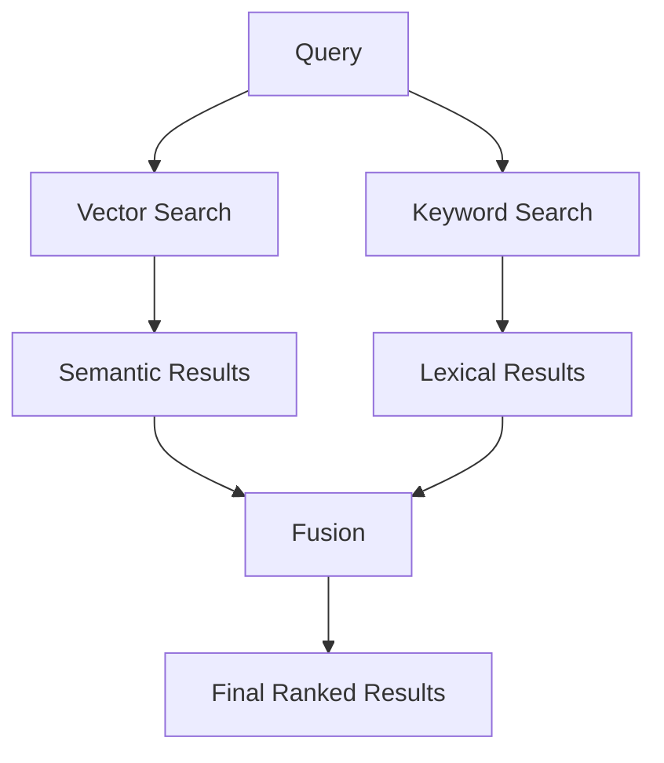
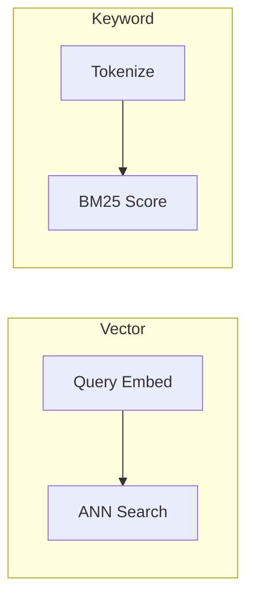
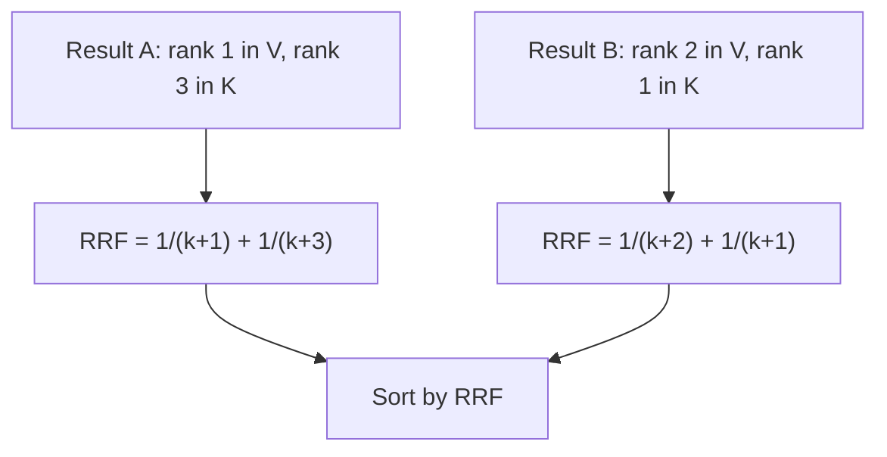
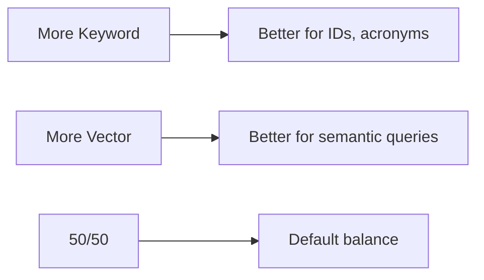
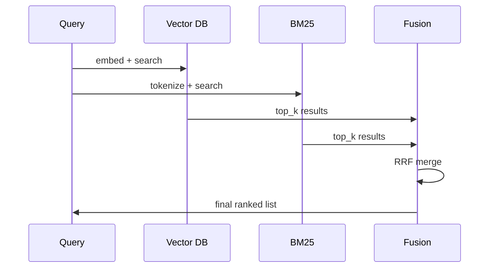

# Hybrid Search (Deep Dive)

📄 File: `book/11_rag_systems/hybrid_search.md`

This chapter covers **hybrid search** — combining vector (semantic) and keyword (BM25) search to improve RAG retrieval. Each method has strengths; hybrid leverages both.

---

## Study Plan (2 days)

* Day 1: Vector vs keyword search, Reciprocal Rank Fusion
* Day 2: Implementation with LangChain/Elasticsearch + tuning

---

## 1 — What is Hybrid Search?

Hybrid search = **vector search** (semantic similarity) + **keyword search** (BM25/lexical) combined with a fusion strategy.



---

## 2 — Vector vs Keyword Search

| Aspect | Vector Search | Keyword Search (BM25) |
| ------ | ------------- | -------------------- |
| **Matching** | Semantic similarity | Exact/partial term match |
| **"car" → "automobile"** | ✓ Similar | ✗ No match |
| **Acronyms, IDs** | Often weak | Strong |
| **Latency** | Embedding + ANN | Inverted index |



---

## 3 — Reciprocal Rank Fusion (RRF)

RRF combines rankings without score normalization. For each result, add `1 / (k + rank)`.



Formula: `RRF_score(d) = Σ 1/(k + rank_i(d))` where k=60 (typical).

---

## 4 — Code: Hybrid Search with LangChain

```python
from langchain_community.retrievers import BM25Retriever
from langchain_community.vectorstores import Chroma
from langchain.retrievers import EnsembleRetriever
from langchain_openai import OpenAIEmbeddings

# 1. Create document store (chunks from previous chapter)
documents = ["chunk1", "chunk2", "chunk3"]  # Your chunked docs

# 2. BM25 retriever (keyword)
bm25_retriever = BM25Retriever.from_texts(documents)
bm25_retriever.k = 5  # Top 5 from keyword search

# 3. Vector retriever (semantic)
embeddings = OpenAIEmbeddings()
vectorstore = Chroma.from_texts(documents, embeddings)
vector_retriever = vectorstore.as_retriever(search_kwargs={"k": 5})

# 4. Ensemble retriever with RRF (equal weight by default)
ensemble = EnsembleRetriever(
    retrievers=[bm25_retriever, vector_retriever],
    weights=[0.5, 0.5],  # 50% keyword, 50% vector
)

# 5. Query
results = ensemble.invoke("What is machine learning?")
for doc in results:
    print(doc.page_content[:100])
```

---

## 5 — Weight Tuning



| Use Case | Keyword Weight | Vector Weight |
| -------- | -------------- | ------------- |
| Technical docs (IDs, code) | 0.6 | 0.4 |
| Conversational QA | 0.3 | 0.7 |
| General | 0.5 | 0.5 |

---

## 6 — Hybrid Search Flow



---

## Exercises

### 1. Implement RRF manually

Given two ranked lists `[A,B,C]` and `[B,A,D]`, compute RRF scores with k=60. Verify B ranks highest.

### 2. Tune weights

Run hybrid search with weights (0.2, 0.8), (0.5, 0.5), (0.8, 0.2). Compare relevance on 5 test queries.

### 3. Add reranking

After hybrid retrieval, apply a cross-encoder reranker. Measure latency vs quality gain.

---

## Interview Questions

1. **When is hybrid search better than vector-only?**
   * Answer: When queries contain exact terms (IDs, names, acronyms) or when semantic search alone misses key matches.

2. **What is RRF and why use it?**
   * Answer: Reciprocal Rank Fusion; combines rankings without normalizing heterogeneous scores (vector vs BM25).

3. **How would you tune hybrid weights for a legal document RAG?**
   * Answer: Increase keyword weight for case IDs, statute numbers; keep vector for conceptual questions.

---

## Key Takeaways

* **Hybrid** = Vector + Keyword, fused with RRF
* **Vector** — Semantic; **Keyword** — Lexical (BM25)
* **RRF** — Simple, robust fusion; k≈60 typical
* **Weights** — Tune per domain (technical vs conversational)

---

## Next Chapter

Proceed to: **retrieval_strategies.md**
