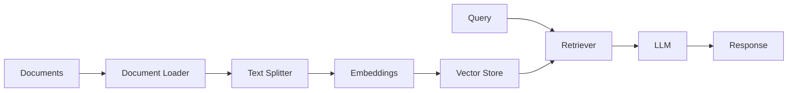
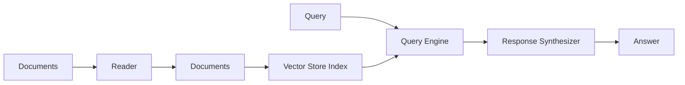

# Orchestration Frameworks — LangChain & LlamaIndex

📄 File: `book/11_rag_systems/orchestration_frameworks.md`

This chapter covers **orchestration frameworks** that connect LLMs, embeddings, vector stores, and tools into production RAG pipelines. You should complete the core RAG concepts (chunking, retrieval, hybrid search) before this chapter.

---

## Study Plan (2–3 days)

* Day 1: When to use frameworks vs custom code + LangChain basics
* Day 2: LlamaIndex + comparison + tradeoffs
* Day 3: Build RAG pipeline with both frameworks (see `projects/rag_pipeline/`)

---

## 1 — When to Use Frameworks vs Custom Code

### Use a framework when:

* **Prototyping** — Get a working RAG pipeline in hours, not days
* **Team velocity** — Standard patterns reduce onboarding and code review time
* **Integrations** — Many connectors (vector DBs, document loaders, LLM providers) out of the box
* **Production features** — Retries, streaming, observability hooks built in

### Use custom code when:

* **Full control** — You need to tune every step (chunking, retrieval, reranking)
* **Minimal dependencies** — Smaller surface area, fewer breaking changes
* **Learning** — Building from scratch teaches you how RAG works internally
* **Performance** — Avoiding abstraction overhead for high-throughput systems

### Rule of thumb

* Learn the **concepts first** (chunking, embeddings, retrieval) with minimal code
* Use **frameworks** when building real products or joining teams that use them
* Know **both** — top engineers can reason about what frameworks do under the hood

---

## 2 — LangChain

LangChain is a general-purpose orchestration framework for LLM applications. It provides chains, agents, tools, and integrations.

### Core concepts

| Concept | Purpose |
| ------- | ------- |
| **Chains** | Composable sequences of LLM calls and tools |
| **LCEL** | LangChain Expression Language — declarative chain building |
| **Runnable** | Base interface for chain components (invoke, stream, batch) |
| **Retrievers** | Abstractions over vector stores and retrieval logic |

### Diagram — LangChain RAG flow



### Basic RAG with LangChain

```python
from langchain_community.document_loaders import TextLoader
from langchain_text_splitters import RecursiveCharacterTextSplitter
from langchain_openai import OpenAIEmbeddings, ChatOpenAI
from langchain_community.vectorstores import Chroma
from langchain.chains import create_retrieval_chain
from langchain.chains.combine_documents import create_stuff_documents_chain
from langchain_core.prompts import ChatPromptTemplate

# 1. Load and chunk documents
loader = TextLoader("docs.txt")
docs = loader.load()
splitter = RecursiveCharacterTextSplitter(chunk_size=500, chunk_overlap=50)
splits = splitter.split_documents(docs)

# 2. Create vector store
embeddings = OpenAIEmbeddings()
vectorstore = Chroma.from_documents(documents=splits, embedding=embeddings)
retriever = vectorstore.as_retriever(k=4)

# 3. Build RAG chain with LCEL
prompt = ChatPromptTemplate.from_messages([
    ("system", "Answer based on context: {context}"),
    ("human", "{input}"),
])
llm = ChatOpenAI(model="gpt-4o-mini", temperature=0)
chain = create_retrieval_chain(retriever, create_stuff_documents_chain(llm, prompt))

# 4. Invoke
result = chain.invoke({"input": "What is the main topic?"})
print(result["answer"])
```

### LCEL — Declarative chains

```python
from langchain_core.runnables import RunnablePassthrough
from langchain_core.output_parsers import StrOutputParser

# Chain: retriever -> format context -> LLM -> parse
chain = (
    {"context": retriever, "question": RunnablePassthrough()}
    | prompt
    | llm
    | StrOutputParser()
)

response = chain.invoke("Summarize the document.")
```

### Key LangChain features for RAG

* **Document loaders** — PDF, web, Notion, Confluence, etc.
* **Text splitters** — Recursive, semantic, token-based
* **Retrievers** — Vector, hybrid, self-query
* **Streaming** — `chain.stream()` for token-by-token output
* **Callbacks** — Integrate with Langfuse, Arize, OpenTelemetry

---

## 3 — LlamaIndex

LlamaIndex is focused on **data-centric LLM applications** — RAG, document QA, and structured data access. It emphasizes indices, query engines, and data connectors.

### Core concepts

| Concept | Purpose |
| ------- | ------- |
| **Index** | Structure over your data (vector, tree, keyword) |
| **Query Engine** | Retrieves and synthesizes answers from an index |
| **Data Connectors** | Load from files, APIs, databases |
| **Response Synthesizer** | How to combine retrieved chunks into an answer |

### Diagram — LlamaIndex RAG flow



### Basic RAG with LlamaIndex

```python
from llama_index.core import VectorStoreIndex, SimpleDirectoryReader, Settings
from llama_index.embeddings.openai import OpenAIEmbedding
from llama_index.llms.openai import OpenAI

# 1. Configure embeddings and LLM
Settings.embed_model = OpenAIEmbedding(model="text-embedding-3-small")
Settings.llm = OpenAI(model="gpt-4o-mini", temperature=0)

# 2. Load documents and build index
documents = SimpleDirectoryReader("docs").load_data()
index = VectorStoreIndex.from_documents(documents)

# 3. Create query engine
query_engine = index.as_query_engine(similarity_top_k=4)

# 4. Query
response = query_engine.query("What is the main topic?")
print(response)
```

### Advanced: custom chunking and retrieval

```python
from llama_index.core.node_parser import SentenceSplitter
from llama_index.core.retrievers import VectorIndexRetriever
from llama_index.core.query_engine import RetrieverQueryEngine
from llama_index.core.response_synthesizers import get_response_synthesizer

# Custom chunking
node_parser = SentenceSplitter(chunk_size=512, chunk_overlap=50)
nodes = node_parser.get_nodes_from_documents(documents)

# Build index from nodes
index = VectorStoreIndex(nodes)

# Custom retriever + synthesizer
retriever = VectorIndexRetriever(index=index, similarity_top_k=4)
synthesizer = get_response_synthesizer(response_mode="compact")
query_engine = RetrieverQueryEngine(retriever=retriever, response_synthesizer=synthesizer)
```

### Key LlamaIndex features for RAG

* **Data loaders** — 100+ connectors (S3, Slack, Notion, databases)
* **Indices** — Vector, keyword, knowledge graph, composite
* **Query modes** — Simple, sub-question, multi-doc
* **Evaluation** — Built-in metrics (faithfulness, relevance)
* **Agents** — ReAct, tool use, multi-step reasoning

---

## 4 — LangChain vs LlamaIndex vs Custom

| Dimension | LangChain | LlamaIndex | Custom |
| --------- | --------- | ---------- | ------ |
| **Focus** | General LLM orchestration | RAG and data-centric apps | Full control |
| **Learning curve** | Steeper (many abstractions) | Moderate | Depends on you |
| **RAG ergonomics** | Good | Excellent | You design it |
| **Integrations** | Very broad | Broad (data-focused) | None built-in |
| **Production readiness** | Mature, large ecosystem | Mature | Your responsibility |
| **Debugging** | Can be opaque | Clearer data flow | Fully transparent |
| **Best for** | Agents, tools, multi-step flows | Document QA, RAG pipelines | High-throughput, custom logic |

### When to choose which

* **LangChain** — You need agents, tools, or many LLM providers; team already uses it
* **LlamaIndex** — RAG is the main use case; you want strong data connectors and indices
* **Custom** — You need maximum control, minimal deps, or are learning internals

---

## 5 — Best Practices

### Avoid over-abstraction

* Start with the simplest chain that works
* Add complexity only when you hit real limits
* Prefer explicit code over deep nesting of abstractions

### Observability

* Use Langfuse, Arize, or OpenTelemetry from day one
* Log prompts, retrieved chunks, and model responses
* Trace latency at each step (retrieval, LLM inference)

### Testing

* Unit test retrievers with fixed embeddings
* Mock LLM calls in integration tests
* Use RAGAS or similar for evaluation (see `book/14_evaluation_frameworks/`)

### Versioning

* Pin framework versions — `langchain` and `llama-index` change frequently
* Lock dependencies in `requirements.txt` or `pyproject.toml`

---

## 6 — Exercises

### 1. Build the same RAG pipeline with both frameworks

Take a small document set (e.g. 3–5 PDFs). Implement:

* LangChain: `create_retrieval_chain` with Chroma
* LlamaIndex: `VectorStoreIndex` + `as_query_engine`

Compare: lines of code, clarity, debugging experience.

### 2. Add streaming

Modify both pipelines to stream the LLM response token-by-token. Compare APIs.

### 3. Add retrieval metrics

Log: number of chunks retrieved, total tokens, latency.

---

## 7 — Interview Questions

1. **When would you use LangChain over custom code?**
   * Answer: Prototyping, team velocity, many integrations. When you need agents, tools, or multi-step flows and want standard patterns.

2. **What is LCEL?**
   * Answer: LangChain Expression Language — a declarative way to compose chains using `|` and runnables. Enables streaming, batching, and parallelization.

3. **How does LlamaIndex differ from LangChain for RAG?**
   * Answer: LlamaIndex is data-centric; it emphasizes indices, query engines, and data connectors. LangChain is general-purpose orchestration. LlamaIndex often has better RAG ergonomics.

4. **What are the tradeoffs of using an orchestration framework?**
   * Answer: Pros — faster development, integrations, community. Cons — abstraction overhead, debugging complexity, dependency on external releases.

---

## 8 — Key Takeaways

* **Orchestration frameworks** speed up RAG development by providing connectors, retriever abstractions, and chain composition.
* **LangChain** — general-purpose; chains, agents, tools; LCEL for composition.
* **LlamaIndex** — RAG-focused; indices, query engines, data loaders.
* **Choose based on** — use case (RAG vs agents), team, and need for control.
* **Always** — understand the underlying concepts (chunking, retrieval) before relying on frameworks.

---

## Next Chapter

Proceed to:

**Evaluation Frameworks** — `book/14_evaluation_frameworks/rag_evaluation.md`

Or return to:

**RAG Architecture** — `book/11_rag_systems/rag_architecture.md`
