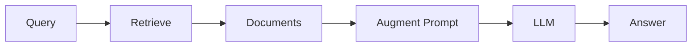
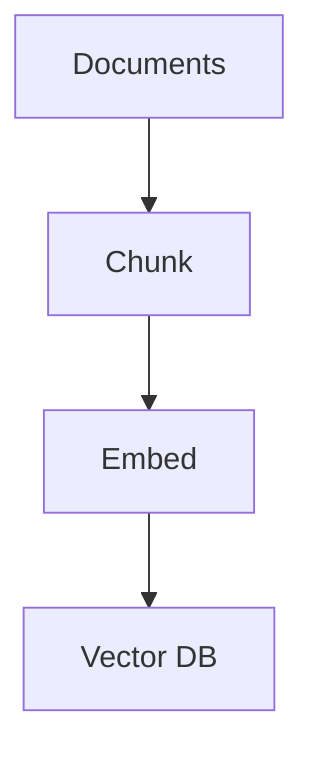

# RAG Architecture (Deep Dive)

📄 File: `book/11_rag_systems/rag_architecture.md`

This chapter covers **RAG (Retrieval Augmented Generation)** — the dominant pattern for grounding LLMs with external knowledge.

---

## Study Plan (1 week)

* Day 1–2: RAG overview, components
* Day 3–4: Indexing pipeline
* Day 5–6: Retrieval + generation
* Day 7: End-to-end project

---

## 1 — What is RAG?

RAG = **Retrieve** relevant documents + **Augment** prompt + **Generate** with LLM.



---

## 2 — Core Components

| Component | Purpose |
| --------- | ------- |
| **Indexing** | Chunk docs, embed, store in vector DB |
| **Retrieval** | Embed query, find similar chunks |
| **Generation** | Pass chunks + query to LLM |

---

## 3 — Indexing Pipeline



---

## 4 — Retrieval + Generation

```python
# Pseudocode — line-by-line
def rag(query):
    # Step 1: Embed the user query into vector space
    query_embedding = embed(query)
    # Step 2: Search vector DB for top-k similar chunks
    chunks = vector_db.search(query_embedding, top_k=5)
    # Step 3: Build prompt with context + question
    prompt = f"Context:\n{chunks}\n\nQuestion: {query}"
    # Step 4: Generate answer using LLM
    return llm.generate(prompt)
```

---

## 5 — Why RAG for AI Data Engineering?

* **Grounding**: Reduces hallucination
* **Up-to-date**: No retraining for new data
* **Traceability**: Cite sources

---

## Key Takeaways

* RAG = retrieve + augment + generate
* Index: chunk → embed → store
* Query: embed → search → LLM

---

## Next Chapter

Proceed to: **document_chunking.md**
