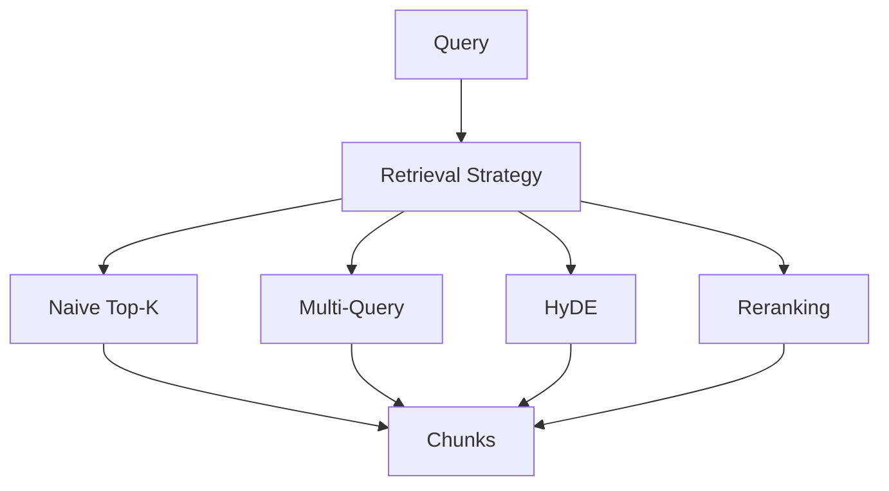
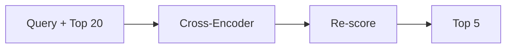
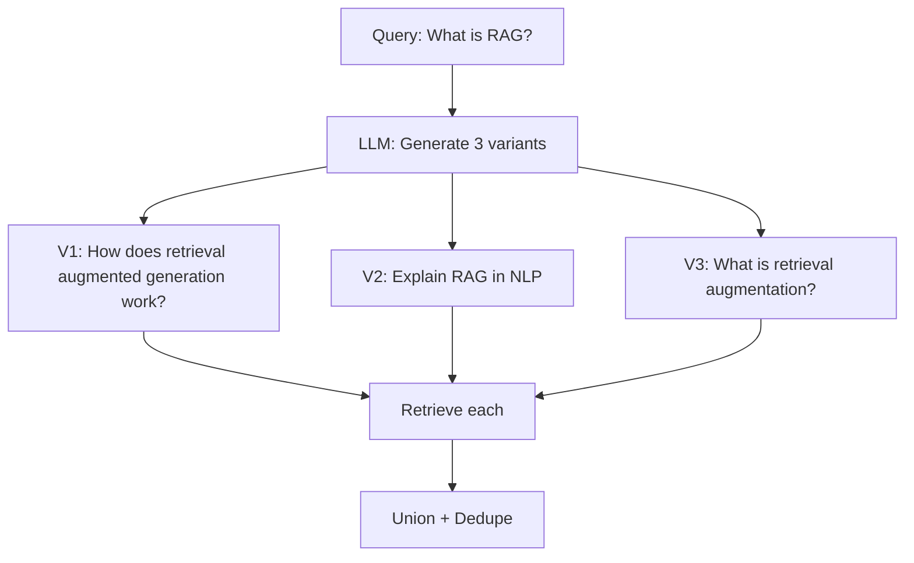
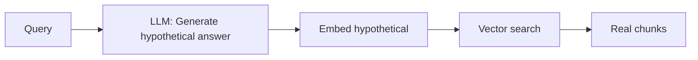
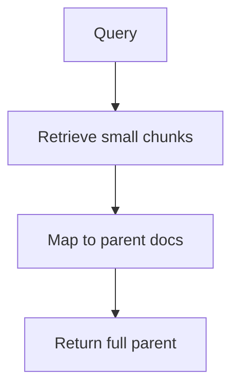

# Retrieval Strategies (Deep Dive)

📄 File: `book/11_rag_systems/retrieval_strategies.md`

This chapter covers **retrieval strategies** beyond naive top-k: reranking, multi-query, HyDE, and query expansion. These improve RAG answer quality significantly.

---

## Study Plan (2–3 days)

* Day 1: Reranking, multi-query retrieval
* Day 2: HyDE, query expansion, parent document
* Day 3: Combine strategies + evaluate

---

## 1 — Retrieval Strategy Overview



---

## 2 — Naive Top-K vs Advanced

| Strategy | Idea | When to Use |
| -------- | ---- | ----------- |
| **Top-K** | Embed query, return k nearest | Baseline, fast |
| **Reranking** | Cross-encoder over top-N | Quality-critical |
| **Multi-Query** | Multiple query variants | Diverse retrieval |
| **HyDE** | Hypothetical docs, then search | Conceptual queries |
| **Parent Doc** | Retrieve small, return parent | Need full context |

---

## 3 — Reranking Flow



First stage: fast retrieval (e.g., top 20). Second stage: cross-encoder reranks and returns top 5.

---

## 4 — Multi-Query Retrieval

Generate multiple query variants; retrieve for each; deduplicate and merge.



---

## 5 — HyDE (Hypothetical Document Embeddings)

Generate a hypothetical answer; embed it; search with that embedding instead of the query.



Query and hypothetical answer are closer in embedding space than query and chunk.

---

## 6 — Code: Reranking with LangChain

```python
from langchain_community.document_loaders import TextLoader
from langchain_openai import OpenAIEmbeddings
from langchain_community.vectorstores import Chroma
from langchain.retrievers import ContextualCompressionRetriever
from langchain_cohere import CohereRerank

# 1. Base retriever (get more than needed)
loader = TextLoader("docs.txt")
docs = loader.load()
embeddings = OpenAIEmbeddings()
vectorstore = Chroma.from_documents(docs, embeddings)
base_retriever = vectorstore.as_retriever(search_kwargs={"k": 20})  # Get 20

# 2. Reranker (compress to top 5)
cohere_rerank = CohereRerank(model="rerank-english-v3.0", top_n=5)

# 3. Compression retriever = base + rerank
compression_retriever = ContextualCompressionRetriever(
    base_compressor=cohere_rerank,
    base_retriever=base_retriever,
)

# 4. Retrieve (returns top 5 after reranking)
compressed_docs = compression_retriever.invoke("What is RAG?")
for doc in compressed_docs:
    print(doc.page_content[:80])
```

---

## 7 — Code: Multi-Query Retrieval

```python
from langchain.retrievers.multi_query import MultiQueryRetriever
from langchain_openai import ChatOpenAI

# Base vector retriever
base_retriever = vectorstore.as_retriever(search_kwargs={"k": 5})

# Multi-query: LLM generates 3 query variants
llm = ChatOpenAI(model="gpt-4o-mini", temperature=0)
multi_retriever = MultiQueryRetriever.from_llm(
    retriever=base_retriever,
    llm=llm,
)

# Retrieve (internally: 3 queries, union, dedupe)
docs = multi_retriever.invoke("Explain document chunking")
```

---

## 8 — Parent Document Retriever



Store small chunks for retrieval; return parent (e.g., full section) for context.

---

## Exercises

### 1. Add reranking to your RAG

Take existing RAG pipeline. Add Cohere or similar reranker. Compare answer quality on 5 questions.

### 2. Implement HyDE

Use an LLM to generate a hypothetical 2–3 sentence answer. Embed and search. Compare with direct query embedding.

### 3. Multi-query + reranking

Combine multi-query retrieval with reranking. Measure latency vs quality.

---

## Interview Questions

1. **Why rerank instead of retrieving more with vector search?**
   * Answer: Cross-encoders are more accurate but too slow for full corpus; rerank only over top-N.

2. **What is HyDE and when does it help?**
   * Answer: Hypothetical Document Embeddings; helps when query and relevant docs are far in embedding space (e.g., vague questions).

3. **When would you use parent document retrieval?**
   * Answer: When small chunks are better for retrieval but full sections are needed for generation context.

---

## Key Takeaways

* **Reranking** — Cross-encoder over top-N; improves precision
* **Multi-Query** — Diverse retrieval; good for ambiguous queries
* **HyDE** — Hypothetical docs bridge query–document gap
* **Parent Doc** — Retrieve small, return large for context

---

## Next Chapter

Proceed to: **agentic_rag.md**
