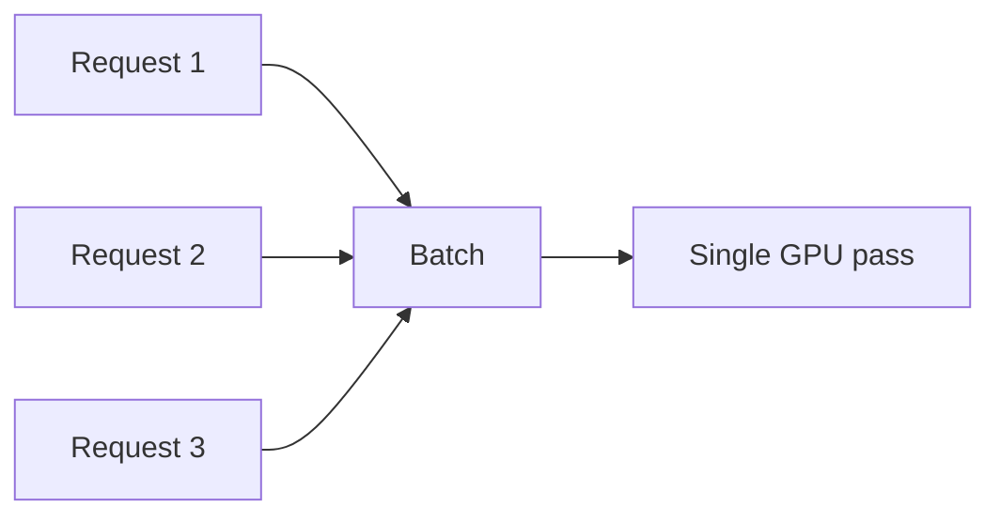
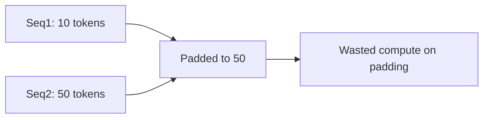
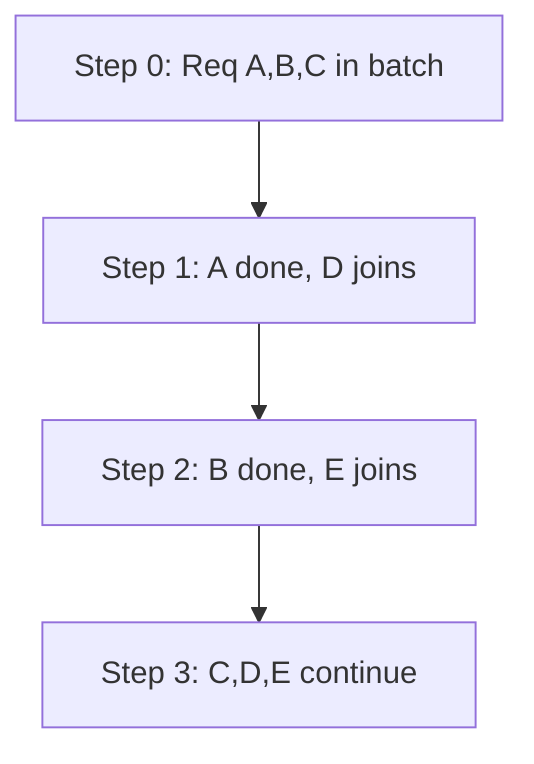
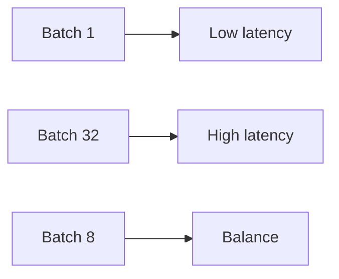

# Batching (Deep Dive)

📄 File: `book/12_ai_infrastructure_inference/batching.md`

This chapter covers **batching** for LLM inference — how grouping requests improves GPU utilization, and the tradeoff between throughput and latency.

---

## Study Plan (1–2 days)

* Day 1: Static vs dynamic batching, padding
* Day 2: Continuous batching (vLLM style)

---

## 1 — Why Batching?

GPUs are parallel; processing one request at a time underutilizes them. Batching amortizes kernel launch and memory bandwidth.



---

## 2 — Static vs Dynamic Batching


| Type | How it works | Latency | Throughput |
| ---- | ------------- | ------- | ---------- |
| **Static** | Wait for N, process | High (wait time) | Good |
| **Dynamic** | Process when batch ready | Lower | Good |
| **Continuous** | Add/remove per step | Lowest | Best |

---

## 3 — Padding Problem

Sequences have different lengths. Padding to max length wastes compute.



Solution: **Packed sequences** (concatenate) or **variable-length batching** (group by length).

---

## 4 — Code: Simple Static Batch

```python
# Simple static batching — line-by-line
import torch

def batch_forward(model, token_ids_list: list[list[int]], pad_id: int = 0) -> torch.Tensor:
    # Step 1: Find max length in batch
    max_len = max(len(ids) for ids in token_ids_list)
    # Step 2: Pad all sequences to max_len
    padded = []
    for ids in token_ids_list:
        pad_len = max_len - len(ids)
        padded.append(ids + [pad_id] * pad_len)
    # Step 3: Stack into batch tensor [B, L]
    batch = torch.tensor(padded, dtype=torch.long)
    # Step 4: Create attention mask (0 for padding)
    mask = (batch != pad_id).long()
    # Step 5: Forward pass
    logits = model(batch, attention_mask=mask)
    return logits
```

---

## 5 — Continuous Batching (Concept)



As requests finish, new ones join. No waiting for full batch.

---

## 6 — Batch Size vs Latency



| Batch Size | Latency | Throughput |
| ---------- | ------- | ---------- |
| 1 | Lowest | Lowest |
| 8–16 | Moderate | Good |
| 32+ | High | Highest |

---

## Exercises

1. Implement padding with left-pad (for causal LM). Compare with right-pad.
2. Estimate: 8 requests, lengths [10,50,20,30,40,15,25,35]. How much compute is wasted with padding?
3. Read vLLM's iteration scheduler; summarize how it adds/removes requests.

---

## Interview Questions

1. **Why does batching improve throughput?**
   * Answer: GPUs parallelize over batch dimension; amortizes kernel launch and memory bandwidth.

2. **What is the padding problem?**
   * Answer: Variable-length sequences padded to max length; padding tokens waste compute.

3. **What is continuous batching?**
   * Answer: Add new requests and remove finished ones each decode step; improves utilization and latency.

---

## Key Takeaways

* **Batching** — Groups requests for parallel GPU execution
* **Padding** — Wastes compute; use packed/variable-length when possible
* **Continuous batching** — Best of both latency and throughput
* **Tradeoff** — Larger batch = higher throughput, higher latency

---

## Next Chapter

Proceed to: **kv_cache.md**
