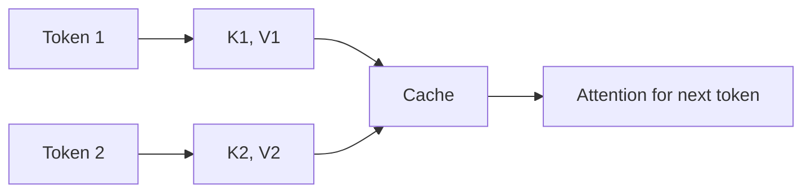
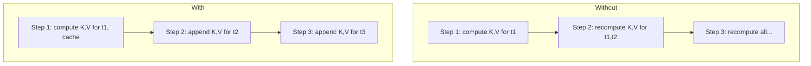
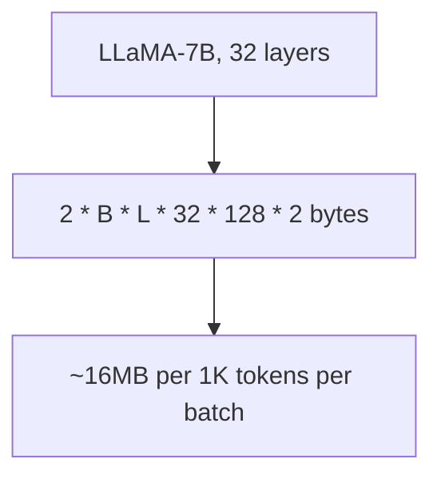
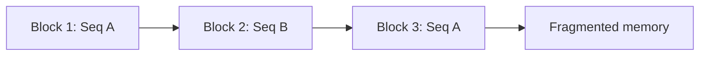

# KV Cache (Deep Dive)

📄 File: `book/12_ai_infrastructure_inference/kv_cache.md`

This chapter covers the **KV cache** — the key optimization that stores key/value pairs from previous tokens so transformers don't recompute them during autoregressive generation.

---

## Study Plan (1–2 days)

* Day 1: Attention and why KV cache is needed
* Day 2: Memory layout, paged attention

---

## 1 — What is the KV Cache?

In transformer attention, each token produces a **Key** and **Value**. For decode, we reuse K,V from all previous tokens — no need to recompute.



---

## 2 — Without vs With KV Cache



Without cache: O(n²) compute per step. With cache: O(n) per step.

---

## 3 — Attention with Cached K,V

```python
# Conceptual attention with KV cache — line-by-line
def attention_with_cache(query, key_cache, value_cache, layer_idx):
    # query: [B, 1, H, D] — only for the NEW token
    # key_cache: [B, seq_len, H, D] — all previous K
    # value_cache: [B, seq_len, H, D] — all previous V
    # Step 1: Compute scores for new token vs all previous
    scores = torch.matmul(query, key_cache.transpose(-2, -1)) / sqrt(d_k)
    # Step 2: Softmax
    attn = torch.softmax(scores, dim=-1)
    # Step 3: Weighted sum of values
    output = torch.matmul(attn, value_cache)
    return output  # [B, 1, H, D]
```

---

## 4 — KV Cache Memory

For each layer: `2 * batch * seq_len * num_heads * head_dim * sizeof(fp16)`



---

## 5 — Paged Attention (vLLM)

Traditional KV cache: contiguous blocks. Problem: fragmentation when sequences finish at different times.



Paged attention: store K,V in **blocks** (like OS pages). Allocate/free per block; reduces fragmentation.

---

## 6 — Code: Append to KV Cache

```python
# Append new K,V to cache — line-by-line
def append_kv_cache(cache, new_k, new_v, layer_idx):
    # cache: list of (K, V) per layer; each K,V is [B, seq, H, D]
    k_old, v_old = cache[layer_idx]
    # Concatenate along sequence dimension
    k_new = torch.cat([k_old, new_k], dim=1)  # [B, seq+1, H, D]
    v_new = torch.cat([v_old, new_v], dim=1)
    # Update cache
    cache[layer_idx] = (k_new, v_new)
    return cache
```

---

## Exercises

1. Compute KV cache size for LLaMA-70B, batch=4, seq_len=4096, fp16.
2. Why does paged attention help with variable-length sequences?
3. What happens to KV cache when a request finishes mid-batch?

---

## Interview Questions

1. **What is the KV cache?**
   * Answer: Stores Key and Value tensors from previous tokens so we don't recompute them during decode.

2. **Why is KV cache memory a bottleneck?**
   * Answer: Grows with batch × seq_len × layers × heads × dim; limits max batch size and context length.

3. **What is paged attention?**
   * Answer: Store KV in non-contiguous blocks; allocate/free per block; reduces fragmentation like OS virtual memory.

---

## Key Takeaways

* **KV cache** — Stores K,V to avoid recomputation in decode
* **Memory** — Major bottleneck; grows with batch and seq_len
* **Paged attention** — Block-based allocation; less fragmentation
* **Per step** — Only compute K,V for the new token; append to cache

---

## Next Chapter

Proceed to: **token_streaming.md**
