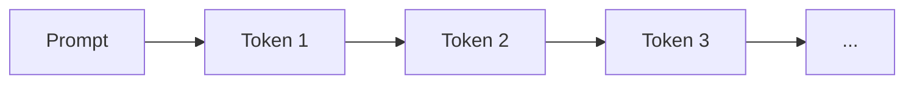
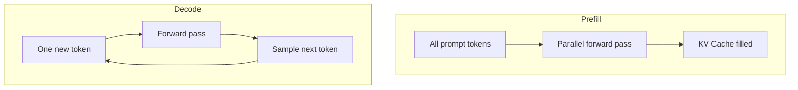
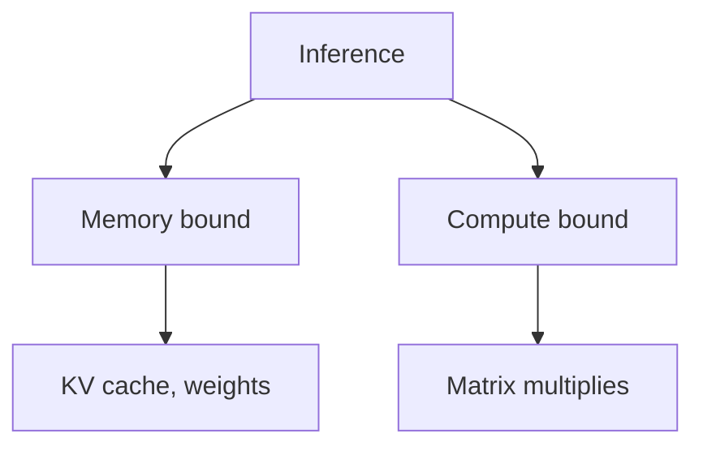
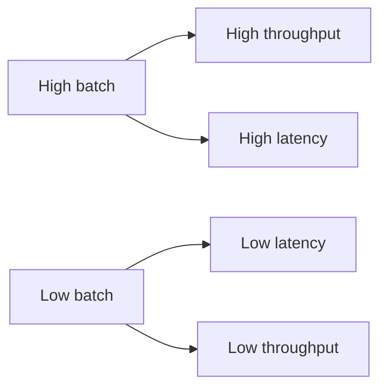

# LLM Inference (Deep Dive)

📄 File: `book/12_ai_infrastructure_inference/llm_inference.md`

This chapter covers **LLM inference** — how language models generate text, the autoregressive loop, and key concepts (prefill, decode, batching) that AI data engineers must understand.

---

## Study Plan (2–3 days)

* Day 1: Autoregressive generation, prefill vs decode
* Day 2: Batching, memory, throughput
* Day 3: vLLM/Triton overview

---

## 1 — What is LLM Inference?

LLM inference = taking a **prompt** and generating **tokens** one at a time (autoregressive) until stop condition.



---

## 2 — Prefill vs Decode



| Phase | Input | Output | Parallelism |
| ----- | ----- | ------ | ------------ |
| **Prefill** | Full prompt | First token + KV cache | High (all tokens) |
| **Decode** | 1 token/step | Next token | Low (sequential) |

---

## 3 — Autoregressive Loop

```python
# Simplified autoregressive generation — line-by-line
def generate(prompt: str, max_tokens: int = 100) -> str:
    # Step 1: Tokenize the prompt into token IDs
    tokens = tokenizer.encode(prompt)
    # Step 2: Initialize output with prompt tokens
    output_ids = list(tokens)
    # Step 3: Loop until max_tokens or stop
    for _ in range(max_tokens - len(tokens)):
        # Step 4: Forward pass — get logits for next token
        logits = model.forward(output_ids)
        # Step 5: Take logits for last position only
        next_logits = logits[:, -1, :]
        # Step 6: Sample (or argmax) next token
        next_id = sample(next_logits)  # e.g., temperature sampling
        # Step 7: Append to sequence
        output_ids.append(next_id)
        # Step 8: Stop if EOS token
        if next_id == tokenizer.eos_token_id:
            break
    # Step 9: Decode IDs back to text
    return tokenizer.decode(output_ids)
```

---

## 4 — Inference Bottlenecks



| Bottleneck | Cause | Mitigation |
| ---------- | ----- | ---------- |
| **Memory** | KV cache, model weights | Quantization, paged attention |
| **Compute** | Attention, FFN | Batching, tensor cores |
| **Latency** | Sequential decode | Continuous batching |

---

## 5 — Throughput vs Latency



---

## Exercises

### 1. Trace one decode step

Given prompt "The cat sat", trace what `model.forward` receives at step 1 vs step 2.

### 2. Estimate KV cache size

For LLaMA-7B, 32 layers, 32 heads, 128 dim/head, seq_len=2048: compute KV cache size in GB.

### 3. Compare prefill vs decode time

With a small model, measure time for prefill (full prompt) vs one decode step.

---

## Interview Questions

1. **What is the difference between prefill and decode?**
   * Answer: Prefill processes all prompt tokens in parallel; decode generates one token at a time sequentially.

2. **Why is decode slow?**
   * Answer: Each step depends on the previous; cannot parallelize across tokens. Memory bandwidth for KV cache also limits speed.

3. **What is continuous batching?**
   * Answer: Add new requests to the batch as others finish; improves GPU utilization vs static batching.

---

## Key Takeaways

* **Prefill** — Parallel over prompt; fills KV cache
* **Decode** — Sequential; one token per step
* **Bottlenecks** — Memory (KV cache), compute (attention)
* **Batching** — Improves throughput; continuous batching helps latency

---

## Next Chapter

Proceed to: **batching.md**
