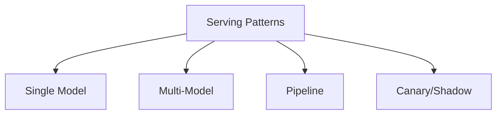
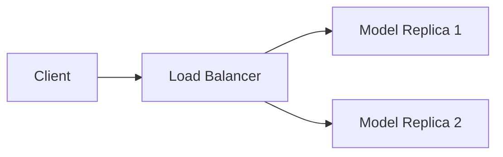
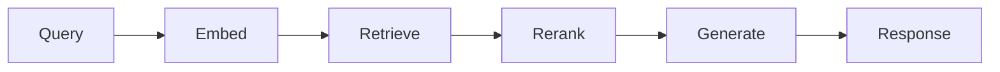
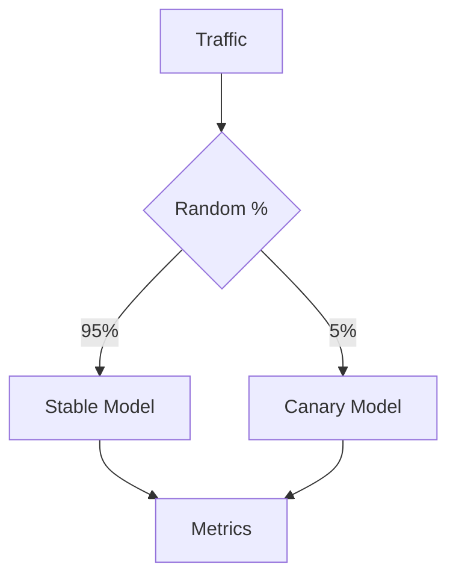
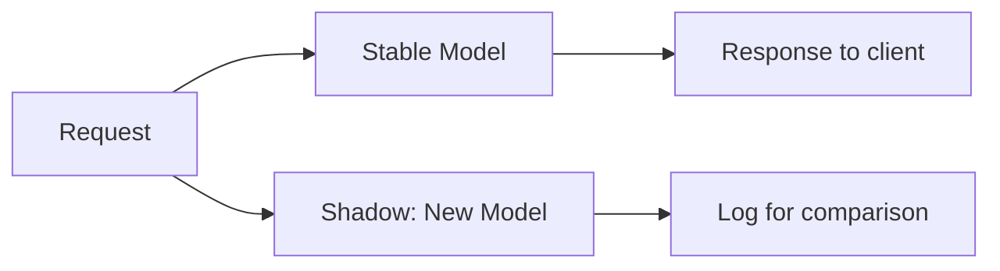

# Model Serving Patterns (Deep Dive)

📄 File: `book/12_ai_infrastructure_inference/model_serving_patterns.md`

This chapter covers **model serving patterns** — common architectures for deploying ML models in production: single-model, multi-model, pipeline, and canary deployments.

---

## Study Plan (1–2 days)

* Day 1: Patterns (single, multi, pipeline)
* Day 2: Canary, shadow, fallback

---

## 1 — Pattern Overview



---

## 2 — Single-Model Serving

One model, one endpoint. Simplest pattern.



| Pros | Cons |
| ---- | ---- |
| Simple | No A/B, no fallback |
| Easy to scale | Single point of failure |

---

## 3 — Multi-Model Serving

Multiple models behind one or more endpoints. Route by model name or path.

```mermaid
flowchart TD
    A[/v1/models] --> B[Router]
    B --> C[Model A]
    B --> D[Model B]
    B --> E[Model C]
```

```python
# Route by model name — line-by-line
@app.post("/predict")
async def predict(model_id: str, input: dict):
    # Get model handle for requested model
    if model_id == "embedding":
        result = await embedding_handle.remote(input)
    elif model_id == "llm":
        result = await llm_handle.remote(input)
    else:
        raise HTTPException(404, "Unknown model")
    return result
```

---

## 4 — Pipeline Serving

Sequential or DAG of models. E.g., RAG: embed → retrieve → rerank → generate.



```python
# Pipeline — line-by-line
async def rag_pipeline(query: str):
    # Step 1: Embed query
    query_embedding = await embed_model.remote(query)
    # Step 2: Retrieve from vector DB
    chunks = await vector_db.search(query_embedding, top_k=20)
    # Step 3: Rerank
    top_chunks = await reranker.remote(query, chunks[:5])
    # Step 4: Generate
    answer = await llm.remote(query, top_chunks)
    return answer
```

---

## 5 — Canary Deployment

Route small % of traffic to new model; compare metrics.



---

## 6 — Shadow Deployment

Send same input to both models; only return stable model's output. Log canary for analysis.



---

## 7 — Fallback Pattern

```python
# Fallback — line-by-line
async def predict_with_fallback(input_data):
    try:
        # Try primary model
        return await primary_model.remote(input_data)
    except Exception as e:
        # Fallback to simpler/faster model
        logger.warning(f"Primary failed: {e}, using fallback")
        return await fallback_model.remote(input_data)
```

---

## Exercises

1. Design a RAG pipeline with embed, retriever, reranker, LLM. Which can be batched?
2. Implement canary: 10% to new model, log latency and errors for both.
3. Add fallback: if LLM times out, return "I'm sorry, try again."

---

## Interview Questions

1. **What is canary deployment?**
   * Answer: Route small % of traffic to new model; compare metrics before full rollout.

2. **What is shadow deployment?**
   * Answer: Run new model in parallel; don't return its output; log for comparison.

3. **When would you use a pipeline vs single-model?**
   * Answer: Pipeline when you have sequential steps (RAG, multi-stage); single when one model suffices.

---

## Key Takeaways

* **Single-model** — One model, simple scaling
* **Multi-model** — Route by model ID
* **Pipeline** — Sequential/DAG of models
* **Canary/Shadow** — Safe rollout; fallback for resilience

---

## Next Chapter

Proceed to: **fastapi_inference_serving.md**
