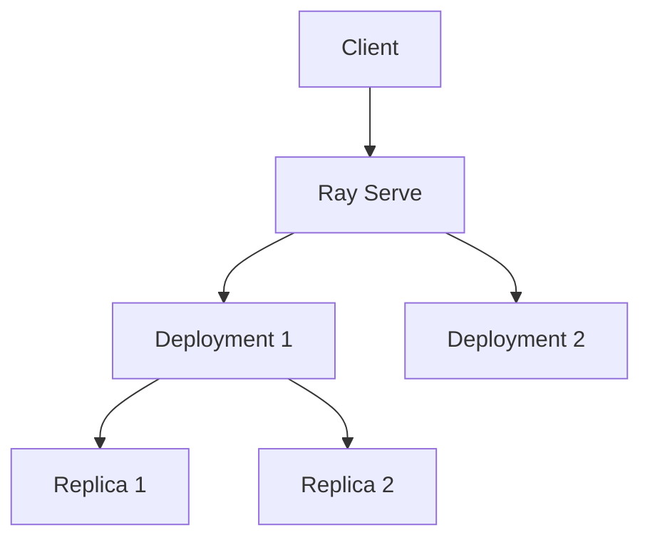
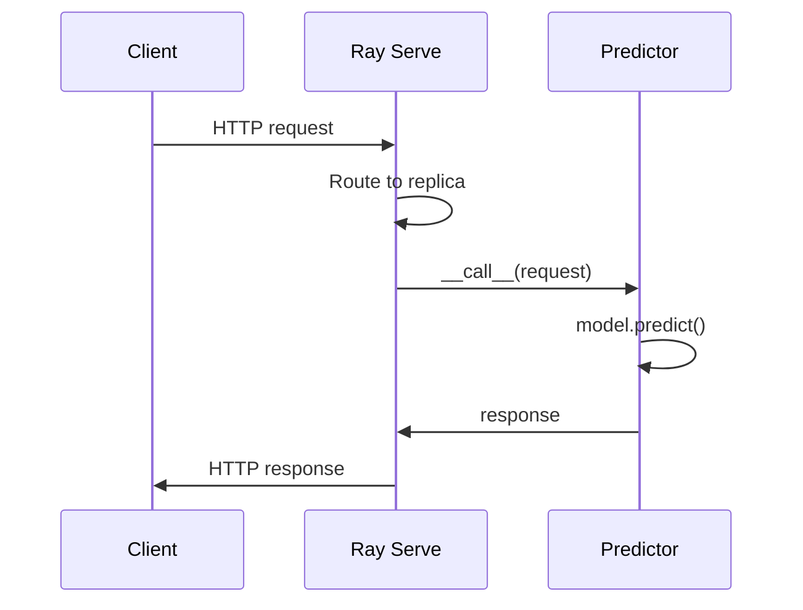

# Ray Serve (Deep Dive)

📄 File: `book/12_ai_infrastructure_inference/ray_serve.md`

This chapter covers **Ray Serve** — a scalable model serving framework on Ray. Deploy Python classes as services with autoscaling, batching, and multi-node support.

---

## Study Plan (2 days)

* Day 1: Ray Serve basics, deployments, scaling
* Day 2: Batching, multi-model, production

---

## 1 — What is Ray Serve?

Ray Serve turns Python classes into **scalable HTTP/gRPC services** on the Ray cluster. Handles replication, load balancing, autoscaling.



---

## 2 — Basic Deployment

```python
from ray import serve
from fastapi import FastAPI

# Define deployment — line-by-line
@serve.deployment(num_replicas=2, ray_actor_options={"num_cpus": 1})
class Predictor:
    def __init__(self):
        # Load model once per replica
        self.model = load_model()

    async def __call__(self, request):
        # Handle request
        data = await request.json()
        return {"prediction": self.model.predict(data["input"])}

# Create deployment
app = Predictor.bind()
```

---

## 3 — Deployment Flow



---

## 4 — Code: Run Ray Serve

```python
# serve_run.py — line-by-line
import ray
from ray import serve

# Start Ray (or connect to cluster)
ray.init()

# Deploy
serve.run(Predictor.bind(), name="predictor", route_prefix="/predict")

# Server runs until stopped
# Query: curl http://localhost:8000/predict -d '{"input": [1,2,3]}'
```

---

## 5 — Batching with Ray Serve

```python
@serve.deployment(route_prefix="/batch")
class BatchedPredictor:
    def __init__(self):
        self.model = load_model()

    @serve.batch(max_batch_size=8, batch_wait_timeout_s=0.1)
    async def batch_inference(self, requests):
        # requests: list of (request_data,)
        inputs = [r["input"] for r in requests]
        results = self.model.predict_batch(inputs)
        return [{"prediction": r} for r in results]

    async def __call__(self, request):
        data = await request.json()
        return await self.batch_inference(data)
```

---

## 6 — Multi-Model Deployment

```mermaid
flowchart LR
    A[/embed] --> B[EmbeddingModel]
    C[/generate] --> D[LLMModel]
    E[/rerank] --> F[RerankerModel]
```

```python
# Compose deployments
app = FastAPI()
serve.run(EmbeddingModel.bind(), route_prefix="/embed")
serve.run(LLMModel.bind(), route_prefix="/generate")
serve.run(RerankerModel.bind(), route_prefix="/rerank")
```

---

## 7 — Ray Serve vs vLLM

| Aspect | Ray Serve | vLLM |
| ------ | --------- | ----- |
| **Scope** | Any Python model | LLMs |
| **Batching** | Manual/@serve.batch | Native continuous |
| **Scaling** | Ray autoscaling | Single/multi-GPU |
| **Use case** | Custom models, RAG pipelines | High-throughput LLM |

---

## Exercises

1. Deploy a simple "echo" deployment. Scale to 4 replicas; measure throughput.
2. Add @serve.batch to an embedding model. Compare latency with/without batching.
3. Deploy RAG: embedding + retriever + LLM as separate deployments.

---

## Interview Questions

1. **What is Ray Serve?**
   * Answer: Model serving on Ray; deploy Python classes as HTTP services with replication and autoscaling.

2. **How does @serve.batch work?**
   * Answer: Queues requests; when batch size or timeout reached, runs batch inference; returns individual responses.

3. **When use Ray Serve over vLLM?**
   * Answer: Custom models (embeddings, rerankers), multi-step pipelines, non-LLM workloads.

---

## Key Takeaways

* **Ray Serve** — Python model serving on Ray
* **Deployments** — @serve.deployment; replicas, scaling
* **Batching** — @serve.batch for throughput
* **Multi-model** — Multiple deployments, different routes

---

## Next Chapter

Proceed to: **model_serving_patterns.md**
