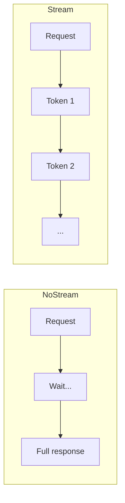
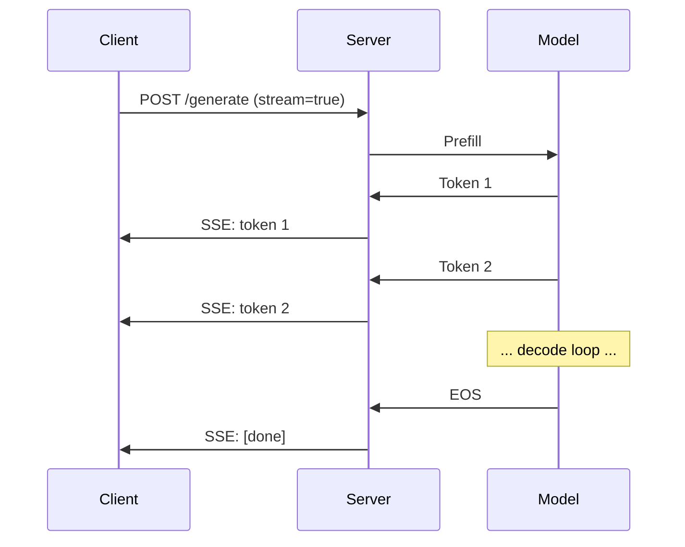
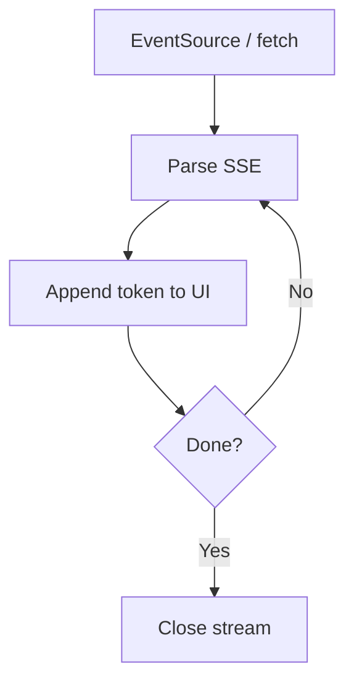

# Token Streaming (Deep Dive)

📄 File: `book/12_ai_infrastructure_inference/token_streaming.md`

This chapter covers **token streaming** — returning generated tokens to the client as they are produced, reducing time-to-first-token and improving perceived latency for chat interfaces.

---

## Study Plan (1 day)

* Day 1: Streaming concepts, Server-Sent Events, implementation

---

## 1 — Why Stream Tokens?

Without streaming: user waits for full response. With streaming: tokens appear incrementally.



**Time to first token (TTFT)** is the key metric for perceived latency.

---

## 2 — Streaming Flow



---

## 3 — Server-Sent Events (SSE)

SSE is a simple protocol for server-to-client streaming over HTTP.

```python
# SSE format — line-by-line
# Each event: "data: {json}\n\n"
# Example stream:
# data: {"token": "The"}\n\n
# data: {"token": " cat"}\n\n
# data: {"token": " sat"}\n\n
# data: {"done": true}\n\n
```

---

## 4 — Code: FastAPI Streaming Response

```python
from fastapi import FastAPI
from fastapi.responses import StreamingResponse
import json

app = FastAPI()

async def generate_tokens(prompt: str):
    # Simulated token generator — replace with real model
    tokens = ["The", " quick", " brown", " fox", "."]
    for token in tokens:
        # Yield SSE format: "data: {json}\n\n"
        yield f"data: {json.dumps({'token': token})}\n\n"
    # Signal completion
    yield f"data: {json.dumps({'done': True})}\n\n"

@app.post("/stream")
async def stream(prompt: str):
    # StreamingResponse with SSE media type
    return StreamingResponse(
        generate_tokens(prompt),
        media_type="text/event-stream",
        headers={"Cache-Control": "no-cache", "Connection": "keep-alive"},
    )
```

---

## 5 — OpenAI-Compatible Streaming

```python
# OpenAI-style streaming chunks — line-by-line
async def openai_stream(prompt: str):
    # Each chunk: {"choices": [{"delta": {"content": "token"}}]}
    async for token in model.stream(prompt):
        chunk = {
            "id": "chatcmpl-xxx",
            "object": "chat.completion.chunk",
            "choices": [{"delta": {"content": token}, "index": 0}],
        }
        yield f"data: {json.dumps(chunk)}\n\n"
    yield "data: [DONE]\n\n"
```

---

## 6 — Client-Side Handling



---

## Exercises

1. Build a minimal FastAPI endpoint that streams tokens from a dummy generator.
2. Add error handling: if model fails mid-stream, send error event and close.
3. Measure TTFT with and without streaming for a 100-token response.

---

## Interview Questions

1. **Why stream tokens instead of returning the full response?**
   * Answer: Reduces time-to-first-token; user sees progress immediately; better UX for long generations.

2. **What is SSE?**
   * Answer: Server-Sent Events — HTTP-based protocol for server-to-client streaming; simple, one-way.

3. **What is TTFT?**
   * Answer: Time to first token — latency from request to first token delivered; key for perceived responsiveness.

---

## Key Takeaways

* **Streaming** — Return tokens as generated; improves perceived latency
* **TTFT** — Time to first token; critical metric
* **SSE** — Server-Sent Events; standard for HTTP streaming
* **FastAPI** — `StreamingResponse` with `text/event-stream`

---

## Next Chapter

Proceed to: **vllm.md**
